# TradeTalk API Data Flow Architecture

This document provides a holistic end-to-end trace of how data moves through the TradeTalk platform. It captures the entire lifecycle—from the point an external data source is ingested, through backend stores and agent analysis, down to the frontend UI components requesting the data.

## Holistic Data Flow Diagram

```mermaid
flowchart TD
  %% --- 1. Frontend Layer ---
  subgraph frontend ["Frontend (React / Vite)"]
    UI_Dashboard["Unified Dashboard
/dashboard"]
    UI_DailyBrief["Daily Brief
/daily-brief"]
    UI_Portfolio["Paper Portfolio
/portfolio"]
    UI_Chat["Chat UI
/chat"]
    UI_Macro["Macro UI
/macro"]
    UI_Backtest["Strategy Lab
/backtest"]
    UI_Video["Video Academy
/learning"]
    UI_Scorecard["Scorecard UI
/scorecard"]

    FE_API["api.js (apiFetch, apiFetchTimed, fetchJsonWithMeta)"]
    FE_Context["AnalysisContext.jsx
(Background Poller)"]
  end

  %% --- 2. API Router Layer (FastAPI) ---
  subgraph routers ["Backend Routers"]
    R_Analysis[/"routers/analysis.py
(Decision Terminal, Trace, Metrics)"/]
    R_DailyBrief[/"routers/daily_brief.py"/]
    R_Portfolio[/"routers/portfolio.py"/]
    R_Chat[/"routers/chat.py"/]
    R_Macro[/"routers/macro.py"/]
    R_Backtest[/"routers/backtest.py"/]
    R_Knowledge[/"routers/knowledge.py
(Ingest Pipelines)"/]
    R_Scorecard[/"routers/scorecard.py
(Risk-Return Scorecard)"/]
    R_MCP[/"mcp_server/router.py
(Live Quotes)"/]
  end

  %% --- 3. Caching & Trust Layer ---
  subgraph cache ["Caching & Trust Layer"]
    VC[("Verdict Cache
(Per Ticker/Session)")]
    CC[("Connector Cache
(60s open / 300s closed)")]
    DTL["Data Trust Layer
(freshness.py, assess_spot)"]
  end

  %% --- 4. Agent & Analysis Layer ---
  subgraph intelligence ["Intelligence Layer (Agents & LLMs)"]
    SWARM{"Swarm Agents
(Bull, Bear, Value, Momentum, etc.)"}
    DEBATE{"Debate Agents
(Moderator, Analysts)"}
    SCORECARD_AGENTS{"Scorecard Agents
(SITG Scorer, Exec Risk)"}
    CHAT_AGENTS{"Chat Agents
(Financial Assistant, Tools)"}
    VIDEO_AGENTS{"Video Generation Agent
(Gemini Veo / Text Fallback)"}

    LLM_Gateway["llm_client.py
(Gateway & Guardrails)"]
  end

  %% --- 5. RAG & Knowledge Store ---
  subgraph knowledge ["Vector Memory (RAG)"]
    KS["knowledge_store.py"]
    V_DB[("Vector Backend
Supabase pgvector / Chroma")]
  end

  %% --- 6. Persistent Storage (Databases & Lakes) ---
  subgraph storage ["Persistence Layer"]
    DB_Ledger[("Decision Ledger
(SQLite/Postgres)")]
    DB_App[("App DBs
Auth, Portfolio, Chat, Alert Store)")]
    DB_Macro[("Domain DBs
macro_flow.db, supply_chain.db)")]
    DATA_LAKE[("Data Lake
daily_prices, BQ, Parquet)")]
  end

  %% --- 7. Data Ingestion & Connectors ---
  subgraph ingestion ["Ingestion & Connectors"]
    C_YF["yfinance_batch.py"]
    C_Fred["fred.py (FRED CSV)"]
    C_Poly["polymarket.py & kalshi.py"]
    C_RSS["news_scanner.py (Google News RSS)"]
    C_FinCrawler["fincrawler_client.py (SEC, Stooq)"]
    C_Spot["live_quote.py (Hedged Pricing Engine)"]

    CRON["Daily Pipeline / sp500-ingest / Scheduled Jobs"]
  end

  %% --- 8. External Data Sources (Truth) ---
  subgraph external ["External Providers"]
    SRC_YF("Yahoo Finance")
    SRC_Fred("FRED")
    SRC_Markets("Polymarket / Kalshi")
    SRC_News("News Sites / Social")
    SRC_LLMs("OpenRouter / Gemini")
  end

  %% === CONNECTIONS ===

  %% Frontend -> Context
  UI_Dashboard --> FE_Context
  UI_DailyBrief --> FE_Context
  UI_Macro --> FE_Context

  %% UI -> api.js
  UI_Dashboard --> FE_API
  UI_DailyBrief --> FE_API
  UI_Portfolio --> FE_API
  UI_Chat --> FE_API
  UI_Macro --> FE_API
  UI_Backtest --> FE_API
  UI_Video --> FE_API
  UI_Scorecard --> FE_API
  FE_Context -.->|30s/5m Poll| FE_API

  %% API.js -> Routers
  FE_API --> R_Analysis
  FE_API --> R_DailyBrief
  FE_API --> R_Portfolio
  FE_API --> R_Chat
  FE_API --> R_Macro
  FE_API --> R_Backtest
  FE_API --> R_Scorecard
  FE_API --> R_MCP

  %% Routers -> Cache/Trust
  R_Analysis --> DTL
  R_DailyBrief --> DTL
  R_Scorecard --> DTL
  R_Macro --> DTL
  R_MCP --> DTL

  R_Analysis --> VC
  R_Analysis --> CC
  R_Scorecard --> CC
  R_Macro --> CC

  %% Routers -> Intelligence
  R_Analysis --> SWARM
  R_Analysis --> DEBATE
  R_Scorecard --> SCORECARD_AGENTS
  R_Chat --> CHAT_AGENTS
  R_Video --> VIDEO_AGENTS
  R_Backtest --> LLM_Gateway

  SWARM --> LLM_Gateway
  DEBATE --> LLM_Gateway
  SCORECARD_AGENTS --> LLM_Gateway
  CHAT_AGENTS --> LLM_Gateway
  VIDEO_AGENTS --> LLM_Gateway

  LLM_Gateway --> SRC_LLMs

  %% Agents/Routers -> RAG
  SWARM --> KS
  DEBATE --> KS
  R_Chat --> KS
  R_Backtest --> KS
  R_DailyBrief --> KS
  KS --> V_DB

  %% Routers/Agents -> DBs
  R_Portfolio --> DB_App
  R_Chat --> DB_App
  R_Macro --> DB_Macro
  R_DailyBrief --> DATA_LAKE
  R_MCP -.->|EOD Fallback| DATA_LAKE

  %% Intelligence -> Decision Ledger (Harness Phase 2)
  SWARM --> DB_Ledger
  DEBATE --> DB_Ledger
  CHAT_AGENTS --> DB_Ledger

  %% Routers/Cache -> Connectors
  CC --> C_YF
  CC --> C_Poly
  CC --> C_FinCrawler
  R_Macro --> C_Fred
  R_MCP --> C_Spot
  C_Spot --> C_YF
  C_Spot --> C_FinCrawler

  %% Connectors -> External
  C_YF --> SRC_YF
  C_Fred --> SRC_Fred
  C_Poly --> SRC_Markets
  C_RSS --> SRC_News
  C_FinCrawler --> SRC_YF
  C_FinCrawler --> SRC_News

  %% Ingestion -> Stores/Connectors
  CRON --> C_YF
  CRON --> C_RSS
  CRON --> C_Fred
  CRON --> DATA_LAKE
  CRON --> KS
  CRON --> DB_App
```

## Component Breakdown

### 1. Frontend Layer
- **Components (`UI_*`):** React components (Vite SPA) initiating data fetching requests. Most heavy lifting happens via `UnifiedDashboardUI` and `DailyBriefUI`.
- **`api.js`:** The single fetch interface (`apiFetch`, `apiFetchTimed`, `fetchJsonWithMeta`). It parses JWT tokens, handles base URLs, and enforces the "Truthful-data contract" by capturing 503 `insufficient_data` exceptions and relaying them to context providers rather than displaying mock or partial data.
- **`AnalysisContext.jsx`:** A centralized data provider that orchestrates parallel requests, acts as an active background poller (refreshing `/metrics`, `/live-quote` every 30s, and `/prediction-markets` every 5m).

### 2. API Router Layer
- **Routers (`backend/routers/*.py`):** FastAPI endpoints defining all HTTP traffic.
  - *Decision Terminal / Trace (`analysis.py`)* embeds multi-agent swarm verdicts, debates, and base metric aggregation into one response to minimize round trips.
  - *Scorecard (`scorecard.py`)* handles deterministic risk-return calculations paired with qualitative LLM agent scoring.
  - *Live Quote (`mcp_server/router.py`)* provides lightning-fast spot prices by hedging Yahoo against Stooq and FinCrawler, before falling back to data lake historical prices.

### 3. Caching & Trust Layer
- **Data Trust Layer (`freshness.py`):** Responsible for attaching a `DataFreshness` envelope to all fetched data, comparing captured times with `market_calendar.py`'s `last_completed_session`. Ensures strict frontend UI rendering (`FreshnessBadge`, `StaleValue`).
- **Verdict Cache:** Intercepts LLM-heavy `/decision-terminal` requests. It computes and stores verdicts keyed by `(ticker, session_date)` valid for the current trading session. Subsequent hits overlay fresh spot pricing while reusing the expensive LLM verdict.
- **Connector Cache:** General purpose TTL cache for API connectors (60s open-market, 300s off-hours).

### 4. Intelligence Layer
- **Swarm & Debate Agents:** Multi-agent LLM systems evaluating tickers from various perspectives (Bull, Bear, Value, Momentum). Orchestrated simultaneously to reduce blocking.
- **Scorecard Agents:** `sitg_scorer` and `execution_risk_scorer` evaluate non-numerical qualitative metrics (e.g. CEO insider selling).
- **`llm_client.py`:** The singular AI gateway. Responsible for managing the global LLM concurrency semaphore, fallback policies, and enforcing the truthful-data contract for verdict roles. Directly interfaces with OpenRouter and Google Gemini APIs.

### 5. RAG & Knowledge Store
- **`knowledge_store.py`:** Provides semantic retrieval via `VectorMemory`.
- **Vector DB:** Handles unstructured data (e.g., YouTube insights, news sentiment, macro alerts, historical agent reflections, SP500 fundamentals). Stores embeddings either persistently (Supabase pgvector) or locally/transiently (Chroma).

### 6. Persistence Layer
- **Decision Ledger:** The immutable SQL ledger (Harness Phase 2) tracking every tool call, RAG chunk citation, and agent decision logic for track-record auditing and continuous learning (SEPL).
- **Data Lake (`daily_prices`):** BigQuery / DuckDB holding historical Parquet bars, EOD fallback prices, and batch ETL results populated by GitHub action CRON jobs.
- **App & Domain Databases (SQLite/Postgres):** Maintains standard CRUD state (user accounts, chat session transcripts, paper portfolios) as well as graph relationships (`macro_flow.db`, `supply_chain.db`).

### 7. Ingestion & Connectors
- **Connectors:** Live bridges to external data. Implemented with resilient chunked batching (`yfinance_batch.py`) and keyset/cursor pagination (`polymarket.py`, `kalshi.py`).
- **Truthful-data Contract:** All connectors are explicitly prohibited from fabricating fallback data. A complete failure from external endpoints directly raises `InsufficientDataError`.
- **CRON / Daily Pipeline:** Background schedulers executing pre-warm logic—caching daily mover snapshots, fetching FRED macro aggregates, parsing RSS channels, and indexing results into the Knowledge Store or Data Lake prior to user interaction.

### 8. External Providers
- The terminal nodes of the system: external dependencies like Yahoo Finance, Federal Reserve Economic Data, Polymarket APIs, SEC filings, Google News RSS feeds, and the foundational LLM API Providers (OpenRouter/Gemini).
