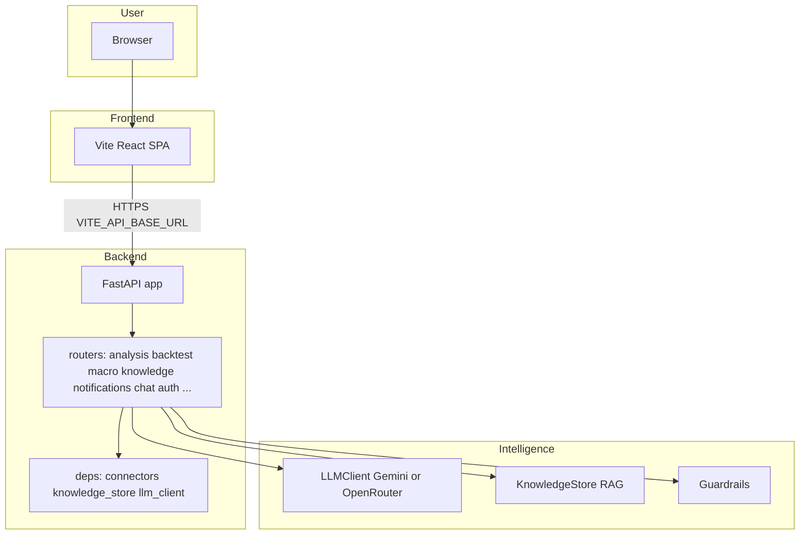
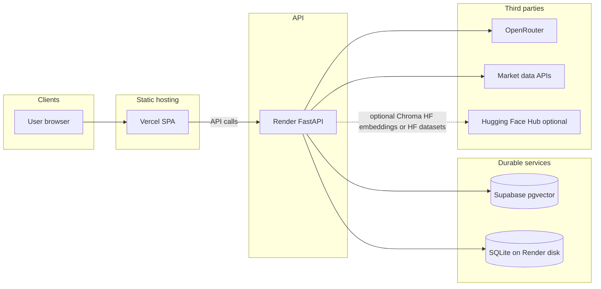

# TradeTalk architecture

This document describes how the TradeTalk platform is structured end to end: the browser app, the Python API, vector memory (RAG), external data sources, deployment on Render and Vercel, and every Hugging Face touchpoint. Use it as the single place to reason about changes before you refactor or extend the system.

**Related docs**

- [RAG_POLICY.md](./RAG_POLICY.md) — operational policy for ingestion, TTL, and PII around the knowledge store.
- [CRON.md](./CRON.md) — wake pings, secured pipeline triggers, GitHub Actions, and Render free-tier behavior.
- [DECISION_LEDGER.md](./DECISION_LEDGER.md) — SQL-queryable substrate of agent decisions + multi-horizon outcomes (Harness Engineering Phase 2).
- [AGENTS.md](../AGENTS.md) — dev commands, env files, and single-process scaling constraints.

---

## 1. Purpose and how to maintain this document

- **Keep it accurate to the repo.** When you add a router, change `VECTOR_BACKEND`, or move data to a new store, update this file in the same PR.
- **Do not duplicate RAG policy** — link to `RAG_POLICY.md` for retention and collection rules.
- **Scaling:** The backend is designed as a **single process**. In-memory SSE clients, the L1 cache, APScheduler, and SQLite usage assume one worker. Multi-worker deployment requires a different message bus, shared cache, and database; see [AGENTS.md](../AGENTS.md).

---

## 2. System overview

At runtime, the **React** app (built with Vite) calls the **FastAPI** backend using the base URL from `VITE_API_BASE_URL` (see `frontend/.env.local`). The backend loads shared singletons from `backend/deps.py` (connectors, `knowledge_store`, `llm_client`, SSE state) and implements routes under `backend/routers/`.

---

## 3. Frontend

| Item | Detail |
|------|--------|
| **Stack** | React 19, Vite 7, React Router (`frontend/`). |
| **API base** | `API_BASE_URL` / `VITE_API_BASE_URL` points at the FastAPI host (local `http://localhost:8000` or your Render URL). |
| **Auth** | Google OAuth when configured; dev mode can bypass with a dev user (`frontend/src/AuthContext.jsx`, backend `backend/auth`). |

**Primary routes** (see `frontend/src/App.jsx`):

| Path | UI module | Role |
|------|-----------|------|
| `/` | ConsumerUI | Valuation dashboard, swarm trace |
| `/decision-terminal` | DecisionTerminalUI | Decision terminal |
| `/macro` | MacroUI | Macro dashboard |
| `/gold` | GoldAdvisorUI | Gold advisor |
| `/chat` | ChatUI | Chat with RAG / context |
| `/debate` | DebateUI | Multi-agent debate |
| `/backtest` | BacktestUI | Strategy backtest |
| `/scorecard` | ScorecardUI | Risk-Return Ratio Scorecard (basket-level) |
| `/observer` | ObserverUI | Developer trace |
| `/systemmap` | SystemMapUI | Architecture map |
| `/challenge`, `/portfolio`, `/learning`, `/academy` | Gamification | Challenges, paper portfolio, learning path, video academy (often gated by `AuthGate`) |

---

## 4. Backend layout

| Piece | Location | Role |
|-------|----------|------|
| **App factory / lifecycle** | `backend/main.py` | `FastAPI` app, CORS, SQLite init for multiple feature DBs, **startup**: news scan loop, daily pipeline scheduler, market-intel jobs, keep-alive (non-Render), optional SP500 ingest |
| **Routers** | `backend/routers/*.py` | All HTTP routes (no handlers in `main.py` beyond wiring) |
| **Shared state** | `backend/deps.py` | Connectors, `knowledge_store`, `llm_client`, `sse_clients`, `last_trace_data` |
| **SSE** | Notifications router + `deps.sse_clients` | Real-time macro alerts to the browser |

**Route ownership (important):**

| Concern | Router file | Example paths |
|---------|-------------|----------------|
| Swarm + debate | `backend/routers/analysis.py` | `GET/POST /trace`, `GET/POST /debate` |
| Backtest | `backend/routers/backtest.py` | `POST /backtest`, validation helpers |
| Macro | `backend/routers/macro.py` | `GET /macro` |
| Notifications + SSE | `backend/routers/notifications.py` | `GET /notifications/stream`, history, `GET /notifications/trace` |
| Knowledge / pipelines | `backend/routers/knowledge.py` | `GET /knowledge/stats`, `POST /knowledge/pipeline-run`, `POST /knowledge/sp500-ingest` |
| Chat | `backend/routers/chat.py` | `/chat/*` |
| Risk-Return Scorecard | `backend/routers/scorecard.py` | `GET /scorecard/presets`, `POST /scorecard/compare`, `GET /scorecard/{ticker}` |

**Naming note:** `GET /trace` (analysis router) runs the **swarm** and returns a `SwarmConsensus`. `GET /notifications/trace` returns the **last background news-scan trace** from memory — different purpose, different path.

---

## 5. Intelligence layer

### 5.1 LLM

`backend/llm_client.py` is the single entry point for every LLM call in the platform (streaming chat, agent JSON, RAG polish, video text fallback). It supports two routing modes controlled by **`GEMINI_PRIMARY`**:

- **Gemini-primary mode** (`GEMINI_PRIMARY=1`, `GEMINI_API_KEY` set) — every call is routed through Google Gemini via `backend/gemini_llm.py`. OpenRouter is **not** consulted on the hot path. On any Gemini failure (empty response, 5xx, rate limit) the client returns the deterministic `FALLBACK_TEMPLATES` for agent JSON, or the original user text for prose paths — OpenRouter is never re-entered. Use this mode to burn Gemini credits.
- **OpenRouter-primary mode** (`GEMINI_PRIMARY=0`, default) — OpenRouter is primary (`OPENROUTER_API_KEY`, `OPENROUTER_MODEL`, optional `OPENROUTER_MODEL_LIGHT`). Gemini is consulted only as a best-effort fallback when OpenRouter fails (toggleable with `GEMINI_LLM_FALLBACK`). Without any key, rule-based templates keep features responsive.

Both modes honor the same **role-to-tier mapping** (`MODEL_TIER` in `llm_client.py`). Heavy-reasoning roles — bull, bear, moderator, strategy_parser, gold_advisor, backtest_explainer — resolve to `GEMINI_MODEL` (default `gemini-3.1-pro-preview`) or `OPENROUTER_MODEL`. Light roles — swarm_analyst, swarm_synthesizer, swarm_reflection_writer, rag_narrative_polish, video_scene_director, video_veo_text_fallback, decision_terminal_roadmap — resolve to `GEMINI_MODEL_LIGHT` (default `gemini-3.1-flash`) or `OPENROUTER_MODEL_LIGHT`. Video clip generation is always Google Veo (`backend/video_generation_agent.py`), independent of the Gemini-primary flag.

### 5.2 Knowledge store (RAG)

`backend/knowledge_store.py` exposes a singleton **KnowledgeStore** used by swarm, debate, backtest, daily pipeline, chat, and reflection flows. Semantic retrieval uses named **collections** defined in `COLLECTIONS` (single source of truth — do not hardcode a count in UI without syncing).

Collections include (non-exhaustive; see code): `swarm_history`, `swarm_reflections`, `debate_history`, `macro_alerts`, `strategy_backtests`, `price_movements`, `macro_snapshots`, `youtube_insights`, `strategy_reflections`, `stock_profiles`, `earnings_memory`, `sp500_fundamentals_narratives`, `sp500_sector_analysis`, `chat_memories`.

### 5.3 Guardrails

`backend/agent_policy_guardrails.py` enforces workload capabilities, host allowlists, and startup checks (`GUARDRAILS_*` env vars).

### 5.4 Resource registry (RSPL, Phase A)

`backend/resource_registry.py` is a protocol-registered, versioned substrate for LLM prompts, following the Resource Substrate Protocol Layer from the [Autogenesis paper](https://arxiv.org/abs/2604.15034). Prompt bodies live under `backend/resources/prompts/*.yaml` (source of truth) and are seeded on startup into `backend/resources.db` (SQLite — schema in `backend/migrations/resources/`). Every LLM call via `LLMClient._resolve_system_prompt(role)` reads from the registry when `RESOURCES_USE_REGISTRY=1`, with automatic byte-exact fallback to the hardcoded `AGENT_SYSTEM_PROMPTS` dict on any failure. Swarm-analysis and reflection writes stamp `prompt_versions` + `registry_snapshot_id` into Chroma metadata so outcomes are traceable to the exact prompt versions that produced them. See **docs/RESOURCE_REGISTRY.md** for the full lifecycle (register → update → restore), the Phase A `learnable`-vs-pinned policy, and the read-only `/resources/*` HTTP surface.

### 5.5 Self-Evolution Protocol Layer (SEPL, Phase B)

`backend/sepl.py` closes the evolution loop on top of §5.4. It implements the Autogenesis §3.2 operator algebra — Reflect, Select, Improve, Evaluate, Commit — as pure, injection-friendly functions orchestrated by `SEPL.run_cycle()`. Improvements are drafted by the pinned `sepl_improver` meta-prompt, scored against per-prompt held-out fixtures in `backend/resources/sepl_eval_fixtures/`, and promoted only when `candidate - active ≥ SEPL_MIN_MARGIN`. Every path terminates in a typed `SEPLOutcome` so nothing crashes; every commit is lineage-stamped with `actor="sepl:<run_id>"` and a `sepl` metadata block capturing scores/margin/fixtures used. A companion `SEPLKillSwitch` watches post-commit effectiveness in `swarm_reflections` and calls `registry.restore()` (actor `sepl:rollback:<run_id>`) when the new version regresses against its pre-commit baseline by more than `SEPL_ROLLBACK_MARGIN`. The whole layer is gated behind `SEPL_ENABLE=0` by default; even when enabled, scheduled ticks run in dry-run unless `SEPL_AUTOCOMMIT=1`, and every manual `/sepl/*` write endpoint requires an explicit `commit: true` flag in the request body. See **docs/SEPL.md** for the full operator contracts, safety invariants, feature-flag matrix, and the 64 Phase B tests.

### 5.6 Risk-Return Ratio Scorecard

The Scorecard surface (`/scorecard` in the SPA, `POST /scorecard/compare` +
`GET /scorecard/{ticker}` on the API) is a **standalone, parallel path** to
the IC debate: it scores a basket of 1-10 tickers on a dimensionless
risk-to-return ratio using a **hybrid deterministic-plus-LLM** model.

- **Deterministic math** (`backend/scorecard.py`, tested by
  `backend/tests/test_scorecard_math.py`) owns normalization, PE-stretch
  computation (`MAX(0, fwd_PE / hist_avg_PE - 1)`), weighted `ReturnScore`
  and `RiskScore` aggregation, investor-type presets (Balanced / Growth /
  Value / Income), Step-7 situational adjustments (bear-market beta
  doubling, M&A execution penalty, CEO-selling SITG haircut, etc.),
  quadrant classification, and the Step-3 interpretation bands.
- **Data connector** — `backend/connectors/scorecard_data.py` pulls
  forward-PE, a 5-year historical average PE proxy, beta, EPS / revenue
  growth, analyst price-target upside, dividend yield, debt-to-equity,
  and 12-month Form 4 insider activity from yFinance (with the data lake
  as a price-history fallback). Missing fields are surfaced back to the
  UI as data-quality notes.
- **LLM personas** (all registered in §5.4 and tested by
  `backend/tests/test_sitg_prompt.py`) cover only the judgment-heavy
  factors that are not cleanly derivable from numbers:
  - `sitg_scorer` — Step 2e Skin-In-The-Game (0-10) with Form 4 +
    DEF 14A signals. Functions as a **return-score amplifier**.
  - `execution_risk_scorer` — Step 2c qualitative execution risk (1-10)
    calibrated to the company profile (utility / industrial /
    high-growth / turnaround).
  - `scorecard_verdict` — one-sentence narrative per ticker (Strong /
    Favorable / Balanced / Stretched / Avoid).
- **Router** — `backend/routers/scorecard.py` orchestrates
  connector → LLM → math → verdict and emits the `BasketResult` payload
  the frontend renders. A `skip_llm_scores` flag in the request body
  forces the safe fallback SITG=3 / exec=5 scores for fast previews and
  is what `e2e/scorecard.spec.js` uses for the smoke.
- **Tests** — math (`test_scorecard_math.py`), router with stubbed
  connector + fakes (`test_scorecard_router.py`), and prompt / fixture
  schema-conformance (`test_sitg_prompt.py`). End-to-end smoke in
  `e2e/scorecard.spec.js` navigates `/scorecard`, runs a basket in
  skip-LLM mode, and asserts the SITG-boost column appears.

The methodology is **additive** — the IC debate contract
(`headline` / `key_points` / `confidence`) and its 5-agent architecture
are untouched. If the Scorecard surface is disabled (router not
included, or route hidden in the SPA), all other flows keep working.

### 5.7 Tool evolution (SEPL-for-TOOLs, Phase C1 + C2)

Phase C extends the registry to a second resource kind — `TOOL` — and evolves its *numeric configuration* rather than its source code. The surface lives in four files: `backend/resources/tools/*.yaml` (canonical configs + per-key `parameter_ranges`), `backend/tool_handlers.py` (pure, deterministic handler functions per tool), `backend/tool_configs.py` (dual-read getter + SEPL-facing `update_tool_config` writer), and `backend/sepl_tool.py` (Select/Improve/Evaluate/Commit + kill switch). Seven safety differences from §5.5 make this path materially lower-risk than prompt evolution: (1) **Improve is NOT an LLM call** — it is a bounded random walk inside the declared ranges, so prompt injection and unbounded drift are structurally impossible; (2) **Evaluate is 100% offline**, scoring active vs candidate configs against held-out JSON fixtures in `backend/resources/sepl_eval_fixtures_tools/` and never touching live traffic or connectors; (3) **Commit goes through `update_tool_config`** which validates against the YAML schema, refuses unknown keys, and honors `learnable=False` pinning; (4) **Tier-aware budget gate** — tools declare a `tier` (0 pure, 1 external read, 2 external write, 3 critical/irreversible) and Commit enforces `min(SEPL_TOOL_MAX_PER_DAY, SEPL_TOOL_MAX_PER_DAY_TIER_<N>)`, with tier-2+ defaulted to `0` so SEPL cannot touch any tool with external side-effects; (5) **Dual-read** — every agent/connector that uses a TOOL config calls `get_tool_config(name, default)`, which falls back byte-exactly to the hardcoded default when `RESOURCES_USE_REGISTRY=0` or the resource is missing, guaranteeing the pre-evolution behaviour is always recoverable by flipping a single flag; (6) **`SEPLToolKillSwitch`** re-evaluates both the committed and the `from_version` config against the same fixtures SEPL used at commit time and calls `registry.restore()` (actor `sepl:tool:rollback:<run_id>`) when the prior beats the new one by `SEPL_TOOL_ROLLBACK_MARGIN`; the switch skips SEPL commits that have already been rolled back (preventing loops) and skips non-SEPL actors (so manual human tweaks are never reverted); (7) **Every layer is off by default** — `SEPL_TOOL_ENABLE=0`, `SEPL_TOOL_DRY_RUN=1`, and `SEPL_TOOL_AUTOCOMMIT=0`. Tier-0 tools shipped in Phase C1: `short_interest_classifier`, `debate_stance_heuristic_bull`, `debate_stance_heuristic_bear`. Tier-1 tool shipped in Phase C2: `macro_vix_to_credit_stress` (VIX→CSI divisor and stress threshold). See **docs/TOOL_EVOLUTION.md** for the operator contracts, fixture format, and the ~125 tool-scoped tests; see `backend/.env.example` for the full feature-flag matrix.

### 5.8 Decision-Outcome Ledger (Harness Engineering Phase 2)

`backend/decision_ledger.py` is the SQL-queryable substrate under every user-facing agent decision. Five tables (`decision_events`, `decision_evidence`, `feature_snapshots`, `outcome_observations`, `contract_violations`) capture what the agent decided, which RAG chunks it cited (`knowledge_store.query_with_refs` threads `chunk_id` + `relevance` through every retrieval), which prompt versions + model produced it (`prompt_versions_json` + `registry_snapshot_id` stamped from §5.4), and the multi-horizon market-truth grades a later scheduler tick attaches to it. Producers are wired into `AgentPair.run` (`swarm_factor`), `_run_full_debate_impl` (`debate`), and `chat_send_message` (`chat_turn`) — each one calls `emit_decision` in a `try/except` so ledger failure never breaks user-facing flows, and every emit dual-writes a `decision_emitted` CORAL handoff so the existing dreaming / meta-harness surfaces keep working unchanged. `backend/outcome_grader.py` runs at **02:10 UTC** via APScheduler (only when `DECISION_LEDGER_ENABLE=1`), writes `price_return_pct` / `excess_return_vs_spy_pct` / `risk_adjusted_return` over `1d/5d/21d/63d`, and derives `correct_bool` from the verdict × excess-return rule. `backend/contract_validator.py` feeds `contract_violations` via `install_contract_validator_sink()` so model-drift per prompt version is answerable with a single `GROUP BY`. Three consumers close the loop: `DecisionLedgerReflectionSource` in §5.5 feeds SEPL with real graded outcomes (not LLM self-grades); `backend/feature_correlations.py` + the `v_feature_hit_rate` SQLite view / Supabase MV rank `(feature, regime, horizon)` by hit-rate and mean excess return; and `backend/model_swap_replay.py` re-runs historical decisions through a candidate model and returns a structured `ReplayReport` so operators can gate a model swap on a measurable delta. Feature flags: `DECISION_LEDGER_ENABLE` (master switch, default on), `DECISION_BACKEND` (`sqlite` | `supabase` | `none`), `CONTRACT_VALIDATOR_ENABLE`, `OUTCOME_GRADER_BATCH`. See **docs/DECISION_LEDGER.md** for the full schema, producer-authoring rules, example queries, and Supabase bootstrap.

---

## 6. Vector backends and embeddings

`VECTOR_BACKEND` selects how vectors are stored. Implementations: `backend/vector_backends.py`; wiring: `backend/knowledge_store.py`.

| `VECTOR_BACKEND` | Storage | Query-time embeddings | Typical use |
|------------------|---------|------------------------|-------------|
| `chroma` | ChromaDB — persistent path `CHROMA_PATH` (default `./chroma_db`) | Default: Chroma’s embedding; on **Render** with `HF_TOKEN`: **Hugging Face Inference API** via `InferenceClient` (`HfInferenceRouterEmbeddingFunction`), model `HF_EMBEDDING_MODEL` or `sentence-transformers/all-MiniLM-L6-v2` | Local dev; optional Render if not using Supabase |
| `supabase` | Supabase table `vector_memory` + RPC `match_vector_memory` | **OpenRouter** when `OPENROUTER_EMBEDDING_MODEL` and `OPENROUTER_API_KEY` are set (not Hugging Face) | **Default in checked-in `render.yaml`** — durable across restarts |
| `hf` | In-memory Chroma loaded from a **Hugging Face Dataset** JSON export | Pre-serialized embeddings in the file when present; else Chroma embeds | Demos / read-only snapshot mode |

**Production default in this repo:** [`render.yaml`](../render.yaml) sets `VECTOR_BACKEND=supabase`. So **Hugging Face is not the default embedding provider on Render** for the main app — Supabase + OpenRouter embeddings are.

**Supabase bootstrap:** Run [`backend/supabase_pgvector_bootstrap.sql`](../backend/supabase_pgvector_bootstrap.sql) in the Supabase SQL editor before first use of `VECTOR_BACKEND=supabase` (the backend fails fast if the schema is missing).

---

## 7. Hugging Face (all integrations)

| Use | Mechanism | Env / files |
|-----|-----------|-------------|
| **Remote embeddings (Chroma on Render)** | `huggingface_hub.InferenceClient` — `HfInferenceRouterEmbeddingFunction` | `RENDER`, `HF_TOKEN`, optional `HF_EMBEDDING_MODEL` — [`backend/vector_backends.py`](../backend/vector_backends.py) |
| **Read-only RAG snapshot** | `VECTOR_BACKEND=hf` downloads `rag_summaries/all_summaries.json` from a dataset | `HF_DATASET_ID`, `HF_TOKEN` (if private) — [`backend/knowledge_store.py`](../backend/knowledge_store.py) |
| **Backtest / Parquet hub** | Read Parquet from a Hub dataset | `HF_DATASET_REPO`, `HF_DATASET_REVISION`, optional `HF_TOKEN` — [`backend/connectors/backtest_data_hub.py`](../backend/connectors/backtest_data_hub.py), [`backend/connectors/backtest_data.py`](../backend/connectors/backtest_data.py) |
| **Data lake prices / fundamentals** | Optional download from Hub | `DATA_LAKE_SOURCE=hf`, `HF_DATASET_ID` — [`backend/data_lake/config.py`](../backend/data_lake/config.py), [`backend/decision_terminal.py`](../backend/decision_terminal.py) |
| **ETL upload** | Scripts / CI push datasets | [`scripts/hf_backtest_etl.py`](../scripts/hf_backtest_etl.py), [`.github/workflows/backtest-data-etl.yml`](../.github/workflows/backtest-data-etl.yml) |
| **HF Space keep-alive (optional)** | Background ping loop targets `HF_SPACE_URL` | [`backend/keep_alive.py`](../backend/keep_alive.py) — **disabled when `RENDER` is set** so Render does not ping HF Spaces |

---

## 8. Data sources (connectors)

Implemented under `backend/connectors/` and used by agents and pipelines:

- **yFinance** — equities, shorts, sectors, historical prices, etc.
- **Google News RSS** — macro keyword scans (`news_scanner`).
- **Polymarket** — prediction markets (`polymarket.py`).
- **FRED** — macro series (`fred.py`).
- **YouTube** — finance channels (`youtube.py`).

---

## 9. Persistence

| Store | Location / mechanism | Contents |
|-------|----------------------|----------|
| **SQLite** | Files under backend (see `alert_store`, `user_progress`, etc.) | Macro alerts, user progress, XP, badges, portfolio, challenges, learning, academy, preferences, **`chat_sessions`** (sticky state + RAG prewarm + last evidence; survives process restart), agent memory — initialized from `backend/main.py` |
| **Supabase** | `vector_memory` | Embeddings + documents per collection when `VECTOR_BACKEND=supabase` |
| **Chroma** | `CHROMA_PATH` on disk | Local / non-Supabase vector persistence |

**Chat memory (three tiers):** (1) **Working session** — rows in `chat_sessions` plus an in-process cache in `chat_service`; the client can send `resume_session_id` on `POST /chat/session` to continue after refresh. (2) **Structured user profile** — `user_preferences` (JSON per user) plus chat tools `recall_financial_profile` / `save_financial_preference`. (3) **Semantic recall** — `agent_memory` SQLite history + `chat_memories` vectors. **CORAL** hub rows are market/agent priors, not end-user identity.

Render’s filesystem is **ephemeral** unless you attach a disk; durable vectors on Render should use **Supabase**, not local Chroma, for production.

---

## 10. Deployment

### 10.1 Backend (Render)

[`render.yaml`](../render.yaml) defines a **Python** web service:

- **Build:** `pip install -r backend/requirements.txt`
- **Start:** `uvicorn backend.main:app --host 0.0.0.0 --port $PORT`
- **Env (examples):** `VECTOR_BACKEND=supabase`, `SUPABASE_URL`, secrets for `SUPABASE_SERVICE_ROLE_KEY`, `CORS_ORIGINS` (your Vercel origin), `SP500_INGEST_ON_STARTUP=0` to avoid heavy Yahoo ingest on small instances / datacenter IP limits

**How the deployed app is “fed”:** There is no continuous bulk sync from Git into the vector DB. **Deploys** push new code; **configuration** comes from Render env vars; **optional** scheduled HTTP calls (GitHub Actions or external cron) hit secured endpoints such as `POST /knowledge/pipeline-run` and wake `GET /docs` — see [CRON.md](./CRON.md).

### 10.2 Frontend (Vercel)

Static build of the Vite app (`frontend/vercel.json` for SPA routing). Set `VITE_API_BASE_URL` to the Render service URL.

### 10.3 CORS

`backend/main.py` allows localhost dev origins and `CORS_ORIGINS`; regex allows `https://*.vercel.app`.

---

## 11. Scheduled jobs and external triggers

Inside the **running** process:

- **News scan loop** — ~60s cycle, updates alerts and can write to the knowledge store.
- **Daily pipeline** — APScheduler (`backend/daily_pipeline.py`) — ingests movers, FRED, YouTube, etc., into KnowledgeStore.
- **Market intel** — additional scheduled refresh jobs from `main.py`.

**Render free tier:** The web service sleeps without incoming traffic; while asleep, **no** in-process schedulers run. External **wake** requests and **cron-triggered** pipeline posts are documented in [CRON.md](./CRON.md).

`keep_alive.py` is for keeping a **Hugging Face Space** awake; on Render it exits early — do not rely on it for Render uptime.

---

## 12. Environment variables (grouped)

See [`backend/.env.example`](../backend/.env.example) for the full local matrix. Summary:

| Group | Variables |
|-------|-----------|
| **LLM** | `OPENROUTER_API_KEY`, `OPENROUTER_BASE_URL`, `OPENROUTER_MODEL`, `OPENROUTER_MODEL_LIGHT`, `OPENROUTER_EMBEDDING_MODEL` |
| **Vectors / RAG** | `VECTOR_BACKEND`, `CHROMA_PATH`, `RAG_TOP_K`, `RAG_TOP_K_MAX` |
| **Supabase** | `SUPABASE_URL`, `SUPABASE_SERVICE_ROLE_KEY` |
| **Hugging Face** | `HF_TOKEN`, `HF_DATASET_ID`, `HF_DATASET_REPO`, `HF_EMBEDDING_MODEL`, `HUGGING_FACE_HUB_TOKEN` (aliases in some connectors) |
| **Guardrails** | `GUARDRAILS_ENABLE`, `GUARDRAILS_STRICT_STARTUP`, `GUARDRAILS_ALLOWED_HOSTS` |
| **Cron security** | `PIPELINE_CRON_SECRET` — protects `POST /knowledge/pipeline-run` and `POST /knowledge/sp500-ingest` when set |
| **Data lake / ingest** | `SP500_INGEST_ON_STARTUP`, `DATA_LAKE_DAILY_INCREMENTAL`, `DATA_LAKE_SOURCE`, `HF_DATASET_ID` |
| **Platform** | `RENDER` (set by Render), `HF_SPACE_URL` (keep-alive target for HF Spaces only) |

---

## 13. Diagram: deployment and data flow

This architecture document is the intended **stable narrative** for onboarding and refactors; update it when behavior changes.
