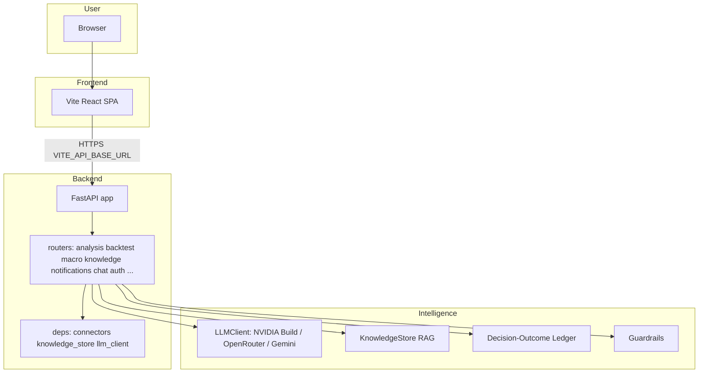
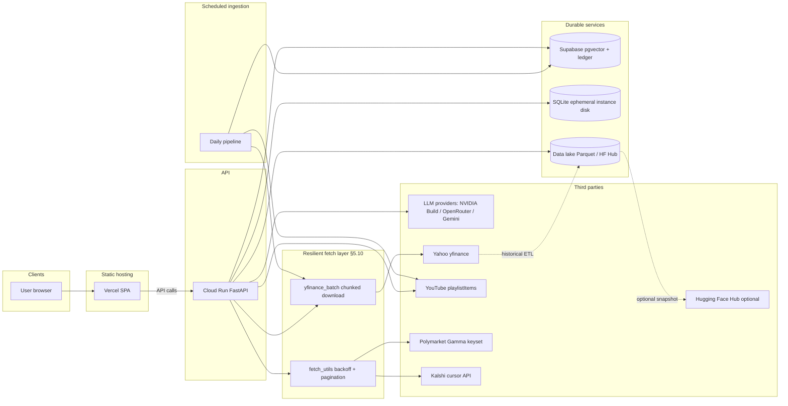
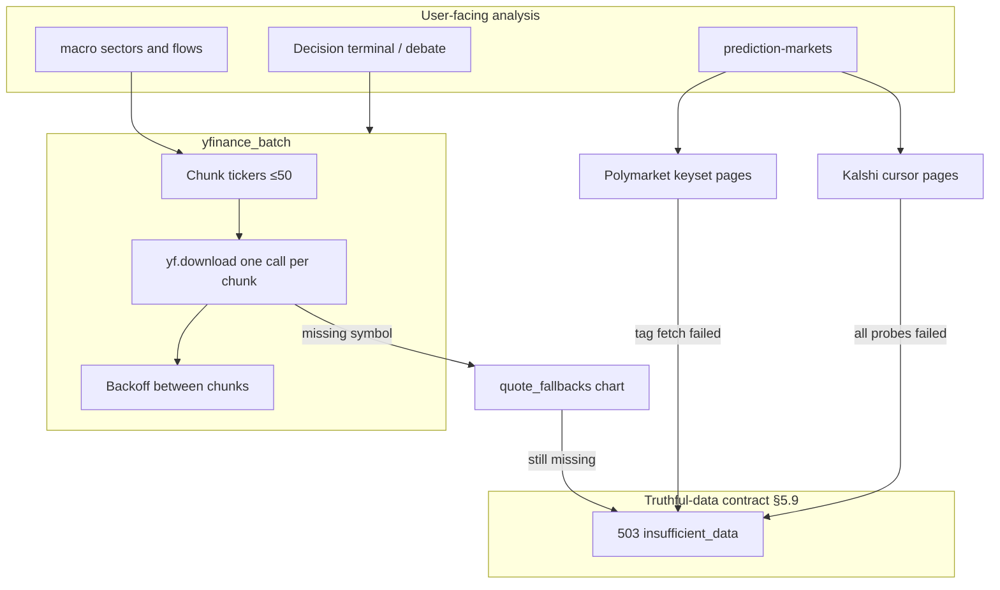

# TradeTalk architecture

This document describes how the TradeTalk platform is structured end to end: the browser app, the Python API, vector memory (RAG), external data sources, deployment on GCP Cloud Run + Vercel (Render is legacy), and every Hugging Face touchpoint. Use it as the single place to reason about changes before you refactor or extend the system.

**Related docs**

- [RAG_POLICY.md](./RAG_POLICY.md) — operational policy for ingestion, TTL, and PII around the knowledge store.
- [CRON.md](./CRON.md) — wake pings, secured pipeline triggers, GitHub Actions, and free-tier scale-to-zero behavior.
- [DECISION_LEDGER.md](./DECISION_LEDGER.md) — SQL-queryable substrate of agent decisions + multi-horizon outcomes (Harness Engineering Phase 2).
- [PHASE_F_INTELLIGENCE_FABRIC.md](./PHASE_F_INTELLIGENCE_FABRIC.md) — model-agnostic intelligence fabric: total ledger capture, single model gateway, capture observability.
- [PHASE_G_LIVE_DATA_PLAN.md](./PHASE_G_LIVE_DATA_PLAN.md) — research plan for the live market data / news / prediction data layer.
- [PHASE_HARNESS_SUPERINVESTOR.md](./PHASE_HARNESS_SUPERINVESTOR.md) — model-agnostic harness, predictor self-learning, `/harness/*` operator APIs.
- [GCP_API_DEPLOY.md](./GCP_API_DEPLOY.md) — Cloud Run backend deployment.
- [AGENTS.md](../AGENTS.md) — dev commands, env files, and single-process scaling constraints.

---

## 1. Purpose and how to maintain this document

- **Keep it accurate to the repo.** When you add a router, change `VECTOR_BACKEND`, or move data to a new store, update this file in the same PR.
- **Do not duplicate RAG policy** — link to `RAG_POLICY.md` for retention and collection rules.
- **Scaling:** The backend is designed as a **single process**. In-memory SSE clients, the L1 cache, APScheduler, and SQLite usage assume one worker. Multi-worker deployment requires a different message bus, shared cache, and database; see [AGENTS.md](../AGENTS.md).

---

## 2. System overview



At runtime, the **React** app (built with Vite) calls the **FastAPI** backend using the base URL from `VITE_API_BASE_URL` (see `frontend/.env.local`). The backend loads shared singletons from `backend/deps.py` (connectors, `knowledge_store`, `llm_client`, SSE state) and implements routes under `backend/routers/`.

---

## 3. Frontend

| Item | Detail |
|------|--------|
| **Stack** | React 19, Vite 7, React Router (`frontend/`). |
| **API base** | `API_BASE_URL` / `VITE_API_BASE_URL` points at the FastAPI host (local `http://localhost:8000` or your deployed Cloud Run URL). |
| **Auth** | Google OAuth when configured; dev mode can bypass with a dev user (`frontend/src/AuthContext.jsx`, backend `backend/auth`). |

**Primary routes** (see `frontend/src/App.jsx`):

| Path | UI module | Role |
|------|-----------|------|
| `/` | ConsumerUI | Valuation dashboard, swarm trace |
| `/decision-terminal` | DecisionTerminalUI | Decision terminal |
| `/macro` | MacroUI | Macro dashboard |
| `/gold` | GoldAdvisorUI | Gold advisor |
| `/chat` | ChatUI | Chat with RAG / context |
| `/debate` | DebateUI | Multi-agent debate |
| `/backtest` | BacktestUI | Strategy backtest |
| `/scorecard` | ScorecardUI | Risk-Return Ratio Scorecard (basket-level) |
| `/observer` | ObserverUI | Developer trace |
| `/systemmap` | SystemMapUI | Architecture map |
| `/challenge`, `/portfolio`, `/learning`, `/academy` | Gamification | Challenges, paper portfolio, learning path, video academy (often gated by `AuthGate`) |

---

## 4. Backend layout

| Piece | Location | Role |
|-------|----------|------|
| **App factory / lifecycle** | `backend/main.py` | `FastAPI` app, CORS, SQLite init for multiple feature DBs, **startup**: news scan loop, daily pipeline scheduler, market-intel jobs, keep-alive (non-Render), optional SP500 ingest |
| **Routers** | `backend/routers/*.py` | All HTTP routes (no handlers in `main.py` beyond wiring) |
| **Shared state** | `backend/deps.py` | Connectors, `knowledge_store`, `llm_client`, `sse_clients`, `last_trace_data` |
| **SSE** | Notifications router + `deps.sse_clients` | Real-time macro alerts to the browser |

**Route ownership (important):**

| Concern | Router file | Example paths |
|---------|-------------|----------------|
| Swarm + debate | `backend/routers/analysis.py` | `GET/POST /trace`, `GET/POST /debate` |
| Backtest | `backend/routers/backtest.py` | `POST /backtest`, validation helpers |
| Macro | `backend/routers/macro.py` | `GET /macro` |
| Notifications + SSE | `backend/routers/notifications.py` | `GET /notifications/stream`, history, `GET /notifications/trace` |
| Knowledge / pipelines | `backend/routers/knowledge.py` | `GET /knowledge/stats`, `POST /knowledge/pipeline-run`, `POST /knowledge/sp500-ingest` |
| Chat | `backend/routers/chat.py` | `/chat/*` |
| Risk-Return Scorecard | `backend/routers/scorecard.py` | `GET /scorecard/presets`, `POST /scorecard/compare`, `GET /scorecard/{ticker}` |
| Small cap | `backend/routers/small_cap.py` | `GET /small-cap-assessment/{ticker}` |
| Daily brief | `backend/routers/daily_brief.py` | `GET /daily-brief`, deep-refresh endpoints |
| House view / portfolio | `backend/routers/house_view.py`, `portfolio.py` | `GET /house-view`, `/portfolio/morning-brief` |
| Predictor | `backend/routers/analysis.py` | `POST /predictor/forecast` |
| Harness (operator) | `backend/routers/harness.py` | `/harness/replay`, `/harness/hit-rates`, `/harness/calibration`, `/harness/self-learning/run` |
| SEPL / registry (operator) | `backend/routers/sepl.py`, `resources.py` | `/sepl/*`, read-only `/resources/*` |
| Learning health (operator) | `backend/routers/debug.py` | `GET /learning-health` (ledger stats + capture coverage) |

**Naming note:** `GET /trace` (analysis router) runs the **swarm** and returns a `SwarmConsensus`. `GET /notifications/trace` returns the **last background news-scan trace** from memory — different purpose, different path.

---

## 5. Intelligence layer

### 5.1 LLM — the model gateway

`backend/llm_client.py` is the single entry point ("model gateway", Phase F) for every LLM call in the platform — streaming chat, agent JSON (`generate` / `generate_with_meta`), plain-text roles (`generate_plain_with_meta`, used by the predictor synthesizer/reviewer and RAG polish), and the SEPL candidate path (`generate_with_body_override`). The provider cascade is:

1. **NVIDIA Build** (OpenAI-compatible, preferred when `NVIDIA_API_KEY` is set or `LLM_HTTP_PROVIDER=nvidia`) — chat/JSON order `NVIDIA_LLM_MODEL_PRO` → `NVIDIA_LLM_MODEL_FLASH`, up to two tries per model.
2. **OpenRouter** — when `LLM_HTTP_PROVIDER=openrouter` or no NVIDIA keys (`OPENROUTER_API_KEY`, `OPENROUTER_MODEL`, optional `OPENROUTER_MODEL_LIGHT`).
3. **Gemini** (`backend/gemini_llm.py`) — last step of the cascade when `GEMINI_LLM_FALLBACK=1`, or primary for *every* call when `GEMINI_PRIMARY=1` (OpenRouter is then never consulted).
4. **Rule-based fallback** — when no provider succeeds (see verdict-role policy below).

**Default model IDs are centralized in `backend/model_defaults.py`** (Phase F gateway contract): no module outside the gateway may hardcode a provider model ID, so a model swap is an env/config change followed by the `/harness/replay` champion/challenger gate — never a code edit. The provider-cascade-aware label actually serving calls is computed by `backend/harness/backend_protocol.py::resolved_model_label()` and stamped on every ledger decision.

**Verdict-role fallback policy (truthful-data contract, §5.9):** `VERDICT_ROLES` in `llm_client.py` (bull, bear, macro, value, momentum, moderator, swarm_synthesizer, swarm_analyst, small_cap_analyst, scorecard_verdict, gold_advisor, sitg_scorer, execution_risk_scorer) must never be answered with a canned template — when no real model output is available the client raises `InsufficientDataError` so the user sees "insufficient data" instead of a fabricated verdict. Non-verdict roles (video text, daily-brief batch rows, ingestion judging, predictor narrative/review, decision-terminal roadmap JSON, news classifier) may still degrade gracefully to templates or static text.

All modes honor the same **role-to-tier mapping** (`MODEL_TIER` in `llm_client.py`, ~28 roles). Heavy roles (bull, bear, moderator, strategy_parser, gold_advisor, backtest_explainer, sitg_scorer, …) resolve to the pro/heavy model per provider; light roles (swarm_analyst, swarm_synthesizer, predictor_synthesizer, predictor_reviewer, ingestion_judge, rag_narrative_polish, video roles, scorecard_verdict, daily_brief_batch, …) resolve to the light tier (`OPENROUTER_MODEL_LIGHT` / `GEMINI_MODEL_LIGHT`). Both Gemini tiers default to the same flash-class model from `model_defaults.py`. Video clip generation is always Google Veo (`backend/video_generation_agent.py`, `VIDEO_VEO_MODEL`), independent of the chat cascade.

System prompts are resolved through the RSPL registry (§5.4) via `_resolve_system_prompt(role)`; every successful HTTP/Gemini call is cost-logged to the ledger's `llm_api_calls` table via `decision_ledger.log_llm_api_call()`.

### 5.2 Knowledge store (RAG)

`backend/knowledge_store.py` exposes a singleton **KnowledgeStore** used by swarm, debate, backtest, daily pipeline, chat, and reflection flows. Semantic retrieval uses named **collections** defined in `COLLECTIONS` (single source of truth — do not hardcode a count in UI without syncing).

Collections include (non-exhaustive; see code): `swarm_history`, `swarm_reflections`, `debate_history`, `macro_alerts`, `strategy_backtests`, `price_movements`, `macro_snapshots`, `youtube_insights`, `strategy_reflections`, `stock_profiles`, `earnings_memory`, `sp500_fundamentals_narratives`, `sp500_sector_analysis`, `chat_memories`.

### 5.3 Guardrails

`backend/agent_policy_guardrails.py` enforces workload capabilities, host allowlists, and startup checks (`GUARDRAILS_*` env vars).

### 5.4 Resource registry (RSPL, Phase A)

`backend/resource_registry.py` is a protocol-registered, versioned substrate for LLM prompts, following the Resource Substrate Protocol Layer from the [Autogenesis paper](https://arxiv.org/abs/2604.15034). Prompt bodies live under `backend/resources/prompts/*.yaml` (source of truth) and are seeded on startup into `backend/resources.db` (SQLite — schema in `backend/migrations/resources/`). Every LLM call via `LLMClient._resolve_system_prompt(role)` reads from the registry when `RESOURCES_USE_REGISTRY=1`, with automatic byte-exact fallback to the hardcoded `AGENT_SYSTEM_PROMPTS` dict on any failure. Swarm-analysis and reflection writes stamp `prompt_versions` + `registry_snapshot_id` into Chroma metadata so outcomes are traceable to the exact prompt versions that produced them. See **docs/RESOURCE_REGISTRY.md** for the full lifecycle (register → update → restore), the Phase A `learnable`-vs-pinned policy, and the read-only `/resources/*` HTTP surface.

### 5.5 Self-Evolution Protocol Layer (SEPL, Phase B)

`backend/sepl.py` closes the evolution loop on top of §5.4. It implements the Autogenesis §3.2 operator algebra — Reflect, Select, Improve, Evaluate, Commit — as pure, injection-friendly functions orchestrated by `SEPL.run_cycle()`. Improvements are drafted by the pinned `sepl_improver` meta-prompt, scored against per-prompt held-out fixtures in `backend/resources/sepl_eval_fixtures/`, and promoted only when `candidate - active ≥ SEPL_MIN_MARGIN`. Every path terminates in a typed `SEPLOutcome` so nothing crashes; every commit is lineage-stamped with `actor="sepl:<run_id>"` and a `sepl` metadata block capturing scores/margin/fixtures used. A companion `SEPLKillSwitch` watches post-commit effectiveness in `swarm_reflections` and calls `registry.restore()` (actor `sepl:rollback:<run_id>`) when the new version regresses against its pre-commit baseline by more than `SEPL_ROLLBACK_MARGIN`. The whole layer is gated behind `SEPL_ENABLE=0` by default; even when enabled, scheduled ticks run in dry-run unless `SEPL_AUTOCOMMIT=1`, and every manual `/sepl/*` write endpoint requires an explicit `commit: true` flag in the request body. See **docs/SEPL.md** for the full operator contracts, safety invariants, feature-flag matrix, and the 64 Phase B tests.

### 5.6 Risk-Return Ratio Scorecard

The Scorecard surface (`/scorecard` in the SPA, `POST /scorecard/compare` +
`GET /scorecard/{ticker}` on the API) is a **standalone, parallel path** to
the IC debate: it scores a basket of 1-10 tickers on a dimensionless
risk-to-return ratio using a **hybrid deterministic-plus-LLM** model.

- **Deterministic math** (`backend/scorecard.py`, tested by
  `backend/tests/test_scorecard_math.py`) owns normalization, PE-stretch
  computation (`MAX(0, fwd_PE / hist_avg_PE - 1)`), weighted `ReturnScore`
  and `RiskScore` aggregation, investor-type presets (Balanced / Growth /
  Value / Income), Step-7 situational adjustments (bear-market beta
  doubling, M&A execution penalty, CEO-selling SITG haircut, etc.),
  quadrant classification, and the Step-3 interpretation bands.
- **Data connector** — `backend/connectors/scorecard_data.py` pulls
  forward-PE, a 5-year historical average PE proxy, beta, EPS / revenue
  growth, analyst price-target upside, dividend yield, debt-to-equity,
  and 12-month Form 4 insider activity from yFinance (with the data lake
  as a price-history fallback). Partial missing fields are surfaced back
  to the UI as data-quality notes; a **total** fetch failure raises
  `InsufficientDataError` (§5.9) instead of scoring a zero-filled row.
- **LLM personas** (all registered in §5.4 and tested by
  `backend/tests/test_sitg_prompt.py`) cover only the judgment-heavy
  factors that are not cleanly derivable from numbers:
  - `sitg_scorer` — Step 2e Skin-In-The-Game (0-10) with Form 4 +
    DEF 14A signals. Functions as a **return-score amplifier**.
  - `execution_risk_scorer` — Step 2c qualitative execution risk (1-10)
    calibrated to the company profile (utility / industrial /
    high-growth / turnaround).
  - `scorecard_verdict` — one-sentence narrative per ticker (Strong /
    Favorable / Balanced / Stretched / Avoid).
- **Router** — `backend/routers/scorecard.py` orchestrates
  connector → LLM → math → verdict and emits the `BasketResult` payload
  the frontend renders. A `skip_llm_scores` flag in the request body
  forces the safe fallback SITG=3 / exec=5 scores for fast previews and
  is what `e2e/scorecard.spec.js` uses for the smoke.
- **Tests** — math (`test_scorecard_math.py`), router with stubbed
  connector + fakes (`test_scorecard_router.py`), and prompt / fixture
  schema-conformance (`test_sitg_prompt.py`). End-to-end smoke in
  `e2e/scorecard.spec.js` navigates `/scorecard`, runs a basket in
  skip-LLM mode, and asserts the SITG-boost column appears.

The methodology is **additive** — the IC debate contract
(`headline` / `key_points` / `confidence`) and its 5-agent architecture
are untouched. If the Scorecard surface is disabled (router not
included, or route hidden in the SPA), all other flows keep working.

### 5.7 Tool evolution (SEPL-for-TOOLs, Phase C1 + C2)

Phase C extends the registry to a second resource kind — `TOOL` — and evolves its *numeric configuration* rather than its source code. The surface lives in four files: `backend/resources/tools/*.yaml` (canonical configs + per-key `parameter_ranges`), `backend/tool_handlers.py` (pure, deterministic handler functions per tool), `backend/tool_configs.py` (dual-read getter + SEPL-facing `update_tool_config` writer), and `backend/sepl_tool.py` (Select/Improve/Evaluate/Commit + kill switch). Seven safety differences from §5.5 make this path materially lower-risk than prompt evolution: (1) **Improve is NOT an LLM call** — it is a bounded random walk inside the declared ranges, so prompt injection and unbounded drift are structurally impossible; (2) **Evaluate is 100% offline**, scoring active vs candidate configs against held-out JSON fixtures in `backend/resources/sepl_eval_fixtures_tools/` and never touching live traffic or connectors; (3) **Commit goes through `update_tool_config`** which validates against the YAML schema, refuses unknown keys, and honors `learnable=False` pinning; (4) **Tier-aware budget gate** — tools declare a `tier` (0 pure, 1 external read, 2 external write, 3 critical/irreversible) and Commit enforces `min(SEPL_TOOL_MAX_PER_DAY, SEPL_TOOL_MAX_PER_DAY_TIER_<N>)`, with tier-2+ defaulted to `0` so SEPL cannot touch any tool with external side-effects; (5) **Dual-read** — every agent/connector that uses a TOOL config calls `get_tool_config(name, default)`, which falls back byte-exactly to the hardcoded default when `RESOURCES_USE_REGISTRY=0` or the resource is missing, guaranteeing the pre-evolution behaviour is always recoverable by flipping a single flag; (6) **`SEPLToolKillSwitch`** re-evaluates both the committed and the `from_version` config against the same fixtures SEPL used at commit time and calls `registry.restore()` (actor `sepl:tool:rollback:<run_id>`) when the prior beats the new one by `SEPL_TOOL_ROLLBACK_MARGIN`; the switch skips SEPL commits that have already been rolled back (preventing loops) and skips non-SEPL actors (so manual human tweaks are never reverted); (7) **Every layer is off by default** — `SEPL_TOOL_ENABLE=0`, `SEPL_TOOL_DRY_RUN=1`, and `SEPL_TOOL_AUTOCOMMIT=0`. Tier-0 tools shipped in Phase C1: `short_interest_classifier`, `debate_stance_heuristic_bull`, `debate_stance_heuristic_bear`. Tier-1 tool shipped in Phase C2: `macro_vix_to_credit_stress` (VIX→CSI divisor and stress threshold). See **docs/TOOL_EVOLUTION.md** for the operator contracts, fixture format, and the ~125 tool-scoped tests; see `backend/.env.example` for the full feature-flag matrix.

### 5.8 Decision-Outcome Ledger (Harness Engineering Phase 2)

`backend/decision_ledger.py` is the SQL-queryable substrate under every user-facing agent decision. Six tables (`decision_events`, `decision_evidence`, `feature_snapshots`, `outcome_observations`, `contract_violations`, `llm_api_calls`) capture what the agent decided, which RAG chunks it cited (`knowledge_store.query_with_refs` threads `chunk_id` + `relevance` through every retrieval; `decision_ledger.evidence_from_chunk_refs()` is the shared converter), which prompt versions + model produced it (`registry_attribution(roles=[...])` stamps the roles a decision actually used + `registry_snapshot_id`, Phase F), and the multi-horizon market-truth grades a later scheduler tick attaches to it.

**Producers (Phase F: every verdict surface emits):** `swarm` (consolidated `/trace` consensus) + `swarm_factor` per agent pair (`backend/agents.py`), `debate` (`backend/debate_agents.py`), `chat_turn` + chat tools `risk_assessment` / `what_if_backtest` (`backend/routers/chat.py`), `decision_terminal` (`backend/decision_terminal.py`), `scorecard` (`backend/routers/scorecard.py`), `gold_advisor` (`backend/gold_advisor_service.py`), `small_cap_assessment` (`backend/routers/small_cap.py`), `backtest_verdict` (`backend/routers/backtest.py`), `daily_brief` (LLM-refined screener rows, capped by `DAILY_BRIEF_LEDGER_EMIT_MAX`, `backend/daily_brief.py`), `price_forecast` (`backend/predictor/ledger_emit.py`), `house_view` (`backend/house_view.py`), `morning_brief` (`backend/morning_brief.py`), and `macro_flow_signal` (`backend/macro_flow/orchestrator.py`). Each producer calls `emit_decision` in a `try/except` so ledger failure never breaks user-facing flows, and every emit dual-writes a `decision_emitted` CORAL handoff so the existing dreaming / meta-harness surfaces keep working unchanged. Capture completeness is observable at `GET /learning-health` → `ledger.capture_coverage_24h` (per-`decision_type` counts + evidence/feature percentages). `backend/outcome_grader.py` runs at **02:10 UTC** via APScheduler (only when `DECISION_LEDGER_ENABLE=1`), writes `price_return_pct` / `excess_return_vs_spy_pct` / `risk_adjusted_return` over `1d/5d/21d/63d`, and derives `correct_bool` from the verdict × excess-return rule. `backend/contract_validator.py` feeds `contract_violations` via `install_contract_validator_sink()` so model-drift per prompt version is answerable with a single `GROUP BY`. Three consumers close the loop: `DecisionLedgerReflectionSource` in §5.5 feeds SEPL with real graded outcomes (not LLM self-grades); `backend/feature_correlations.py` + the `v_feature_hit_rate` SQLite view / Supabase MV rank `(feature, regime, horizon)` by hit-rate and mean excess return; and `backend/model_swap_replay.py` re-runs historical decisions through a candidate model and returns a structured `ReplayReport` so operators can gate a model swap on a measurable delta — exposed over HTTP via the **`/harness/*` operator APIs** (`backend/routers/harness.py`: `/harness/replay`, `/harness/hit-rates`, `/harness/calibration`, `/harness/model-backtest`, `/harness/self-learning/run`; see [PHASE_HARNESS_SUPERINVESTOR.md](./PHASE_HARNESS_SUPERINVESTOR.md)). Feature flags: `DECISION_LEDGER_ENABLE` (master switch, default on), `DECISION_BACKEND` (`sqlite` | `supabase` | `none`), `CONTRACT_VALIDATOR_ENABLE`, `OUTCOME_GRADER_BATCH`. See **docs/DECISION_LEDGER.md** for the full schema, producer-authoring rules, example queries, and Supabase bootstrap.

### 5.9 Truthful-data contract (insufficient_data)

**Policy: no user-facing surface may deliver a final verdict, analysis, or chart built on fabricated, placeholder, or silently-degraded data.** When a required live source (yfinance, FinCrawler, FRED, Google News RSS, Polymarket, Kalshi, LLM provider, …) cannot deliver, the producer raises `backend.data_errors.InsufficientDataError` instead of substituting defaults. A global FastAPI handler in `backend/main.py` converts it into **HTTP 503** with a stable body:

```json
{
  "error": "insufficient_data",
  "source": "yfinance",
  "message": "No usable 6-month price history for AAPL; ...",
  "ticker": "AAPL",
  "missing": ["price_history_6mo"]
}
```

**The truthfulness line:** a *failed fetch* must never be reported as a real result — but an *empty result from a successful fetch* (e.g. "no recent news coverage", "no open prediction markets") is real data and flows through normally.

What raises (instead of the previous silent fallbacks):

| Producer | Previously fabricated | Now |
|----------|----------------------|-----|
| `connectors/debate_data.py` | Spot-only records with zeroed 1m/3m/6m returns and synthetic ±12 % 52-week bands; all-zero "empty shell" | Raises when 6-month history is unavailable |
| `connectors/macro.py` | VIX `15.0` placeholder; zeroed sector %; empty capital flows; **simulated** consumer-spending and cash-reserve chart series; mock `k_shape` indicator | Raises on VIX/sector/flow failure; the two unsourced chart series are returned **empty** (no live source is wired); mock indicator removed |
| `connectors/fundamentals.py` / `shorts.py` | `0` cash/debt and `0 %` short interest on failure | Raises (missing short data is reported as missing, not 0 %) |
| `connectors/social.py` | Silent empty titles on RSS failure | Raises on transport/parse failure; genuine zero-coverage still returns `[]` |
| `connectors/polymarket.py` / `kalshi.py` | Failed API calls reported as "no relevant markets" | Raises when tag fetches fail / all Kalshi requests fail |
| `connectors/investor_metrics.py` | Random 8-point "sparklines", fabricated `historical` deltas (`roe*0.9` etc.), RSI **proxy** from 1-month return | `history: []`, `historical/trend: "N/A"`, no proxies; raises when both primary and fallback fetches fail |
| `connectors/scorecard_data.py` | Zero-filled `_empty_scorecard_fields` row | Raises (partial-field gaps are still flagged in `fields_missing`) |
| `predictor/agent.py` | **Synthetic** random-walk price series (`price_source: "synthetic"`); `MockTimesFMClient` quantile bands served as live forecasts | Returns `status: "insufficient_data"`, `executed: false`. The mock client is test/eval-only; quantile bands come **only** from the deployed TimesFM service. `PREDICTOR_BACKEND=baselines_only` opts into transparent statistical baselines (point forecasts only, no q10/q90 bands, `model_confidence: "low"`) |
| `decision_terminal.py` roadmap | No-data heuristic of arbitrary spot multiples (×1.36 / ×1.12 / ×0.82); misscaled LLM scenarios silently replaced with the same multiples | Heuristic requires a **real** historical 3Y CAGR; otherwise the roadmap panel returns `null` prices with an honest assumption note. Misscaled model output is dropped, never substituted |
| `frontend/DailyBriefUI.jsx` | Hardcoded `MOCK_LOSERS` / `MOCK_HOLDINGS` / `MOCK_NEWS` rows, stale hardcoded market-cap/P-E table, injected `MRVL/EWY/AMZN` news tickers, fabricated "Neutral" insider labels | Explicit empty states ("Live … data is unavailable"); metadata renders `N/A` when missing; only real portfolio tickers queried |
| `llm_client.py` | `FALLBACK_TEMPLATES` verdicts (NEUTRAL moderator, all-yellow small-cap, default SITG/exec scores, …) | `VERDICT_ROLES` raise; non-verdict roles keep templates (§5.1) |
| `gold_advisor_service.py` | Placeholder briefing on invalid LLM output; ran without gold OHLC | Raises on missing gold data or invalid briefing |
| `routers/macro.py` `/metrics`, `/macro/global-markets` | `metrics: {}` / empty series on failure | Raise |
| `routers/analysis.py` `/prediction-markets` | Per-source error masked as `has_relevant_data: false` | Raises |
| `routers/scorecard.py` personas | Default SITG=3 / exec=5 on LLM failure | Raise (explicit `skip_llm_scores=true` opt-out is unchanged) |

**Heuristics vs fabrication:** deterministic computations over *real* fetched data (e.g. the decision-terminal heuristic roadmap from live price + historical CAGR, provenance-stamped `source: "heuristic"`) are allowed — the contract bans *invented inputs*, not transparent models.

**Frontend:** `apiFetch` (`frontend/src/api.js`) detects the `insufficient_data` body, marks the thrown error with `isInsufficientData`, and `AnalysisContext.jsx` treats any insufficient-data refusal as a full analysis error (no more "partial success" dashboards) with the backend's message shown to the user.

**Tests:** `backend/tests/test_insufficient_data.py` (offline, mocked I/O) plus the rewritten `test_debate_data_fallback.py` and `test_gemini_primary_routing.py` encode this contract.

---

## 6. Vector backends and embeddings

`VECTOR_BACKEND` selects how vectors are stored. Implementations: `backend/vector_backends.py`; wiring: `backend/knowledge_store.py`.

| `VECTOR_BACKEND` | Storage | Query-time embeddings | Typical use |
|------------------|---------|------------------------|-------------|
| `chroma` | ChromaDB — persistent path `CHROMA_PATH` (default `./chroma_db`) | Default: Chroma’s embedding; on **Render** with `HF_TOKEN`: **Hugging Face Inference API** via `InferenceClient` (`HfInferenceRouterEmbeddingFunction`), model `HF_EMBEDDING_MODEL` or `sentence-transformers/all-MiniLM-L6-v2` | Local dev; optional Render if not using Supabase |
| `supabase` | Supabase table `vector_memory` + RPC `match_vector_memory` | **OpenRouter** when `OPENROUTER_EMBEDDING_MODEL` and `OPENROUTER_API_KEY` are set (not Hugging Face) | **Default in checked-in `render.yaml`** — durable across restarts |
| `hf` | In-memory Chroma loaded from a **Hugging Face Dataset** JSON export | Pre-serialized embeddings in the file when present; else Chroma embeds | Demos / read-only snapshot mode |

**Production default in this repo:** [`render.yaml`](../render.yaml) sets `VECTOR_BACKEND=supabase`. So **Hugging Face is not the default embedding provider on Render** for the main app — Supabase + OpenRouter embeddings are.

**Supabase bootstrap:** Run [`backend/supabase_pgvector_bootstrap.sql`](../backend/supabase_pgvector_bootstrap.sql) in the Supabase SQL editor before first use of `VECTOR_BACKEND=supabase` (the backend fails fast if the schema is missing).

---

## 7. Hugging Face (all integrations)

| Use | Mechanism | Env / files |
|-----|-----------|-------------|
| **Remote embeddings (Chroma on Render)** | `huggingface_hub.InferenceClient` — `HfInferenceRouterEmbeddingFunction` | `RENDER`, `HF_TOKEN`, optional `HF_EMBEDDING_MODEL` — [`backend/vector_backends.py`](../backend/vector_backends.py) |
| **Read-only RAG snapshot** | `VECTOR_BACKEND=hf` downloads `rag_summaries/all_summaries.json` from a dataset | `HF_DATASET_ID`, `HF_TOKEN` (if private) — [`backend/knowledge_store.py`](../backend/knowledge_store.py) |
| **Backtest / Parquet hub** | Read Parquet from a Hub dataset | `HF_DATASET_REPO`, `HF_DATASET_REVISION`, optional `HF_TOKEN` — [`backend/connectors/backtest_data_hub.py`](../backend/connectors/backtest_data_hub.py), [`backend/connectors/backtest_data.py`](../backend/connectors/backtest_data.py) |
| **Data lake prices / fundamentals** | Optional download from Hub | `DATA_LAKE_SOURCE=hf`, `HF_DATASET_ID` — [`backend/data_lake/config.py`](../backend/data_lake/config.py), [`backend/decision_terminal.py`](../backend/decision_terminal.py) |
| **ETL upload** | Scripts / CI push datasets | [`scripts/hf_backtest_etl.py`](../scripts/hf_backtest_etl.py), [`.github/workflows/backtest-data-etl.yml`](../.github/workflows/backtest-data-etl.yml) |
| **HF Space keep-alive (optional)** | Background ping loop targets `HF_SPACE_URL` | [`backend/keep_alive.py`](../backend/keep_alive.py) — **disabled when `RENDER` is set** so Render does not ping HF Spaces |

---

## 8. Data sources (connectors)

Implemented under `backend/connectors/` and used by agents and pipelines:

- **yFinance** — equities, shorts, sectors, historical prices, etc. Batched via `yfinance_batch.py` (§5.10).
- **Google News RSS** — macro keyword scans (`news_scanner`).
- **Polymarket** — prediction markets (`polymarket.py`); keyset/offset pagination.
- **Kalshi** — prediction markets (`kalshi.py`); cursor pagination.
- **FRED** — macro series (`fred.py`).
- **YouTube** — finance channels (`youtube.py`); uploads-playlist ingestion (1 unit/page).
- **Shared HTTP** — backoff + pagination helpers (`fetch_utils.py`).

All connectors follow the **truthful-data contract** (§5.9): a fetch failure raises `InsufficientDataError` (HTTP 503 `insufficient_data`) instead of returning placeholder/zero/synthetic values; an empty result from a *successful* fetch is real data and is returned normally.

See **§5.10 Resilient free-API fetching** for batching, pagination, and quota-aware ingestion patterns shared across connectors.

---

### 5.10 Resilient free-API fetching (batching & pagination)

Free market-data APIs enforce **per-IP / per-key quotas**, not “more parallel calls = more quota.” TradeTalk therefore:

| Source | Pattern | Module | Effect |
|--------|---------|--------|--------|
| **yfinance (Yahoo)** | **Chunked batch download** — `yf.download` over ≤50 tickers per call, exponential backoff + inter-chunk delay between chunks; per-symbol fallback via `quote_fallbacks` | [`backend/connectors/yfinance_batch.py`](../backend/connectors/yfinance_batch.py) | Fewer HTTP round-trips for macro sectors, capital-flow proxies, and `/macro/global-markets`; avoids N separate `.info` calls |
| **YouTube Data API** | **Uploads playlist** — `playlistItems.list` on each channel’s `UU…` playlist (1 unit/page) instead of `search.list` (100 units/call) | [`backend/connectors/youtube.py`](../backend/connectors/youtube.py) | ~12 quota units per daily ingestion vs ~600 previously; scans up to 150 recent uploads/channel |
| **Polymarket (Gamma)** | **Keyset pagination** on `/events/keyset` with offset fallback on `/events`; concurrent per-tag walks | [`backend/connectors/polymarket.py`](../backend/connectors/polymarket.py) | Up to `POLYMARKET_MAX_PAGES` × `POLYMARKET_PAGE_SIZE` events/tag (default 5×100) |
| **Kalshi Trade API v2** | **Cursor pagination** on `/events` and `/markets` open scans; series-scoped calls stay single-page | [`backend/connectors/kalshi.py`](../backend/connectors/kalshi.py) | Up to `KALSHI_MAX_PAGES` × `KALSHI_PAGE_SIZE` items (default 3×200) per scan |
| **All HTTP connectors above** | Shared **429/5xx backoff** + optional `Retry-After` honour | [`backend/connectors/fetch_utils.py`](../backend/connectors/fetch_utils.py) | Transient failures retry; persistent failures still raise `InsufficientDataError` |

**Env tuning (optional):** `YFINANCE_BATCH_CHUNK_SIZE`, `YFINANCE_BATCH_INTER_CHUNK_DELAY_S`, `POLYMARKET_PAGE_SIZE`, `POLYMARKET_MAX_PAGES`, `KALSHI_PAGE_SIZE`, `KALSHI_MAX_PAGES`.

**What divide-and-conquer does *not* do:** firing 50 parallel yfinance calls does not increase Yahoo’s rate limit — it usually triggers 429 sooner. Chunked **batching** (one download, many tickers) plus **cache TTLs** (`connector_cache`) and the **data lake** for historical bars are the durable levers.

---

## 9. Persistence

| Store | Location / mechanism | Contents |
|-------|----------------------|----------|
| **SQLite (app)** | Files under backend (see `alert_store`, `user_progress`, etc.) | Macro alerts, user progress, XP, badges, portfolio, challenges, learning, academy, preferences, **`chat_sessions`** (sticky state + RAG prewarm + last evidence; survives process restart), agent memory, **CORAL hub** (notes / skills / handoff events share `progress.db` via `PROGRESS_DB_PATH`) — initialized from `backend/main.py` |
| **SQLite (intelligence)** | `DECISIONS_DB_PATH` (default `backend/decisions.db`), `RESOURCES_DB_PATH` (`backend/resources.db`), `HARNESS_DB_PATH` (`harness.db`) | Decision-Outcome Ledger (§5.8; `DECISION_BACKEND=supabase` for durable production), RSPL prompt/tool versions (§5.4, reseeded from YAML on boot), harness replay reports |
| **Supabase** | `vector_memory` (+ optional `decision_events` family via `supabase_decisions_bootstrap.sql`) | Embeddings + documents per collection when `VECTOR_BACKEND=supabase`; durable ledger when `DECISION_BACKEND=supabase` |
| **Chroma** | `CHROMA_PATH` on disk | Local / non-Supabase vector persistence |

**Chat memory (three tiers):** (1) **Working session** — rows in `chat_sessions` plus an in-process cache in `chat_service`; the client can send `resume_session_id` on `POST /chat/session` to continue after refresh. (2) **Structured user profile** — `user_preferences` (JSON per user) plus chat tools `recall_financial_profile` / `save_financial_preference`. (3) **Semantic recall** — `agent_memory` SQLite history + `chat_memories` vectors. **CORAL** hub rows are market/agent priors, not end-user identity.

The deployed filesystem (Cloud Run, or Render without a disk) is **ephemeral**; durable vectors should use **Supabase**, not local Chroma, and the decision ledger should run with `DECISION_BACKEND=supabase` in production.

---

## 10. Deployment

### 10.1 Backend (GCP Cloud Run — primary; Render legacy)

The backend deploys to **GCP Cloud Run** via [`cloudbuild.api.yaml`](../cloudbuild.api.yaml) (see [GCP_API_DEPLOY.md](./GCP_API_DEPLOY.md) for the full procedure; `docker-compose.gcp.yml` mirrors it locally). [`render.yaml`](../render.yaml) is retained as the **legacy** Render definition and still documents the canonical env matrix:

- **Start:** `uvicorn backend.main:app --host 0.0.0.0 --port $PORT`
- **Env (examples):** `VECTOR_BACKEND=supabase`, `SUPABASE_URL`, secrets for `SUPABASE_SERVICE_ROLE_KEY`, `CORS_ORIGINS` (your Vercel origin), `SP500_INGEST_ON_STARTUP=0` to avoid heavy Yahoo ingest on small instances / datacenter IP limits

**Scale-to-zero caveat (applies to Cloud Run min-instances=0 and Render free tier alike):** while no instance is warm, **no in-process schedulers run** (APScheduler, news loop, market intel). External wake pings and cron-triggered pipeline posts are documented in [CRON.md](./CRON.md). The filesystem is **ephemeral** — durable state belongs in Supabase (vectors, optionally the decision ledger via `DECISION_BACKEND=supabase`) or Cloud SQL (paper portfolio, [GCP_POSTGRES.md](./GCP_POSTGRES.md)).

**How the deployed app is “fed”:** There is no continuous bulk sync from Git into the vector DB. **Deploys** push new code; **configuration** comes from service env vars; **optional** scheduled HTTP calls (GitHub Actions or external cron) hit secured endpoints such as `POST /knowledge/pipeline-run` and wake `GET /docs` — see [CRON.md](./CRON.md).

### 10.2 Frontend (Vercel)

Static build of the Vite app (`frontend/vercel.json` for SPA routing). Set `VITE_API_BASE_URL` to the backend (Cloud Run) service URL.

### 10.3 CORS

`backend/main.py` allows localhost dev origins and `CORS_ORIGINS`; regex allows `https://*.vercel.app`.

---

## 11. Scheduled jobs and external triggers

Inside the **running** process:

- **News scan loop** — ~60s cycle, updates alerts and can write to the knowledge store.
- **Daily pipeline** — APScheduler (`backend/daily_pipeline.py`) — ingests movers, FRED, YouTube, etc., into KnowledgeStore.
- **Market intel** — additional scheduled refresh jobs from `main.py`.

**Scale-to-zero (Cloud Run min-instances=0 / Render free tier):** the service sleeps without incoming traffic; while asleep, **no** in-process schedulers run. External **wake** requests and **cron-triggered** pipeline posts are documented in [CRON.md](./CRON.md). Key scheduled jobs when warm: daily pipeline 00:00 UTC, CORAL dreaming 01:40, outcome grader 02:10, predictor self-learning 02:40, portfolio snapshots 22:30, market-L1 refresh every 15 min, market-intel fast/slow every 10/30 min, CORAL heartbeat every 30 min (`backend/daily_pipeline.py`, `backend/main.py`).

`keep_alive.py` is for keeping a **Hugging Face Space** awake; on Render it exits early — do not rely on it for service uptime.

---

## 12. Environment variables (grouped)

See [`backend/.env.example`](../backend/.env.example) for the full local matrix. Summary:

| Group | Variables |
|-------|-----------|
| **LLM provider selection** | `LLM_HTTP_PROVIDER` (`nvidia` \| `openrouter`), `GEMINI_PRIMARY`, `GEMINI_LLM_FALLBACK`, `GEMINI_INSTANT_OPENROUTER_FAILOVER` |
| **LLM (NVIDIA Build)** | `NVIDIA_API_KEY`, `NVIDIA_API_KEY_2`, `NVIDIA_LLM_BASE_URL`, `NVIDIA_LLM_MODEL_PRO`, `NVIDIA_LLM_MODEL_FLASH` |
| **LLM (OpenRouter)** | `OPENROUTER_API_KEY`, `OPENROUTER_BASE_URL`, `OPENROUTER_MODEL`, `OPENROUTER_MODEL_LIGHT`, `OPENROUTER_EMBEDDING_MODEL` |
| **LLM (Gemini / Veo)** | `GEMINI_API_KEY` / `GOOGLE_API_KEY`, `GEMINI_MODEL`, `GEMINI_MODEL_LIGHT`, `GEMINI_VISION_MODEL`, `VIDEO_VEO_MODEL` — defaults live in `backend/model_defaults.py` |
| **Vectors / RAG** | `VECTOR_BACKEND`, `CHROMA_PATH`, `RAG_TOP_K`, `RAG_TOP_K_MAX` |
| **Supabase** | `SUPABASE_URL`, `SUPABASE_SERVICE_ROLE_KEY` |
| **Hugging Face** | `HF_TOKEN`, `HF_DATASET_ID`, `HF_DATASET_REPO`, `HF_EMBEDDING_MODEL`, `HUGGING_FACE_HUB_TOKEN` (aliases in some connectors) |
| **Intelligence fabric** | `DECISION_LEDGER_ENABLE`, `DECISION_BACKEND`, `DECISIONS_DB_PATH`, `RESOURCES_USE_REGISTRY`, `RESOURCES_DB_PATH`, `SEPL_ENABLE`, `SEPL_AUTOCOMMIT`, `SEPL_TOOL_ENABLE`, `HARNESS_API_ENABLE`, `DAILY_BRIEF_LEDGER_EMIT_MAX` |
| **Guardrails** | `GUARDRAILS_ENABLE`, `GUARDRAILS_STRICT_STARTUP`, `GUARDRAILS_ALLOWED_HOSTS` |
| **Cron security** | `PIPELINE_CRON_SECRET` — protects `POST /knowledge/pipeline-run` and `POST /knowledge/sp500-ingest` when set |
| **Data lake / ingest** | `SP500_INGEST_ON_STARTUP`, `DATA_LAKE_DAILY_INCREMENTAL`, `DATA_LAKE_SOURCE`, `HF_DATASET_ID` |
| **Platform** | `RENDER` (set by Render, legacy), `HF_SPACE_URL` (keep-alive target for HF Spaces only) |

---

## 13. Diagram: deployment and data flow



### 13.1 Connector fetch paths (live user query)



This architecture document is the intended **stable narrative** for onboarding and refactors; update it when behavior changes.
