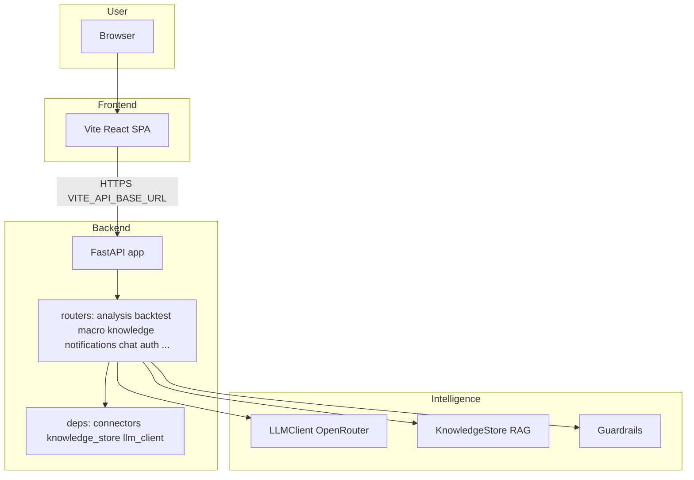
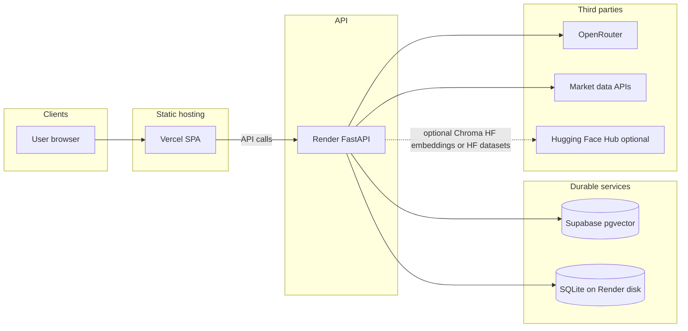

# TradeTalk architecture

This document describes how the TradeTalk platform is structured end to end: the browser app, the Python API, vector memory (RAG), external data sources, deployment on Render and Vercel, and every Hugging Face touchpoint. Use it as the single place to reason about changes before you refactor or extend the system.

**Related docs**

- [RAG_POLICY.md](./RAG_POLICY.md) — operational policy for ingestion, TTL, and PII around the knowledge store.
- [CRON.md](./CRON.md) — wake pings, secured pipeline triggers, GitHub Actions, and Render free-tier behavior.
- [AGENTS.md](../AGENTS.md) — dev commands, env files, and single-process scaling constraints.

---

## 1. Purpose and how to maintain this document

- **Keep it accurate to the repo.** When you add a router, change `VECTOR_BACKEND`, or move data to a new store, update this file in the same PR.
- **Do not duplicate RAG policy** — link to `RAG_POLICY.md` for retention and collection rules.
- **Scaling:** The backend is designed as a **single process**. In-memory SSE clients, the L1 cache, APScheduler, and SQLite usage assume one worker. Multi-worker deployment requires a different message bus, shared cache, and database; see [AGENTS.md](../AGENTS.md).

---

## 2. System overview

At runtime, the **React** app (built with Vite) calls the **FastAPI** backend using the base URL from `VITE_API_BASE_URL` (see `frontend/.env.local`). The backend loads shared singletons from `backend/deps.py` (connectors, `knowledge_store`, `llm_client`, SSE state) and implements routes under `backend/routers/`.

---

## 3. Frontend

| Item | Detail |
|------|--------|
| **Stack** | React 19, Vite 7, React Router (`frontend/`). |
| **API base** | `API_BASE_URL` / `VITE_API_BASE_URL` points at the FastAPI host (local `http://localhost:8000` or your Render URL). |
| **Auth** | Google OAuth when configured; dev mode can bypass with a dev user (`frontend/src/AuthContext.jsx`, backend `backend/auth`). |

**Primary routes** (see `frontend/src/App.jsx`):

| Path | UI module | Role |
|------|-----------|------|
| `/` | ConsumerUI | Valuation dashboard, swarm trace |
| `/decision-terminal` | DecisionTerminalUI | Decision terminal |
| `/macro` | MacroUI | Macro dashboard |
| `/gold` | GoldAdvisorUI | Gold advisor |
| `/chat` | ChatUI | Chat with RAG / context |
| `/debate` | DebateUI | Multi-agent debate |
| `/backtest` | BacktestUI | Strategy backtest |
| `/observer` | ObserverUI | Developer trace |
| `/systemmap` | SystemMapUI | Architecture map |
| `/challenge`, `/portfolio`, `/learning`, `/academy` | Gamification | Challenges, paper portfolio, learning path, video academy (often gated by `AuthGate`) |

---

## 4. Backend layout

| Piece | Location | Role |
|-------|----------|------|
| **App factory / lifecycle** | `backend/main.py` | `FastAPI` app, CORS, SQLite init for multiple feature DBs, **startup**: news scan loop, daily pipeline scheduler, market-intel jobs, keep-alive (non-Render), optional SP500 ingest |
| **Routers** | `backend/routers/*.py` | All HTTP routes (no handlers in `main.py` beyond wiring) |
| **Shared state** | `backend/deps.py` | Connectors, `knowledge_store`, `llm_client`, `sse_clients`, `last_trace_data` |
| **SSE** | Notifications router + `deps.sse_clients` | Real-time macro alerts to the browser |

**Route ownership (important):**

| Concern | Router file | Example paths |
|---------|-------------|----------------|
| Swarm + debate | `backend/routers/analysis.py` | `GET/POST /trace`, `GET/POST /debate` |
| Backtest | `backend/routers/backtest.py` | `POST /backtest`, validation helpers |
| Macro | `backend/routers/macro.py` | `GET /macro` |
| Notifications + SSE | `backend/routers/notifications.py` | `GET /notifications/stream`, history, `GET /notifications/trace` |
| Knowledge / pipelines | `backend/routers/knowledge.py` | `GET /knowledge/stats`, `POST /knowledge/pipeline-run`, `POST /knowledge/sp500-ingest` |
| Chat | `backend/routers/chat.py` | `/chat/*` |

**Naming note:** `GET /trace` (analysis router) runs the **swarm** and returns a `SwarmConsensus`. `GET /notifications/trace` returns the **last background news-scan trace** from memory — different purpose, different path.

---

## 5. Intelligence layer

### 5.1 LLM

`backend/llm_client.py` talks to **OpenRouter** (`OPENROUTER_API_KEY`, `OPENROUTER_MODEL`, optional `OPENROUTER_MODEL_LIGHT`). Without a key, the app can use rule-based fallbacks so features still respond.

### 5.2 Knowledge store (RAG)

`backend/knowledge_store.py` exposes a singleton **KnowledgeStore** used by swarm, debate, backtest, daily pipeline, chat, and reflection flows. Semantic retrieval uses named **collections** defined in `COLLECTIONS` (single source of truth — do not hardcode a count in UI without syncing).

Collections include (non-exhaustive; see code): `swarm_history`, `swarm_reflections`, `debate_history`, `macro_alerts`, `strategy_backtests`, `price_movements`, `macro_snapshots`, `youtube_insights`, `strategy_reflections`, `stock_profiles`, `earnings_memory`, `sp500_fundamentals_narratives`, `sp500_sector_analysis`, `chat_memories`.

### 5.3 Guardrails

`backend/agent_policy_guardrails.py` enforces workload capabilities, host allowlists, and startup checks (`GUARDRAILS_*` env vars).

---

## 6. Vector backends and embeddings

`VECTOR_BACKEND` selects how vectors are stored. Implementations: `backend/vector_backends.py`; wiring: `backend/knowledge_store.py`.

| `VECTOR_BACKEND` | Storage | Query-time embeddings | Typical use |
|------------------|---------|------------------------|-------------|
| `chroma` | ChromaDB — persistent path `CHROMA_PATH` (default `./chroma_db`) | Default: Chroma’s embedding; on **Render** with `HF_TOKEN`: **Hugging Face Inference API** via `InferenceClient` (`HfInferenceRouterEmbeddingFunction`), model `HF_EMBEDDING_MODEL` or `sentence-transformers/all-MiniLM-L6-v2` | Local dev; optional Render if not using Supabase |
| `supabase` | Supabase table `vector_memory` + RPC `match_vector_memory` | **OpenRouter** when `OPENROUTER_EMBEDDING_MODEL` and `OPENROUTER_API_KEY` are set (not Hugging Face) | **Default in checked-in `render.yaml`** — durable across restarts |
| `hf` | In-memory Chroma loaded from a **Hugging Face Dataset** JSON export | Pre-serialized embeddings in the file when present; else Chroma embeds | Demos / read-only snapshot mode |

**Production default in this repo:** [`render.yaml`](../render.yaml) sets `VECTOR_BACKEND=supabase`. So **Hugging Face is not the default embedding provider on Render** for the main app — Supabase + OpenRouter embeddings are.

**Supabase bootstrap:** Run [`backend/supabase_pgvector_bootstrap.sql`](../backend/supabase_pgvector_bootstrap.sql) in the Supabase SQL editor before first use of `VECTOR_BACKEND=supabase` (the backend fails fast if the schema is missing).

---

## 7. Hugging Face (all integrations)

| Use | Mechanism | Env / files |
|-----|-----------|-------------|
| **Remote embeddings (Chroma on Render)** | `huggingface_hub.InferenceClient` — `HfInferenceRouterEmbeddingFunction` | `RENDER`, `HF_TOKEN`, optional `HF_EMBEDDING_MODEL` — [`backend/vector_backends.py`](../backend/vector_backends.py) |
| **Read-only RAG snapshot** | `VECTOR_BACKEND=hf` downloads `rag_summaries/all_summaries.json` from a dataset | `HF_DATASET_ID`, `HF_TOKEN` (if private) — [`backend/knowledge_store.py`](../backend/knowledge_store.py) |
| **Backtest / Parquet hub** | Read Parquet from a Hub dataset | `HF_DATASET_REPO`, `HF_DATASET_REVISION`, optional `HF_TOKEN` — [`backend/connectors/backtest_data_hub.py`](../backend/connectors/backtest_data_hub.py), [`backend/connectors/backtest_data.py`](../backend/connectors/backtest_data.py) |
| **Data lake prices / fundamentals** | Optional download from Hub | `DATA_LAKE_SOURCE=hf`, `HF_DATASET_ID` — [`backend/data_lake/config.py`](../backend/data_lake/config.py), [`backend/decision_terminal.py`](../backend/decision_terminal.py) |
| **ETL upload** | Scripts / CI push datasets | [`scripts/hf_backtest_etl.py`](../scripts/hf_backtest_etl.py), [`.github/workflows/backtest-data-etl.yml`](../.github/workflows/backtest-data-etl.yml) |
| **HF Space keep-alive (optional)** | Background ping loop targets `HF_SPACE_URL` | [`backend/keep_alive.py`](../backend/keep_alive.py) — **disabled when `RENDER` is set** so Render does not ping HF Spaces |

---

## 8. Data sources (connectors)

Implemented under `backend/connectors/` and used by agents and pipelines:

- **yFinance** — equities, shorts, sectors, historical prices, etc.
- **Google News RSS** — macro keyword scans (`news_scanner`).
- **Polymarket** — prediction markets (`polymarket.py`).
- **FRED** — macro series (`fred.py`).
- **YouTube** — finance channels (`youtube.py`).

---

## 9. Persistence

| Store | Location / mechanism | Contents |
|-------|----------------------|----------|
| **SQLite** | Files under backend (see `alert_store`, `user_progress`, etc.) | Macro alerts, user progress, XP, badges, portfolio, challenges, learning, academy, preferences, agent memory — initialized from `backend/main.py` |
| **Supabase** | `vector_memory` | Embeddings + documents per collection when `VECTOR_BACKEND=supabase` |
| **Chroma** | `CHROMA_PATH` on disk | Local / non-Supabase vector persistence |

Render’s filesystem is **ephemeral** unless you attach a disk; durable vectors on Render should use **Supabase**, not local Chroma, for production.

---

## 10. Deployment

### 10.1 Backend (Render)

[`render.yaml`](../render.yaml) defines a **Python** web service:

- **Build:** `pip install -r backend/requirements.txt`
- **Start:** `uvicorn backend.main:app --host 0.0.0.0 --port $PORT`
- **Env (examples):** `VECTOR_BACKEND=supabase`, `SUPABASE_URL`, secrets for `SUPABASE_SERVICE_ROLE_KEY`, `CORS_ORIGINS` (your Vercel origin), `SP500_INGEST_ON_STARTUP=0` to avoid heavy Yahoo ingest on small instances / datacenter IP limits

**How the deployed app is “fed”:** There is no continuous bulk sync from Git into the vector DB. **Deploys** push new code; **configuration** comes from Render env vars; **optional** scheduled HTTP calls (GitHub Actions or external cron) hit secured endpoints such as `POST /knowledge/pipeline-run` and wake `GET /docs` — see [CRON.md](./CRON.md).

### 10.2 Frontend (Vercel)

Static build of the Vite app (`frontend/vercel.json` for SPA routing). Set `VITE_API_BASE_URL` to the Render service URL.

### 10.3 CORS

`backend/main.py` allows localhost dev origins and `CORS_ORIGINS`; regex allows `https://*.vercel.app`.

---

## 11. Scheduled jobs and external triggers

Inside the **running** process:

- **News scan loop** — ~60s cycle, updates alerts and can write to the knowledge store.
- **Daily pipeline** — APScheduler (`backend/daily_pipeline.py`) — ingests movers, FRED, YouTube, etc., into KnowledgeStore.
- **Market intel** — additional scheduled refresh jobs from `main.py`.

**Render free tier:** The web service sleeps without incoming traffic; while asleep, **no** in-process schedulers run. External **wake** requests and **cron-triggered** pipeline posts are documented in [CRON.md](./CRON.md).

`keep_alive.py` is for keeping a **Hugging Face Space** awake; on Render it exits early — do not rely on it for Render uptime.

---

## 12. Environment variables (grouped)

See [`backend/.env.example`](../backend/.env.example) for the full local matrix. Summary:

| Group | Variables |
|-------|-----------|
| **LLM** | `OPENROUTER_API_KEY`, `OPENROUTER_BASE_URL`, `OPENROUTER_MODEL`, `OPENROUTER_MODEL_LIGHT`, `OPENROUTER_EMBEDDING_MODEL` |
| **Vectors / RAG** | `VECTOR_BACKEND`, `CHROMA_PATH`, `RAG_TOP_K`, `RAG_TOP_K_MAX` |
| **Supabase** | `SUPABASE_URL`, `SUPABASE_SERVICE_ROLE_KEY` |
| **Hugging Face** | `HF_TOKEN`, `HF_DATASET_ID`, `HF_DATASET_REPO`, `HF_EMBEDDING_MODEL`, `HUGGING_FACE_HUB_TOKEN` (aliases in some connectors) |
| **Guardrails** | `GUARDRAILS_ENABLE`, `GUARDRAILS_STRICT_STARTUP`, `GUARDRAILS_ALLOWED_HOSTS` |
| **Cron security** | `PIPELINE_CRON_SECRET` — protects `POST /knowledge/pipeline-run` and `POST /knowledge/sp500-ingest` when set |
| **Data lake / ingest** | `SP500_INGEST_ON_STARTUP`, `DATA_LAKE_DAILY_INCREMENTAL`, `DATA_LAKE_SOURCE`, `HF_DATASET_ID` |
| **Platform** | `RENDER` (set by Render), `HF_SPACE_URL` (keep-alive target for HF Spaces only) |

---

## 13. Diagram: deployment and data flow

This architecture document is the intended **stable narrative** for onboarding and refactors; update it when behavior changes.
