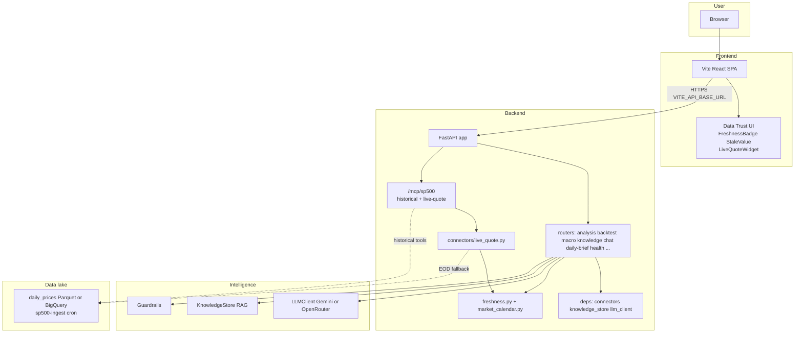
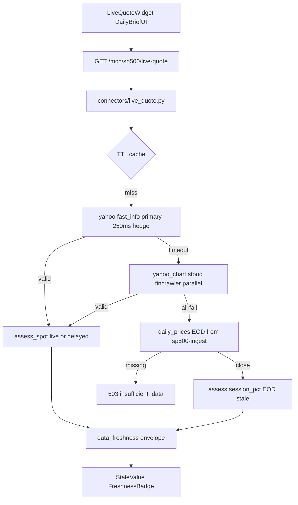
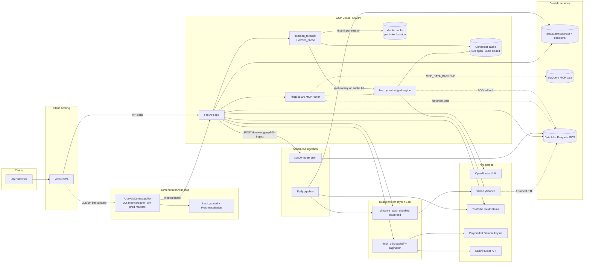
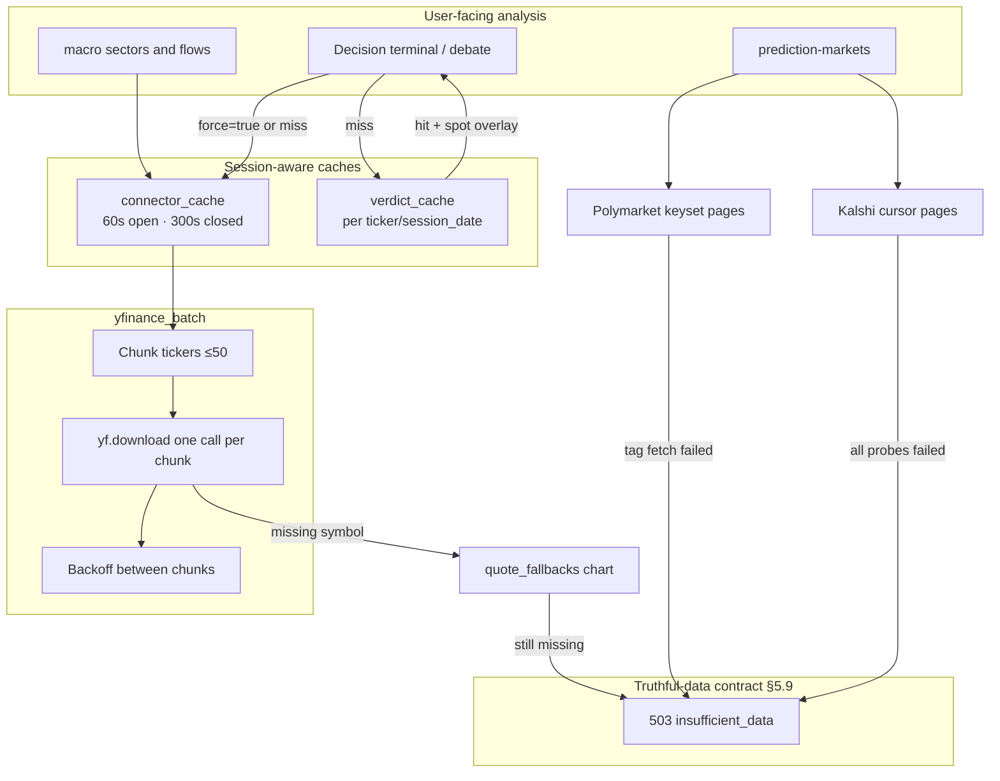
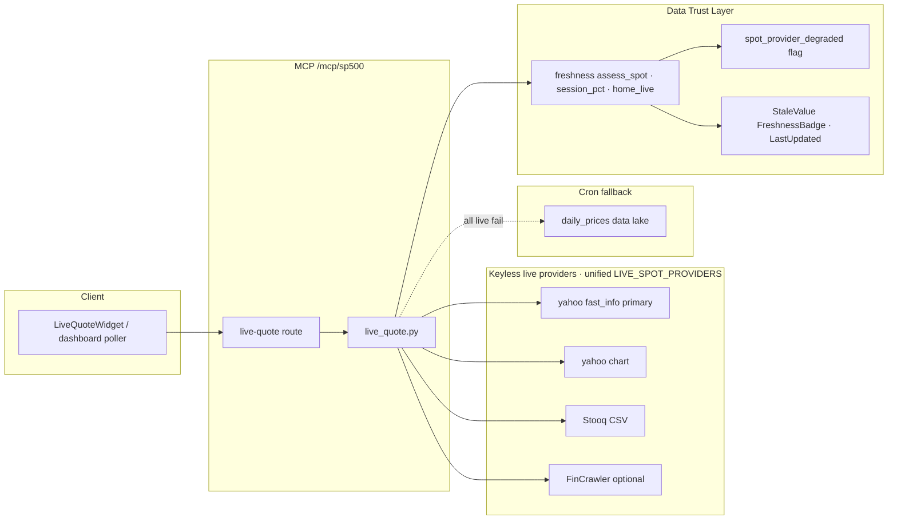
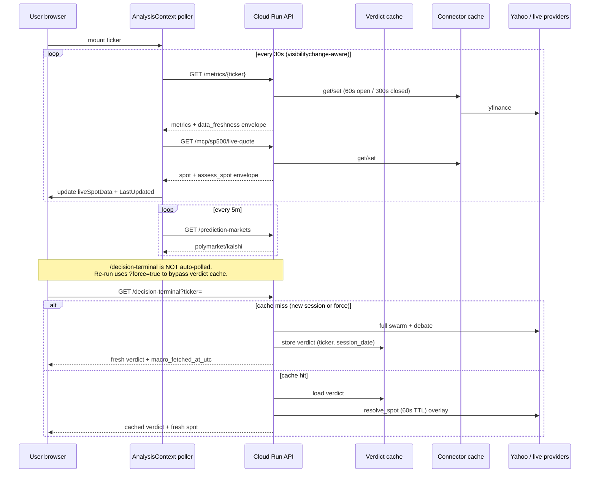

# TradeTalk architecture

This document describes how the TradeTalk platform is structured end to end: the browser app, the Python API, vector memory (RAG), external data sources, deployment on Render and Vercel, and every Hugging Face touchpoint. Use it as the single place to reason about changes before you refactor or extend the system.

**Related docs**

- [DATA_FETCH_MAP.md](./DATA_FETCH_MAP.md) — page-by-page frontend fetches and live vs DB vs RAG backend sources.
- [RAG_POLICY.md](./RAG_POLICY.md) — operational policy for ingestion, TTL, and PII around the knowledge store.
- [CRON.md](./CRON.md) — wake pings, secured pipeline triggers, GitHub Actions, and Render free-tier behavior.
- [DECISION_LEDGER.md](./DECISION_LEDGER.md) — SQL-queryable substrate of agent decisions + multi-horizon outcomes (Harness Engineering Phase 2).
- [AGENTS.md](../AGENTS.md) — dev commands, env files, and single-process scaling constraints.

---

## 1. Purpose and how to maintain this document

- **Keep it accurate to the repo.** When you add a router, change `VECTOR_BACKEND`, or move data to a new store, update this file in the same PR.
- **Do not duplicate RAG policy** — link to `RAG_POLICY.md` for retention and collection rules.
- **Scaling:** The backend is designed as a **single process**. In-memory SSE clients, the L1 cache, APScheduler, and SQLite usage assume one worker. Multi-worker deployment requires a different message bus, shared cache, and database; see [AGENTS.md](../AGENTS.md).

---

## 2. System overview



At runtime, the **React** app (built with Vite) calls the **FastAPI** backend using the base URL from `VITE_API_BASE_URL` (see `frontend/.env.local`). The backend loads shared singletons from `backend/deps.py` (connectors, `knowledge_store`, `llm_client`, SSE state) and implements routes under `backend/routers/`.

---

## 3. Frontend

| Item | Detail |
|------|--------|
| **Stack** | React 19, Vite 7, React Router (`frontend/`). |
| **API base** | `API_BASE_URL` / `VITE_API_BASE_URL` points at the FastAPI host (local `http://localhost:8000` or your Render URL). |
| **Auth** | Google OAuth when configured; dev mode can bypass with a dev user (`frontend/src/AuthContext.jsx`, backend `backend/auth`). |

**Primary routes** (see `frontend/src/App.jsx`):

| Path | UI module | Role |
|------|-----------|------|
| `/` | ConsumerUI | Valuation dashboard, swarm trace |
| `/decision-terminal` | DecisionTerminalUI | Decision terminal |
| `/macro` | MacroUI | Macro dashboard |
| `/gold` | GoldAdvisorUI | Gold advisor |
| `/chat` | ChatUI | Chat with RAG / context |
| `/debate` | DebateUI | Multi-agent debate |
| `/backtest` | BacktestUI | Strategy backtest |
| `/scorecard` | ScorecardUI | Risk-Return Ratio Scorecard (basket-level) |
| `/observer` | ObserverUI | Developer trace |
| `/systemmap` | SystemMapUI | Architecture map |
| `/challenge`, `/portfolio`, `/learning`, `/academy` | Gamification | Challenges, paper portfolio, learning path, video academy (often gated by `AuthGate`) |

---

## 4. Backend layout

| Piece | Location | Role |
|-------|----------|------|
| **App factory / lifecycle** | `backend/main.py` | `FastAPI` app, CORS, SQLite init for multiple feature DBs, **startup**: news scan loop, daily pipeline scheduler, market-intel jobs, keep-alive (non-Render), optional SP500 ingest |
| **Routers** | `backend/routers/*.py` | All HTTP routes (no handlers in `main.py` beyond wiring) |
| **Shared state** | `backend/deps.py` | Connectors, `knowledge_store`, `llm_client`, `sse_clients`, `last_trace_data` |
| **SSE** | Notifications router + `deps.sse_clients` | Real-time macro alerts to the browser |

**Route ownership (important):**

| Concern | Router file | Example paths |
|---------|-------------|----------------|
| Swarm + debate | `backend/routers/analysis.py` | `GET/POST /trace`, `GET/POST /debate`, `GET/POST /decision-terminal` |
| Backtest | `backend/routers/backtest.py` | `POST /backtest`, validation helpers |
| Macro | `backend/routers/macro.py` | `GET /macro` |
| Notifications + SSE | `backend/routers/notifications.py` | `GET /notifications/stream`, history, `GET /notifications/trace` |
| Knowledge / pipelines | `backend/routers/knowledge.py` | `GET /knowledge/stats`, `POST /knowledge/pipeline-run`, `POST /knowledge/sp500-ingest` |
| Chat | `backend/routers/chat.py` | `/chat/*` |
| Risk-Return Scorecard | `backend/routers/scorecard.py` | `GET /scorecard/presets`, `POST /scorecard/compare`, `GET /scorecard/{ticker}` |

**Naming note:** `GET /trace` (analysis router) runs the **swarm** and returns a `SwarmConsensus`. `GET /notifications/trace` returns the **last background news-scan trace** from memory — different purpose, different path.

**Consolidated analysis call:** the Stock Analysis dashboard issues a **single** `GET /decision-terminal` request instead of separately calling `/trace`, `/debate`, and `/decision-terminal`. `decision_terminal.run_decision_terminal_request` runs the full analyze pipeline (swarm then debate) **once**, and `DecisionTerminalPayload` now embeds the full `swarm` (`SwarmConsensus`) and `debate` (`DebateResult`) objects so the Trace and Debate tabs render from the same payload. `fetch_debate_data` is fetched once per request and threaded into `_execute_debate` (no duplicate fetch); it is started as a task (`debate_data_task`) so the network fetch overlaps with the swarm phase, the Polymarket fetch, and the extended snapshot instead of blocking ahead of them. The standalone `/trace` and `/debate` routes remain for API consumers and FaultHunter.

---

## 5. Intelligence layer

### 5.1 LLM

`backend/llm_client.py` is the single entry point for every LLM call in the platform (streaming chat, agent JSON, RAG polish, video text fallback). It supports two routing modes controlled by **`GEMINI_PRIMARY`**:

- **Gemini-primary mode** (`GEMINI_PRIMARY=1`, `GEMINI_API_KEY` set) — every call is routed through Google Gemini via `backend/gemini_llm.py`. OpenRouter is **not** consulted on the hot path. On any Gemini failure (empty response, 5xx, rate limit), **verdict roles raise `InsufficientDataError`** (see §5.6) while non-verdict roles fall back to the deterministic `FALLBACK_TEMPLATES` (agent JSON) or the original user text (prose paths) — OpenRouter is never re-entered. Use this mode to burn Gemini credits.
- **OpenRouter-primary mode** (`GEMINI_PRIMARY=0`, default) — OpenRouter is primary (`OPENROUTER_API_KEY`, `OPENROUTER_MODEL`, optional `OPENROUTER_MODEL_LIGHT`). Gemini is consulted only as a best-effort fallback when OpenRouter fails (toggleable with `GEMINI_LLM_FALLBACK`). Without any key, verdict roles raise `InsufficientDataError`; only non-verdict roles use rule-based templates.

**Verdict-role fallback policy (truthful-data contract, §5.9):** `VERDICT_ROLES` in `llm_client.py` (bull, bear, macro, value, momentum, moderator, swarm_synthesizer, swarm_analyst, small_cap_analyst, scorecard_verdict, gold_advisor, sitg_scorer, execution_risk_scorer) must never be answered with a canned template — when no real model output is available the client raises `InsufficientDataError` so the user sees "insufficient data" instead of a fabricated verdict. Non-verdict roles (video text, daily-brief batch rows, ingestion judging, decision-terminal roadmap JSON, news classifier) may still degrade gracefully to templates.

**Concurrency & timeouts:** all LLM calls share a single async gateway bounded by a global semaphore — `LLM_MAX_CONCURRENCY` (default **6**) — so parallel agents (swarm + debate) overlap their provider round-trips instead of serializing, without overwhelming the upstream rate limits. Each provider call carries a per-request HTTP timeout (`LLM_HTTP_TIMEOUT_S`, applied to both the sync and async OpenAI/OpenRouter clients in `backend/openrouter_pool.py`) so a slow upstream fails fast into the fallback path (§5.1) rather than stalling the whole analysis.

Both modes honor the same **role-to-tier mapping** (`MODEL_TIER` in `llm_client.py`). Heavy-reasoning roles — bull, bear, moderator, strategy_parser, gold_advisor, backtest_explainer — resolve to `GEMINI_MODEL` (default `gemini-3.1-pro-preview`) or `OPENROUTER_MODEL`. Light roles — swarm_analyst, swarm_synthesizer, swarm_reflection_writer, rag_narrative_polish, video_scene_director, video_veo_text_fallback, decision_terminal_roadmap — resolve to `GEMINI_MODEL_LIGHT` (default `gemini-3.1-flash`) or `OPENROUTER_MODEL_LIGHT`. Video clip generation is always Google Veo (`backend/video_generation_agent.py`), independent of the Gemini-primary flag.

### 5.2 Knowledge store (RAG)

`backend/knowledge_store.py` exposes a singleton **KnowledgeStore** used by swarm, debate, backtest, daily pipeline, chat, and reflection flows. Semantic retrieval uses named **collections** defined in `COLLECTIONS` (single source of truth — do not hardcode a count in UI without syncing).

Collections include (non-exhaustive; see code): `swarm_history`, `swarm_reflections`, `debate_history`, `macro_alerts`, `strategy_backtests`, `price_movements`, `macro_snapshots`, `youtube_insights`, `strategy_reflections`, `stock_profiles`, `earnings_memory`, `sp500_fundamentals_narratives`, `sp500_sector_analysis`, `chat_memories`.

### 5.3 Guardrails

`backend/agent_policy_guardrails.py` enforces workload capabilities, host allowlists, and startup checks (`GUARDRAILS_*` env vars).

### 5.4 Resource registry (RSPL, Phase A)

`backend/resource_registry.py` is a protocol-registered, versioned substrate for LLM prompts, following the Resource Substrate Protocol Layer from the [Autogenesis paper](https://arxiv.org/abs/2604.15034). Prompt bodies live under `backend/resources/prompts/*.yaml` (source of truth) and are seeded on startup into `backend/resources.db` (SQLite — schema in `backend/migrations/resources/`). Every LLM call via `LLMClient._resolve_system_prompt(role)` reads from the registry when `RESOURCES_USE_REGISTRY=1`, with automatic byte-exact fallback to the hardcoded `AGENT_SYSTEM_PROMPTS` dict on any failure. Swarm-analysis and reflection writes stamp `prompt_versions` + `registry_snapshot_id` into Chroma metadata so outcomes are traceable to the exact prompt versions that produced them. See **docs/RESOURCE_REGISTRY.md** for the full lifecycle (register → update → restore), the Phase A `learnable`-vs-pinned policy, and the read-only `/resources/*` HTTP surface.

### 5.5 Self-Evolution Protocol Layer (SEPL, Phase B)

`backend/sepl.py` closes the evolution loop on top of §5.4. It implements the Autogenesis §3.2 operator algebra — Reflect, Select, Improve, Evaluate, Commit — as pure, injection-friendly functions orchestrated by `SEPL.run_cycle()`. Improvements are drafted by the pinned `sepl_improver` meta-prompt, scored against per-prompt held-out fixtures in `backend/resources/sepl_eval_fixtures/`, and promoted only when `candidate - active ≥ SEPL_MIN_MARGIN`. Every path terminates in a typed `SEPLOutcome` so nothing crashes; every commit is lineage-stamped with `actor="sepl:<run_id>"` and a `sepl` metadata block capturing scores/margin/fixtures used. A companion `SEPLKillSwitch` watches post-commit effectiveness in `swarm_reflections` and calls `registry.restore()` (actor `sepl:rollback:<run_id>`) when the new version regresses against its pre-commit baseline by more than `SEPL_ROLLBACK_MARGIN`. The whole layer is gated behind `SEPL_ENABLE=0` by default; even when enabled, scheduled ticks run in dry-run unless `SEPL_AUTOCOMMIT=1`, and every manual `/sepl/*` write endpoint requires an explicit `commit: true` flag in the request body. See **docs/SEPL.md** for the full operator contracts, safety invariants, feature-flag matrix, and the 64 Phase B tests.

### 5.6 Risk-Return Ratio Scorecard

The Scorecard surface (`/scorecard` in the SPA, `POST /scorecard/compare` +
`GET /scorecard/{ticker}` on the API) is a **standalone, parallel path** to
the IC debate: it scores a basket of 1-10 tickers on a dimensionless
risk-to-return ratio using a **hybrid deterministic-plus-LLM** model.

- **Deterministic math** (`backend/scorecard.py`, tested by
  `backend/tests/test_scorecard_math.py`) owns normalization, PE-stretch
  computation (`MAX(0, fwd_PE / hist_avg_PE - 1)`), weighted `ReturnScore`
  and `RiskScore` aggregation, investor-type presets (Balanced / Growth /
  Value / Income), Step-7 situational adjustments (bear-market beta
  doubling, M&A execution penalty, CEO-selling SITG haircut, etc.),
  quadrant classification, and the Step-3 interpretation bands.
- **Data connector** — `backend/connectors/scorecard_data.py` pulls
  forward-PE, a 5-year historical average PE proxy, beta, EPS / revenue
  growth, analyst price-target upside, dividend yield, debt-to-equity,
  and 12-month Form 4 insider activity from yFinance (with the data lake
  as a price-history fallback). Partial missing fields are surfaced back
  to the UI as data-quality notes; a **total** fetch failure raises
  `InsufficientDataError` (§5.9) instead of scoring a zero-filled row.
- **LLM personas** (all registered in §5.4 and tested by
  `backend/tests/test_sitg_prompt.py`) cover only the judgment-heavy
  factors that are not cleanly derivable from numbers:
  - `sitg_scorer` — Step 2e Skin-In-The-Game (0-10) with Form 4 +
    DEF 14A signals. Functions as a **return-score amplifier**.
  - `execution_risk_scorer` — Step 2c qualitative execution risk (1-10)
    calibrated to the company profile (utility / industrial /
    high-growth / turnaround).
  - `scorecard_verdict` — one-sentence narrative per ticker (Strong /
    Favorable / Balanced / Stretched / Avoid).
- **Router** — `backend/routers/scorecard.py` orchestrates
  connector → LLM → math → verdict and emits the `BasketResult` payload
  the frontend renders. A `skip_llm_scores` flag in the request body
  forces the safe fallback SITG=3 / exec=5 scores for fast previews and
  is what `e2e/scorecard.spec.js` uses for the smoke.
- **Tests** — math (`test_scorecard_math.py`), router with stubbed
  connector + fakes (`test_scorecard_router.py`), and prompt / fixture
  schema-conformance (`test_sitg_prompt.py`). End-to-end smoke in
  `e2e/scorecard.spec.js` navigates `/scorecard`, runs a basket in
  skip-LLM mode, and asserts the SITG-boost column appears.

The methodology is **additive** — the IC debate contract
(`headline` / `key_points` / `confidence`) and its 5-agent architecture
are untouched. If the Scorecard surface is disabled (router not
included, or route hidden in the SPA), all other flows keep working.

### 5.7 Tool evolution (SEPL-for-TOOLs, Phase C1 + C2)

Phase C extends the registry to a second resource kind — `TOOL` — and evolves its *numeric configuration* rather than its source code. The surface lives in four files: `backend/resources/tools/*.yaml` (canonical configs + per-key `parameter_ranges`), `backend/tool_handlers.py` (pure, deterministic handler functions per tool), `backend/tool_configs.py` (dual-read getter + SEPL-facing `update_tool_config` writer), and `backend/sepl_tool.py` (Select/Improve/Evaluate/Commit + kill switch). Seven safety differences from §5.5 make this path materially lower-risk than prompt evolution: (1) **Improve is NOT an LLM call** — it is a bounded random walk inside the declared ranges, so prompt injection and unbounded drift are structurally impossible; (2) **Evaluate is 100% offline**, scoring active vs candidate configs against held-out JSON fixtures in `backend/resources/sepl_eval_fixtures_tools/` and never touching live traffic or connectors; (3) **Commit goes through `update_tool_config`** which validates against the YAML schema, refuses unknown keys, and honors `learnable=False` pinning; (4) **Tier-aware budget gate** — tools declare a `tier` (0 pure, 1 external read, 2 external write, 3 critical/irreversible) and Commit enforces `min(SEPL_TOOL_MAX_PER_DAY, SEPL_TOOL_MAX_PER_DAY_TIER_<N>)`, with tier-2+ defaulted to `0` so SEPL cannot touch any tool with external side-effects; (5) **Dual-read** — every agent/connector that uses a TOOL config calls `get_tool_config(name, default)`, which falls back byte-exactly to the hardcoded default when `RESOURCES_USE_REGISTRY=0` or the resource is missing, guaranteeing the pre-evolution behaviour is always recoverable by flipping a single flag; (6) **`SEPLToolKillSwitch`** re-evaluates both the committed and the `from_version` config against the same fixtures SEPL used at commit time and calls `registry.restore()` (actor `sepl:tool:rollback:<run_id>`) when the prior beats the new one by `SEPL_TOOL_ROLLBACK_MARGIN`; the switch skips SEPL commits that have already been rolled back (preventing loops) and skips non-SEPL actors (so manual human tweaks are never reverted); (7) **Every layer is off by default** — `SEPL_TOOL_ENABLE=0`, `SEPL_TOOL_DRY_RUN=1`, and `SEPL_TOOL_AUTOCOMMIT=0`. Tier-0 tools shipped in Phase C1: `short_interest_classifier`, `debate_stance_heuristic_bull`, `debate_stance_heuristic_bear`. Tier-1 tool shipped in Phase C2: `macro_vix_to_credit_stress` (VIX→CSI divisor and stress threshold). See **docs/TOOL_EVOLUTION.md** for the operator contracts, fixture format, and the ~125 tool-scoped tests; see `backend/.env.example` for the full feature-flag matrix.

### 5.8 Decision-Outcome Ledger (Harness Engineering Phase 2)

`backend/decision_ledger.py` is the SQL-queryable substrate under every user-facing agent decision. Five tables (`decision_events`, `decision_evidence`, `feature_snapshots`, `outcome_observations`, `contract_violations`) capture what the agent decided, which RAG chunks it cited (`knowledge_store.query_with_refs` threads `chunk_id` + `relevance` through every retrieval), which prompt versions + model produced it (`prompt_versions_json` + `registry_snapshot_id` stamped from §5.4), and the multi-horizon market-truth grades a later scheduler tick attaches to it. Producers are wired into `AgentPair.run` (`swarm_factor`), `_run_full_debate_impl` (`debate`), and `chat_send_message` (`chat_turn`) — each one calls `emit_decision` in a `try/except` so ledger failure never breaks user-facing flows, and every emit dual-writes a `decision_emitted` CORAL handoff so the existing dreaming / meta-harness surfaces keep working unchanged. `backend/outcome_grader.py` runs at **02:10 UTC** via APScheduler (only when `DECISION_LEDGER_ENABLE=1`), writes `price_return_pct` / `excess_return_vs_spy_pct` / `risk_adjusted_return` over `1d/5d/21d/63d`, and derives `correct_bool` from the verdict × excess-return rule. `backend/contract_validator.py` feeds `contract_violations` via `install_contract_validator_sink()` so model-drift per prompt version is answerable with a single `GROUP BY`. Three consumers close the loop: `DecisionLedgerReflectionSource` in §5.5 feeds SEPL with real graded outcomes (not LLM self-grades); `backend/feature_correlations.py` + the `v_feature_hit_rate` SQLite view / Supabase MV rank `(feature, regime, horizon)` by hit-rate and mean excess return; and `backend/model_swap_replay.py` re-runs historical decisions through a candidate model and returns a structured `ReplayReport` so operators can gate a model swap on a measurable delta. Feature flags: `DECISION_LEDGER_ENABLE` (master switch, default on), `DECISION_BACKEND` (`sqlite` | `supabase` | `none`), `CONTRACT_VALIDATOR_ENABLE`, `OUTCOME_GRADER_BATCH`. See **docs/DECISION_LEDGER.md** for the full schema, producer-authoring rules, example queries, and Supabase bootstrap.

### 5.9 Truthful-data contract (insufficient_data)

**Policy: no user-facing surface may deliver a final verdict, analysis, or chart built on fabricated, placeholder, or silently-degraded data.** When a required live source (yfinance, FinCrawler, FRED, Google News RSS, Polymarket, Kalshi, LLM provider, …) cannot deliver, the producer raises `backend.data_errors.InsufficientDataError` instead of substituting defaults. A global FastAPI handler in `backend/main.py` converts it into **HTTP 503** with a stable body:

```json
{
  "error": "insufficient_data",
  "source": "yfinance",
  "message": "No usable 6-month price history for AAPL; ...",
  "ticker": "AAPL",
  "missing": ["price_history_6mo"]
}
```

**The truthfulness line:** a *failed fetch* must never be reported as a real result — but an *empty result from a successful fetch* (e.g. "no recent news coverage", "no open prediction markets") is real data and flows through normally.

What raises (instead of the previous silent fallbacks):

| Producer | Previously fabricated | Now |
|----------|----------------------|-----|
| `connectors/debate_data.py` | Spot-only records with zeroed 1m/3m/6m returns and synthetic ±12 % 52-week bands; all-zero "empty shell" | Raises when 6-month history is unavailable |
| `connectors/macro.py` | VIX `15.0` placeholder; zeroed sector %; empty capital flows; **simulated** consumer-spending and cash-reserve chart series; mock `k_shape` indicator | Raises on VIX/sector/flow failure; the two unsourced chart series are returned **empty** (no live source is wired); mock indicator removed |
| `connectors/fundamentals.py` / `shorts.py` | `0` cash/debt and `0 %` short interest on failure | Raises (missing short data is reported as missing, not 0 %) |
| `connectors/social.py` | Silent empty titles on RSS failure | Raises on transport/parse failure; genuine zero-coverage still returns `[]` |
| `connectors/polymarket.py` / `kalshi.py` | Failed API calls reported as "no relevant markets" | Raises when tag fetches fail / all Kalshi requests fail |
| `connectors/investor_metrics.py` | Random 8-point "sparklines", fabricated `historical` deltas (`roe*0.9` etc.), RSI **proxy** from 1-month return | `history: []`, `historical/trend: "N/A"`, no proxies; raises when both primary and fallback fetches fail |
| `connectors/scorecard_data.py` | Zero-filled `_empty_scorecard_fields` row | Raises (partial-field gaps are still flagged in `fields_missing`) |
| `predictor/agent.py` | **Synthetic** random-walk price series (`price_source: "synthetic"`); `MockTimesFMClient` quantile bands served as live forecasts | Returns `status: "insufficient_data"`, `executed: false`. The mock client is test/eval-only; quantile bands come **only** from the deployed TimesFM service. `PREDICTOR_BACKEND=baselines_only` opts into transparent statistical baselines (point forecasts only, no q10/q90 bands, `model_confidence: "low"`) |
| `decision_terminal.py` roadmap | No-data heuristic of arbitrary spot multiples (×1.36 / ×1.12 / ×0.82); misscaled LLM scenarios silently replaced with the same multiples | Heuristic requires a **real** historical 3Y CAGR; otherwise the roadmap panel returns `null` prices with an honest assumption note. Misscaled model output is dropped, never substituted |
| `frontend/DailyBriefUI.jsx` | Hardcoded `MOCK_LOSERS` / `MOCK_HOLDINGS` / `MOCK_NEWS` rows, stale hardcoded market-cap/P-E table, injected `MRVL/EWY/AMZN` news tickers, fabricated "Neutral" insider labels | Explicit empty states ("Live … data is unavailable"); metadata renders `N/A` when missing; only real portfolio tickers queried |
| `llm_client.py` | `FALLBACK_TEMPLATES` verdicts (NEUTRAL moderator, all-yellow small-cap, default SITG/exec scores, …) | `VERDICT_ROLES` raise; non-verdict roles keep templates (§5.1) |
| `gold_advisor_service.py` | Placeholder briefing on invalid LLM output; ran without gold OHLC | Raises on missing gold data or invalid briefing |
| `routers/macro.py` `/metrics`, `/macro/global-markets` | `metrics: {}` / empty series on failure | Raise |
| `routers/analysis.py` `/prediction-markets` | Per-source error masked as `has_relevant_data: false` | Raises |
| `routers/scorecard.py` personas | Default SITG=3 / exec=5 on LLM failure | Raise (explicit `skip_llm_scores=true` opt-out is unchanged) |

**Heuristics vs fabrication:** deterministic computations over *real* fetched data (e.g. the decision-terminal heuristic roadmap from live price + historical CAGR, provenance-stamped `source: "heuristic"`) are allowed — the contract bans *invented inputs*, not transparent models.

**Frontend:** `apiFetch` (`frontend/src/api.js`) detects the `insufficient_data` body, marks the thrown error with `isInsufficientData`, and `AnalysisContext.jsx` treats any insufficient-data refusal as a full analysis error (no more "partial success" dashboards) with the backend's message shown to the user.

**Tests:** `backend/tests/test_insufficient_data.py` (offline, mocked I/O) plus the rewritten `test_debate_data_fallback.py` and `test_gemini_primary_routing.py` encode this contract.

### 5.11 Data freshness (truthful "as of")

The truthful-data contract (§5.9) bans fabricated inputs; the **freshness contract** is its time-axis companion: a surface must never present *stale* stored data as if it were the current session. The locally-seeded data lake can lag the real market by months, so every market surface compares its stored data to the **real** last completed US cash-equity session before labelling anything "the last trading session."

- **Market calendar (single source of truth)** — `backend/market_calendar.py` is the one trading-calendar module: `is_trading_day`, `is_market_holiday`, `previous_trading_day`, `adjust_to_trading_day`, and `last_completed_session(today=None)` (ET-aware; before ~16:00 ET on a trading day it rolls back to the prior session). Crucially the NYSE holiday set is **computed from the holidays' defining rules** (n-th-weekday rules + Gregorian Easter for Good Friday + official Sat/Sun observance, with the New-Year's-Saturday exception) via `us_market_holidays(year)`, so it **never expires** — replacing the old hand-maintained set that stopped at 2026. `daily_brief.expected_last_session` / `_adjust_weekend_to_friday`, `morning_brief._resolve_trade_date`, and `market_intel.is_market_open` / `needs_realtime_overlay` all delegate here so weekends **and** holidays are handled identically everywhere. Tests: `backend/tests/test_market_calendar.py` (includes a regression lock to the retired 2024-2026 table).
- **Freshness policy registry** — `backend/freshness.py` is the single decision point for "is this value fresh enough for its data class?" `assess(data_class=..., source=..., as_of=..., captured_at=...)` returns a `DataFreshness` envelope (`backend/schemas.py`: `data_class`, `source`, `tier`, `as_of`, `captured_at`, `expected_as_of`, `is_stale`, `staleness_seconds`, `degraded`, `policy_max_age_s`). Policies are env-tunable and use two modes: **age** (clock vs `max_age_s` — `live_quote` ~60s, `delayed_quote`/`prediction_market` ~15m, `macro_fred` ~36h, `model_forecast` ~24h) and **session** (value's `as_of` date vs `market_calendar.last_completed_session` with a day tolerance — `session_pct`, `eod_movers`, `daily_brief`, `fundamentals`). Unknown classes fall back to a forgiving session policy rather than crashing the producer. Tests: `backend/tests/test_freshness.py`.
- **Legacy freshness helper** (`backend/daily_brief.py`): `compute_data_freshness(db_latest, source=...)` predates the registry and still backs the home/portfolio surfaces (`db_latest_date`, `expected_last_session`, `staleness_days`, `is_stale`, `source`, `tolerance_days`); it now shares the same calendar. New producers should prefer `freshness.assess` + the `DataFreshness` model.
- **"Both" strategy** in `build_daily_brief`: when stored data is stale and the caller did not pin an explicit `trade_date`, it tries **live** movers first via `_fetch_movers_from_intel` (`market_intel.get_live_movers_snapshot` → yfinance, not weekend-gated). On success the payload is rebuilt with `source="market_intel_live"` and `is_stale=false`; on failure it falls back to the stored snapshot but keeps `is_stale=true` plus a warning. Either way `payload["data_freshness"]` is **always** stamped (including the cached-snapshot early return).
- **Envelope at the boundary**: `backend/routers/daily_brief.py` guarantees `data_freshness` exists on every response (a successful realtime overlay marks it `source="realtime_overlay"`, `is_stale=false`). `backend/morning_brief.py` mirrors the same block onto the portfolio brief (`source="portfolio"`).
- **Frontend**: `frontend/src/DailyBriefUI.jsx` reads `data?.data_freshness || portfolioBrief?.data_freshness` and renders a reusable `DataFreshnessBadge` on the weekend banner, Top Movers, and Portfolio Exposure headers. When `is_stale`, the misleading "last trading session" copy is suppressed in favor of an explicit staleness warning.
- **Tests:** `backend/tests/test_daily_brief_freshness.py` (offline) covers `expected_last_session` weekend/holiday logic, `compute_data_freshness` stale/fresh/None cases, and the `build_daily_brief` stale→live and live-fail→stored-fallback paths.

### 5.12 MCP S&P 500 live quotes (`/mcp/sp500/live-quote`)

Historical MCP tools (`price-window`, `movement-context`, …) read the **data lake** populated by `sp500-ingest`. Live quotes add a hedged keyless provider lane plus the same lake as EOD fallback:

| Step | Source | Freshness |
|------|--------|-----------|
| 1 (primary) | Yahoo `fast_info` via `market_intel._fetch_single_rt_quote` | `assess_spot` (live/delayed) |
| 2 (after ~250ms hedge) | Yahoo chart, Stooq, FinCrawler (parallel, first valid) | `assess_spot`, `degraded=true` for non-primary |
| 3 (fallback) | `daily_prices` last close from sp500-ingest | `assess(session_pct)`, `source=data_lake` — stale when session lags |

- Engine: [`backend/connectors/live_quote.py`](../backend/connectors/live_quote.py); routes: [`backend/mcp_server/router.py`](../backend/mcp_server/router.py).
- UI: [`frontend/src/components/LiveQuoteWidget.jsx`](../frontend/src/components/LiveQuoteWidget.jsx) on the home page (`DailyBriefUI`), using `StaleValue` + `FreshnessBadge`.
- Env: `LIVE_QUOTE_TTL_SEC`, `LIVE_QUOTE_HEDGE_DELAY_MS`, `LIVE_QUOTE_HARD_DEADLINE_S`, `QUOTE_FALLBACK_ALLOW_YAHOO_CHART`.



> **Scope / status of the app-wide Data Trust Layer:** **done (all workstreams A–H)** — (1) the shared calculator (`backend/market_calendar.py`, all duplicate session calculators migrated to it); (2) the freshness policy registry (`backend/freshness.py` + `DataFreshness` schema); (3) `GET /health/data-freshness` observability probe (`backend/routers/health.py`); (4) removed the hardcoded MacroUI GDP/Brent/Fed-Funds/CPI placeholders (now show only live VIX + Credit Stress, with explicit "Live data unavailable" otherwise) and routed `GlobalMarketsChart` through `apiFetch`. (5) **D-P0 (partial)** — the `DataFreshness` envelope now rides on `/macro` (live VIX, via `freshness.assess_spot`), `/metrics/validate/{ticker}`, and `/stock-fundamentals/{ticker}` (session-anchored on the latest price bar so a stale upstream is caught); `/daily-brief` and `/portfolio/morning-brief` already carry the legacy `data_freshness` block. (6) **E — frontend trust components**: `frontend/src/freshness.js` (`parseFreshness` handles both the new envelope and the legacy daily-brief block; `isStrictMode` kill switch via `VITE_DATA_TRUST_STRICT=0`; `shouldHideValue`) and `frontend/src/components/Freshness.jsx` (`FreshnessBadge`, `StaleValue` — strict-hides a price-sensitive stale number — and `DataTrustBanner`). (7) **C — canonical spot fetch**: `backend/connectors/spot.py:get_spot_with_freshness(ticker)` returns `(value, DataFreshness)`, wrapping the FinCrawler→Stooq→Yahoo fallback chain and stamping provenance/degraded; `strict_when_open=True` raises `InsufficientDataError` when no live quote is available during an open session (test `backend/tests/test_spot_freshness.py`). New code should prefer it; existing call sites migrate incrementally. (8) **D (more endpoints)**: the envelope now also rides on `/macro/global-markets` (session-anchored on the last bar), `/portfolio/performance` (`assess_spot`), and the **Decision Terminal** payload (`DecisionTerminalPayload.data_freshness`, folding the legacy `market_data_degraded` + `spot_price_source` flags via `_terminal_data_freshness`). (9) **F — strict rendering wired into the high-traffic surfaces**: MacroUI header (`FreshnessBadge` from `data.data_freshness`), UnifiedDashboardUI spot price/change (wrapped in `StaleValue` + badge from `/stock-fundamentals`), DecisionTerminalUI (`DataTrustBanner` from `payload.data_freshness`), and DailyBriefUI (shared `DataTrustBanner`). (10) **D P1/P2 — remaining endpoints**: the envelope now also rides on `/advisor/gold` (`assess_spot`), `/backtest` (new `backtest` policy — HISTORICAL, anchored on `captured_at=now` so a freshly-computed historical window is never flagged stale), scorecard `/compare` + `/{ticker}` (new `scorecard` policy), `/prediction-markets` (`prediction_market` policy), `/predictor/forecast` GET+POST (`model_forecast` policy via `_stamp_forecast_freshness`), and the chat **quote_card** SSE event (`assess_spot`). (11) **F P1/P2 — UI**: ChatUI quote card renders a `FreshnessBadge` (honest `QUOTE` label instead of always "LIVE"), BacktestUI shows a `DataTrustBanner`, and DashboardScorecardPanel shows a `FreshnessBadge`. (12) **H — E2E**: `e2e/data-trust-freshness.spec.js` injects a stale (and a live) `data_freshness` envelope into `/macro` via route interception and asserts the stale badge appears / is absent. Backend coverage: `backend/tests/test_dtl_p1_envelopes.py`, `test_spot_freshness.py`. (13) **MCP live S&P 500 quote surface**: `GET /mcp/sp500/live-quote` and `/live-quotes` (`backend/connectors/live_quote.py` hedged engine: yahoo fast_info primary → parallel yahoo_chart/stooq/fincrawler → `daily_prices` data-lake EOD fallback from `sp500-ingest`; always stamped with `data_freshness`). Home page widget: `frontend/src/components/LiveQuoteWidget.jsx` on `DailyBriefUI`. Tests: `backend/tests/test_live_quote.py`.

---

## 6. Vector backends and embeddings

`VECTOR_BACKEND` selects how vectors are stored. Implementations: `backend/vector_backends.py`; wiring: `backend/knowledge_store.py`.

| `VECTOR_BACKEND` | Storage | Query-time embeddings | Typical use |
|------------------|---------|------------------------|-------------|
| `chroma` | ChromaDB — persistent path `CHROMA_PATH` (default `./chroma_db`) | Default: Chroma’s embedding; on **Render** with `HF_TOKEN`: **Hugging Face Inference API** via `InferenceClient` (`HfInferenceRouterEmbeddingFunction`), model `HF_EMBEDDING_MODEL` or `sentence-transformers/all-MiniLM-L6-v2` | Local dev; optional Render if not using Supabase |
| `supabase` | Supabase table `vector_memory` + RPC `match_vector_memory` | **OpenRouter** when `OPENROUTER_EMBEDDING_MODEL` and `OPENROUTER_API_KEY` are set (not Hugging Face) | **Default in checked-in `render.yaml`** — durable across restarts |
| `hf` | In-memory Chroma loaded from a **Hugging Face Dataset** JSON export | Pre-serialized embeddings in the file when present; else Chroma embeds | Demos / read-only snapshot mode |

**Production default in this repo:** [`render.yaml`](../render.yaml) sets `VECTOR_BACKEND=supabase`. So **Hugging Face is not the default embedding provider on Render** for the main app — Supabase + OpenRouter embeddings are.

**Supabase bootstrap:** Run [`backend/supabase_pgvector_bootstrap.sql`](../backend/supabase_pgvector_bootstrap.sql) in the Supabase SQL editor before first use of `VECTOR_BACKEND=supabase` (the backend fails fast if the schema is missing).

---

## 7. Hugging Face (all integrations)

| Use | Mechanism | Env / files |
|-----|-----------|-------------|
| **Remote embeddings (Chroma on Render)** | `huggingface_hub.InferenceClient` — `HfInferenceRouterEmbeddingFunction` | `RENDER`, `HF_TOKEN`, optional `HF_EMBEDDING_MODEL` — [`backend/vector_backends.py`](../backend/vector_backends.py) |
| **Read-only RAG snapshot** | `VECTOR_BACKEND=hf` downloads `rag_summaries/all_summaries.json` from a dataset | `HF_DATASET_ID`, `HF_TOKEN` (if private) — [`backend/knowledge_store.py`](../backend/knowledge_store.py) |
| **Backtest / Parquet hub** | Read Parquet from a Hub dataset | `HF_DATASET_REPO`, `HF_DATASET_REVISION`, optional `HF_TOKEN` — [`backend/connectors/backtest_data_hub.py`](../backend/connectors/backtest_data_hub.py), [`backend/connectors/backtest_data.py`](../backend/connectors/backtest_data.py) |
| **Data lake prices / fundamentals** | Optional download from Hub | `DATA_LAKE_SOURCE=hf`, `HF_DATASET_ID` — [`backend/data_lake/config.py`](../backend/data_lake/config.py), [`backend/decision_terminal.py`](../backend/decision_terminal.py) |
| **ETL upload** | Scripts / CI push datasets | [`scripts/hf_backtest_etl.py`](../scripts/hf_backtest_etl.py), [`.github/workflows/backtest-data-etl.yml`](../.github/workflows/backtest-data-etl.yml) |
| **HF Space keep-alive (optional)** | Background ping loop targets `HF_SPACE_URL` | [`backend/keep_alive.py`](../backend/keep_alive.py) — **disabled when `RENDER` is set** so Render does not ping HF Spaces |

---

## 8. Data sources (connectors)

Implemented under `backend/connectors/` and used by agents and pipelines:

- **yFinance** — equities, shorts, sectors, historical prices, etc. Batched via `yfinance_batch.py` (§5.10).
- **Google News RSS** — macro keyword scans (`news_scanner`).
- **Polymarket** — prediction markets (`polymarket.py`); keyset/offset pagination.
- **Kalshi** — prediction markets (`kalshi.py`); cursor pagination.
- **FRED** — macro series (`fred.py`).
- **YouTube** — finance channels (`youtube.py`); uploads-playlist ingestion (1 unit/page).
- **Shared HTTP** — backoff + pagination helpers (`fetch_utils.py`).

All connectors follow the **truthful-data contract** (§5.9): a fetch failure raises `InsufficientDataError` (HTTP 503 `insufficient_data`) instead of returning placeholder/zero/synthetic values; an empty result from a *successful* fetch is real data and is returned normally.

See **§5.10 Resilient free-API fetching** for batching, pagination, and quota-aware ingestion patterns shared across connectors.

For a **panel-by-panel catalog** of every metric, signal, and formula on the Stock Analysis page (`/dashboard`), see [STOCK_ANALYSIS_METRICS.md](./STOCK_ANALYSIS_METRICS.md).

---

### 5.10 Resilient free-API fetching (batching & pagination)

Free market-data APIs enforce **per-IP / per-key quotas**, not “more parallel calls = more quota.” TradeTalk therefore:

| Source | Pattern | Module | Effect |
|--------|---------|--------|--------|
| **yfinance (Yahoo)** | **Chunked batch download** — `yf.download` over ≤50 tickers per call, exponential backoff + inter-chunk delay between chunks; per-symbol fallback via `quote_fallbacks` | [`backend/connectors/yfinance_batch.py`](../backend/connectors/yfinance_batch.py) | Fewer HTTP round-trips for macro sectors, capital-flow proxies, and `/macro/global-markets`; avoids N separate `.info` calls |
| **YouTube Data API** | **Uploads playlist** — `playlistItems.list` on each channel’s `UU…` playlist (1 unit/page) instead of `search.list` (100 units/call) | [`backend/connectors/youtube.py`](../backend/connectors/youtube.py) | ~12 quota units per daily ingestion vs ~600 previously; scans up to 150 recent uploads/channel |
| **Polymarket (Gamma)** | **Keyset pagination** on `/events/keyset` with offset fallback on `/events`; concurrent per-tag walks | [`backend/connectors/polymarket.py`](../backend/connectors/polymarket.py) | Up to `POLYMARKET_MAX_PAGES` × `POLYMARKET_PAGE_SIZE` events/tag (default 5×100) |
| **Kalshi Trade API v2** | **Cursor pagination** on `/events` and `/markets` open scans; series-scoped calls stay single-page | [`backend/connectors/kalshi.py`](../backend/connectors/kalshi.py) | Up to `KALSHI_MAX_PAGES` × `KALSHI_PAGE_SIZE` items (default 3×200) per scan |
| **All HTTP connectors above** | Shared **429/5xx backoff** + optional `Retry-After` honour | [`backend/connectors/fetch_utils.py`](../backend/connectors/fetch_utils.py) | Transient failures retry; persistent failures still raise `InsufficientDataError` |

**Env tuning (optional):** `YFINANCE_BATCH_CHUNK_SIZE`, `YFINANCE_BATCH_INTER_CHUNK_DELAY_S`, `POLYMARKET_PAGE_SIZE`, `POLYMARKET_MAX_PAGES`, `KALSHI_PAGE_SIZE`, `KALSHI_MAX_PAGES`.

**What divide-and-conquer does *not* do:** firing 50 parallel yfinance calls does not increase Yahoo’s rate limit — it usually triggers 429 sooner. Chunked **batching** (one download, many tickers) plus **cache TTLs** (`connector_cache`) and the **data lake** for historical bars are the durable levers.

---

## 9. Persistence

| Store | Location / mechanism | Contents |
|-------|----------------------|----------|
| **SQLite** | Files under backend (see `alert_store`, `user_progress`, etc.) | Macro alerts, user progress, XP, badges, portfolio, challenges, learning, academy, preferences, **`chat_sessions`** (sticky state + RAG prewarm + last evidence; survives process restart), agent memory — initialized from `backend/main.py` |
| **Supabase** | `vector_memory` | Embeddings + documents per collection when `VECTOR_BACKEND=supabase` |
| **Chroma** | `CHROMA_PATH` on disk | Local / non-Supabase vector persistence |

**Chat memory (three tiers):** (1) **Working session** — rows in `chat_sessions` plus an in-process cache in `chat_service`; the client can send `resume_session_id` on `POST /chat/session` to continue after refresh. (2) **Structured user profile** — `user_preferences` (JSON per user) plus chat tools `recall_financial_profile` / `save_financial_preference`. (3) **Semantic recall** — `agent_memory` SQLite history + `chat_memories` vectors. **CORAL** hub rows are market/agent priors, not end-user identity.

Render’s filesystem is **ephemeral** unless you attach a disk; durable vectors on Render should use **Supabase**, not local Chroma, for production.

---

## 10. Deployment

### 10.1 Backend (GCP Cloud Run)

The **FastAPI backend is deployed to GCP Cloud Run** (not Render — `render.yaml` is retained only as a legacy/fallback spec). See [`docs/GCP_API_DEPLOY.md`](./GCP_API_DEPLOY.md) and [`scripts/deploy_api_cloudrun.sh`](../scripts/deploy_api_cloudrun.sh).

- **Build:** `gcloud builds submit --config cloudbuild.api.yaml .` (container image `gcr.io/tradetalkapp-492904/tradetalk-api:latest`)
- **Start:** `uvicorn backend.main:app --host 0.0.0.0 --port 8080`
- **Scaling:** 0–10 managed instances, 2 vCPU / 2 GiB, 300s timeout, `--allow-unauthenticated` (public API; CORS gates browser origins)
- **Env (core):** `VECTOR_BACKEND=supabase`, `DECISION_BACKEND=supabase`, `MCP_DATA_BACKEND=bigquery`, `LLM_HTTP_PROVIDER=openrouter`, `CORS_ORIGINS=https://frontend-manojsilwals-projects.vercel.app`, `SP500_INGEST_ON_STARTUP=0`, `SEPL_TOOL_ENABLE=1`. Secrets (Supabase service key, OpenRouter key, etc.) are loaded from Cloud Run secrets, with local `.env.gcp` / `backend/.env` merged at deploy time by the script.
- **Freshness/cache env:** `VERDICT_CACHE_ENABLE` (default on; `=0` to disable the demand-only verdict cache), connector-cache TTLs are session-aware (60s open / 300s closed) and need no env var.

**How the deployed app is “fed”:** There is no continuous bulk sync from Git into the vector DB. **Deploys** push new code; **configuration** comes from Cloud Run env vars / secrets; **optional** scheduled HTTP calls (GitHub Actions or external cron) hit secured endpoints such as `POST /knowledge/pipeline-run` — see [CRON.md](./CRON.md).

### 10.2 Frontend (Vercel)

Static build of the Vite app (`frontend/vercel.json` for SPA routing, deployed via `scripts/deploy_vercel.sh` or the `vercel-production-deploy` GitHub Action). Set `VITE_API_BASE_URL` to the Cloud Run service URL and `VITE_DASHBOARD_LIVE_POLL` (default `1`) to enable the dashboard background poller.

### 10.3 CORS

`backend/main.py` allows localhost dev origins and `CORS_ORIGINS`; regex allows `https://*.vercel.app`.

---

## 11. Scheduled jobs and external triggers

Inside the **running** process:

- **News scan loop** — ~60s cycle, updates alerts and can write to the knowledge store.
- **Daily pipeline** — APScheduler (`backend/daily_pipeline.py`) — ingests movers, FRED, YouTube, etc., into KnowledgeStore.
- **Market intel** — additional scheduled refresh jobs from `main.py` (fast=10min, slow=30min).
- **Verdict cache** — **demand-only**, not cron. First user `/decision-terminal?ticker=` hit per trading session computes and caches the verdict; subsequent hits overlay fresh spot and reuse the verdict. New trading session = automatic miss. No pre-warming cron.

**Cloud Run scale-to-zero:** the service can scale to 0 instances; while at 0, no in-process schedulers run. External **wake** requests and **cron-triggered** pipeline posts are documented in [CRON.md](./CRON.md).

`keep_alive.py` is for keeping a **Hugging Face Space** awake; on Cloud Run it exits early — do not rely on it for uptime.

---

## 12. Environment variables (grouped)

See [`backend/.env.example`](../backend/.env.example) for the full local matrix. Summary:

| Group | Variables |
|-------|-----------|
| **LLM** | `OPENROUTER_API_KEY`, `OPENROUTER_BASE_URL`, `OPENROUTER_MODEL`, `OPENROUTER_MODEL_LIGHT`, `OPENROUTER_EMBEDDING_MODEL` |
| **Vectors / RAG** | `VECTOR_BACKEND`, `CHROMA_PATH`, `RAG_TOP_K`, `RAG_TOP_K_MAX` |
| **Supabase** | `SUPABASE_URL`, `SUPABASE_SERVICE_ROLE_KEY` |
| **Hugging Face** | `HF_TOKEN`, `HF_DATASET_ID`, `HF_DATASET_REPO`, `HF_EMBEDDING_MODEL`, `HUGGING_FACE_HUB_TOKEN` (aliases in some connectors) |
| **Guardrails** | `GUARDRAILS_ENABLE`, `GUARDRAILS_STRICT_STARTUP`, `GUARDRAILS_ALLOWED_HOSTS` |
| **Cron security** | `PIPELINE_CRON_SECRET` — protects `POST /knowledge/pipeline-run` and `POST /knowledge/sp500-ingest` when set |
| **Data lake / ingest** | `SP500_INGEST_ON_STARTUP`, `DATA_LAKE_DAILY_INCREMENTAL`, `DATA_LAKE_SOURCE`, `HF_DATASET_ID` |
| **Platform** | `RENDER` (set by Render), `HF_SPACE_URL` (keep-alive target for HF Spaces only) |

---

## 13. Diagram: deployment and data flow



### 13.1 Connector fetch paths (live user query)



### 13.2 MCP live quote path (hedged providers + data-lake fallback)



### 13.3 Dashboard realtime freshness loop



This architecture document is the intended **stable narrative** for onboarding and refactors; update it when behavior changes.
