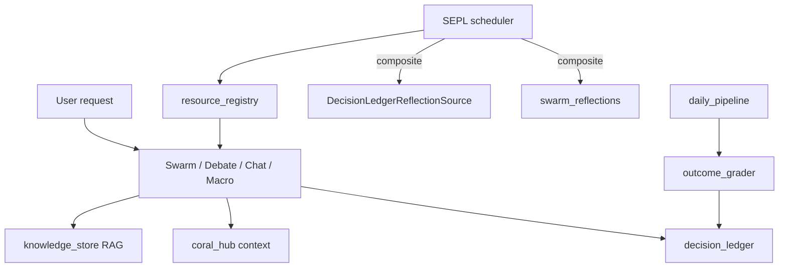

# Continual Learning Capability Assessment

TradeTalk captures decision signals, grades market outcomes, and can evolve prompts via SEPL — but the closed loop from **graded outcomes → agent behavior** is only partial in production unless SEPL and ledger reflection are enabled.

## Executive verdict

| Dimension | Rating | Summary |
|-----------|--------|---------|
| Signal capture | Strong | Ledger producers for swarm, debate, chat, macro flow, predictor, scorecard, decision terminal, gold |
| Memory / context | Strong | Chroma RAG + CORAL hub on hot path |
| Outcome-grounded evolution | Improving | `DecisionLedgerReflectionSource` wired into SEPL via **composite** default |
| Closed-loop improvement | Gated | `SEPL_ENABLE=0` by default; `SEPL_AUTOCOMMIT=0` |
| Attribution / replay | Partial | Model-swap replay + feature correlations are library-only |

## Architecture (after wiring)



**Reflection source:** `SEPL_REFLECTION_SOURCE=composite` (default) merges graded ledger rows first, then legacy Chroma `swarm_reflections`. Use `ledger` or `chroma` to force a single source.

## Verification runbook

### A. Signal volume

```bash
PYTHONPATH=. python3.12 -c "
from backend import decision_ledger as dl
L = dl.get_ledger()
print('stats:', L.stats())
"
```

Or `GET /learning-health` (also surfaced on **Observer** UI).

### B. Grader health

```bash
PYTHONPATH=. python3.12 -m unittest backend.tests.test_outcome_grader -v
```

### C. SEPL dry-run

Set `SEPL_ENABLE=1`, keep `SEPL_AUTOCOMMIT=0`, call `POST /sepl/run` with `{"dry_run": true}`.

Check `GET /sepl/status` for `reflection_source`.

### D. Reflection wiring tests

```bash
PYTHONPATH=. python3.12 -m unittest backend.tests.test_sepl_decision_source backend.tests.test_sepl_reflection_wiring -v
```

### E. Regression safety

```bash
PYTHONPATH=. python -m backend.eval.tevv_runner
PYTHONPATH=. python3.12 -m unittest backend.tests.test_decision_ledger_producers -v
```

## Producer checklist

All user-facing verdict surfaces should call `decision_ledger.emit_decision` with:

1. `prompt_versions` + `registry_snapshot_id` from `decision_ledger_registry.registry_attribution()`
2. RAG evidence via `EvidenceRef` where applicable
3. `try/except` — ledger failure must not break UX

## Environment flags

| Variable | Default | Meaning |
|----------|---------|---------|
| `DECISION_LEDGER_ENABLE` | `1` | Master ledger switch |
| `SEPL_ENABLE` | `0` | Prompt evolution scheduler |
| `SEPL_DRY_RUN` | `1` | Log-only cycles |
| `SEPL_AUTOCOMMIT` | `0` | Actually commit prompt versions |
| `SEPL_REFLECTION_SOURCE` | `composite` | `ledger` \| `chroma` \| `composite` |

## Gap priority (remaining)

| Priority | Item |
|----------|------|
| P2 | Gate `_track_swarm_outcomes` when ledger+SEPL composite is live in staging |
| P2 | Ops endpoints for feature correlations + model-swap replay |
| P3 | LLM-enhanced CORAL dreaming |
