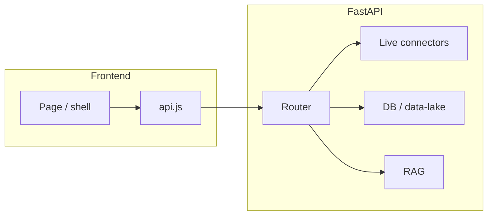

# TradeTalk data-fetch map

Page-by-page inventory of **what the frontend fetches** and **where the backend gets data** (live external APIs vs database vs RAG). Use this when adding a route, debugging stale UI, or tracing a feature to its connectors.

**Related docs**

- [ARCHITECTURE.md](./ARCHITECTURE.md) — system layers, stores, deployment
- [RAG_POLICY.md](./RAG_POLICY.md) — knowledge-store collections and retention
- [MCP.md](./MCP.md) — `/mcp/sp500` data-lake and live-quote tools
- [DECISION_LEDGER.md](./DECISION_LEDGER.md) — decision/outcome DB used by track-record and LLM call log

**Maintenance:** Update this file in the same PR when you add a page fetch, change an endpoint's data source, or mount/unmount a component that calls the API.

---

## 1. How fetching works

### Frontend

All pages call the Python API at `VITE_API_BASE_URL` (see `frontend/src/api.js`). The browser **never** calls yfinance, FRED, Polymarket, etc. directly.

| Mechanism | File | Used for |
|-----------|------|----------|
| `apiFetch` | `frontend/src/api.js` | Authenticated JSON GET/POST (JWT when logged in) |
| `apiFetchTimed` | `frontend/src/api.js` | Same, with abort timeout (long LLM routes) |
| `fetchJsonWithMeta` | `frontend/src/api.js` | Long POST/GET with `X-Request-ID` (backtest) |
| `apiPost` / `apiPostMultipart` | `frontend/src/api.js` | JSON POST, image upload |
| Raw `fetch` | various | Chat streaming, bootstrap, multipart |
| `EventSource` | `NotificationBell.jsx` | SSE `/notifications/stream` |
| Static asset | `public/dashboard/*.json` | Eval artifacts (no backend) |

Shared state: `AnalysisContext.jsx` centralizes daily brief, macro preload, and dashboard ticker analysis fan-out.

### Backend source categories

| Category | Examples |
|----------|----------|
| **Live** | yfinance, Yahoo chart HTTP, Stooq, FinCrawler, FRED CSV, Polymarket/Kalshi, Google News RSS, NewsAPI, OpenRouter/Gemini LLM |
| **DB** | SQLite/Postgres (auth, progress, chat, portfolio, alerts, decision ledger), DuckDB/BigQuery data-lake (`daily_prices`, `daily_brief_snapshot`), domain SQLite (`macro_flow.db`, `supply_chain.db`, actionable snapshots) |
| **RAG** | `knowledge_store` (Chroma / pgvector) — queried inside agents, not by the browser |
| **Static** | Bundled JSON (`supply_chains.json`, quiz bank, presets), committed eval reports |
| **Mixed** | DB/cache first + live overlay and/or RAG/LLM on read or refresh |

---

## 2. Global shell (all pages)

| Endpoint | Component | FE mechanism | Backend source |
|----------|-----------|--------------|----------------|
| `GET /auth/me` | `AuthContext.jsx` | `apiFetch` | **DB** — auth users |
| `GET /progress` | `XPBar.jsx` | `apiFetch` | **DB** — XP/badges |
| `GET /notifications/history` | `App.jsx`, `NotificationBell.jsx` | `apiFetch` | **DB** — `alert_store` |
| `GET /notifications/stream` | `NotificationBell.jsx` | **EventSource** | In-memory SSE (alerts from background scan → **DB**) |
| `POST /notifications/dismiss/{id}` | `NotificationBell.jsx` | `apiFetch` | **DB** |
| `POST /notifications/mark-seen` | `NotificationBell.jsx` | `apiFetch` | **DB** |
| `GET /chat/bootstrap` | `App.jsx`, `ChatUI.jsx`, `AppAssistantPanel.jsx` | `fetch` | **Mixed** — RAG stats/prewarm |
| `GET /chat/user-context` | `App.jsx`, `ChatUI.jsx` | `fetch` + auth | **Mixed** — **DB** portfolio + preferences |
| `POST /chat/session` | `ChatUI.jsx`, `AppAssistantPanel.jsx` | `apiFetch` | **Mixed** — session + **RAG** system prompt |
| `POST /chat/message` | `ChatUI.jsx`, `AppAssistantPanel.jsx` | `fetch` (stream) | **Mixed** — **RAG** + **DB** + **Live** tools + **LLM** |
| `POST /chat/context/refresh` | `ChatUI.jsx`, `AppAssistantPanel.jsx` | `fetch` | **RAG** background refresh |
| `POST /chat/evidence-export` | `ChatUI.jsx`, `AppAssistantPanel.jsx` | `fetch` | Session evidence (in-memory contract) |

Background notification scan (not a page fetch): **Live** Google News RSS → **LLM** pipeline → **DB** alerts → SSE push.

---

## 3. Pages by route

Routes are defined in `frontend/src/App.jsx`.

### `/` and `/daily-brief` — Daily Brief (`DailyBriefUI.jsx`)

| Endpoint | Trigger | FE mechanism | Backend source |
|----------|---------|--------------|----------------|
| `GET /daily-brief[?refresh=true]` | Mount, 5m poll, Refresh | `apiFetch` via `AnalysisContext` | **Mixed** — **DB** data-lake snapshot; stale → **Live** `market_intel` (yfinance S&P); **Live** realtime quote overlay (hedged Yahoo/Stooq/FinCrawler) |
| `GET /daily-brief/screener` | After brief load | `apiFetch` | **Mixed** — **DB** pre-scored rows + **Live** quote overlay |
| `POST /daily-brief/deep-refresh` | User action | `apiFetch` | **Mixed** — **Live** yfinance scorecard batch + **LLM** → **DB** snapshot |
| `GET /daily-brief/deep-refresh/status` | Poll while deep job runs | `apiFetch` | In-memory job state |
| `GET /portfolio/morning-brief` | Mount, poll, Refresh | `apiFetch` | **Mixed** — **DB** paper positions/snapshots + **Live** yfinance P&L/benchmarks + data-lake movement |
| `GET /portfolio/news[?tickers=]` | After morning-brief | `apiFetch` | **Mixed** — **Live** yfinance headlines + **LLM** classifier; macro path: NewsAPI → **RAG** → yfinance → static default; async **RAG** write-back |
| `GET /actionable-companies/results` | `ActionableCompaniesPanel` mount | `apiFetch` | **DB** — SQLite snapshot |
| `POST /actionable-companies/run` | Scan button | `apiPost` | **Mixed** — background **Live** yfinance S&P + heuristics → **DB** |
| `GET /actionable-companies/status` | Poll during scan | `apiFetch` | In-memory job state |

### `/dashboard` — Unified Dashboard (`UnifiedDashboardUI.jsx` + `AnalysisContext.analyzeTicker`)

Triggered by ticker search or `?ticker=` query param. Six parallel calls (plus validate probe):

| Endpoint | FE mechanism | Backend source |
|----------|--------------|----------------|
| `GET /metrics/validate/{ticker}` | `apiFetch` | **Live** — Yahoo chart probe → Stooq/FinCrawler |
| `GET /metrics/{ticker}` | `apiFetchTimed` | **Live** — yfinance (`InvestorMetricsConnector`) |
| `GET /small-cap-assessment/{ticker}` | `apiFetchTimed` (Small/Micro cap only) | **Mixed** — **Live** yfinance + FinCrawler SEC/news + **LLM** |
| `GET /prediction-markets?ticker=` | `apiFetchTimed` | **Live** — Polymarket Gamma + Kalshi |
| `GET /decision-terminal?ticker=` | `apiFetchTimed` | **Mixed** — **Live** connectors + **RAG** + **LLM** swarm/debate/scenarios + **DB** ledger emit. Returns embedded `swarm` + `debate` (no separate `/trace`/`/debate` from this page) |
| `GET /scorecard/{ticker}?skip_llm_scores=true` | `apiFetchTimed` | **Mixed** — **Live** yfinance fundamentals; deterministic math |
| `GET /stock-fundamentals/{ticker}` | `apiFetchTimed` | **Live** — yfinance OHLC, financials, info |

Also consumes shared `AnalysisContext` preload: `/macro`, `/daily-brief/*` when those loaders ran elsewhere.

**Legacy:** `ConsumerUI.jsx` calls `GET /trace` + `GET /metrics` but is **not routed**; `/dashboard` uses `UnifiedDashboardUI`.

### `/decision-terminal` — Decision Terminal (`DecisionTerminalUI.jsx`)

| Endpoint | FE mechanism | Backend source |
|----------|--------------|----------------|
| `GET /decision-terminal?ticker=` | `apiFetch` | Same **Mixed** pipeline as dashboard (standalone, not via `AnalysisContext`) |

### `/macro` — Macro (`MacroUI.jsx`, `GlobalCapFlowDashboard.jsx`)

| Endpoint | Component | FE mechanism | Backend source |
|----------|-----------|--------------|----------------|
| `GET /macro` | `AnalysisContext.loadMacro` | `apiFetch` | **Mixed** — **Live** yfinance (VIX, sectors, cap flows) + **Live** FRED |
| `GET /macro/fred-snapshot` | `MacroUI` | `apiFetch` | **Live** FRED CSV; fallback **Static** seed + disk cache |
| `GET /macro/global-markets?period=&tickers=` | `GlobalMarketsChartPanel` | `apiFetch` | **Live** — yfinance batch history |
| `GET /macro/spend-chain` | `ValueChainSpendPanel` | `apiFetch` | **Static** — `backend/data/supply_chains.json` |
| `GET /macro/flow/chain?interval=` | `ValueChainSpendPanel` (fallback) | `apiFetch` | **DB** — `macro_flow.db` cached pipeline |

### `/backtest` — Strategy Lab (`BacktestUI.jsx`)

| Endpoint | FE mechanism | Backend source |
|----------|--------------|----------------|
| `GET /strategies/presets` | `fetchJsonWithMeta` | **Static** — code presets |
| `GET /strategies/leaderboard?n=` | `fetchJsonWithMeta` | **RAG** — backtest leaderboard collection |
| `POST /backtest/validate` | `fetchJsonWithMeta` | **Static** — in-process rules |
| `POST /backtest` | `fetchJsonWithMeta` | **Mixed** — **Static**/ **LLM** parse + **RAG**; **Live** yfinance/SEC data; **RAG** reflection write-back |

### `/chat` — Chat (`ChatUI.jsx`)

See global shell chat endpoints. Additional:

| Endpoint | FE mechanism | Backend source |
|----------|--------------|----------------|
| `GET /chat/sessions?limit=` | `apiFetch` | **DB** — transcript store |
| `GET /chat/sessions/{id}` | `apiFetch` | **DB** |

### `/portfolio` — Paper Portfolio (`PaperPortfolioUI.jsx`)

| Endpoint | FE mechanism | Backend source |
|----------|--------------|----------------|
| `GET /preferences`, `PUT /preferences` | `apiFetch` | **DB** |
| `GET /portfolio/performance` | `fetchJsonWithMeta` | **Mixed** — **DB** positions + **Live** yfinance |
| `POST /portfolio/position`, `POST /portfolio/close/{id}` | `apiFetch` | **DB** |
| `POST /portfolio/preview-holdings-import`, `/apply-holdings-import` | `apiFetch` | **DB** reconcile |
| `POST /portfolio/parse-holdings-image` | `apiPostMultipart` | **Mixed** — **Live** Gemini vision OCR |
| `POST /scorecard/compare` | `fetchJsonWithMeta` (watchlist) | **Mixed** — **Live** yfinance batch |
| `GET /portfolio/news?tickers=` | `fetch` | Same news pipeline as Daily Brief |

### `/challenge`, `/learning` — Investor Academy (`AcademyUI.jsx`)

| Endpoint | FE mechanism | Backend source |
|----------|--------------|----------------|
| `GET /challenge/today`, `/yesterday` | `apiFetch` | **Mixed** — **Static** quiz bank + **DB** answers; grading uses **Live** yfinance |
| `POST /challenge/answer` | `apiFetch` | **DB** + **Live** yfinance |
| `GET /learning/curriculum`, `/learning/module/{id}` | `apiFetch` | **Mixed** — **Static** curriculum + **DB** completion |
| `POST /learning/module/{id}/complete` | `apiFetch` | **DB** |
| `POST /academy/lesson/{id}/generate` | `apiFetch` | **Mixed** — **LLM**/video gen → **DB** |
| `POST /academy/lesson/{id}/watch` | `apiFetch` | **DB** progress + XP |

`VideoPlayer.jsx` loads lesson media from the API static origin (backend-served assets).

### `/observer` — Developer Trace (`ObserverUI.jsx`)

| Endpoint | FE mechanism | Backend source |
|----------|--------------|----------------|
| `GET /learning-health` | `apiFetch` | **DB** — decision ledger / SEPL stats |
| `GET /trace?ticker=` | `apiFetch` | **Mixed** — **Live** connectors + **RAG** + **LLM** swarm |
| `GET /notifications/trace` | `apiFetch` | **Mixed** — last scan trace + **DB** alerts |
| `GET /dashboard/uiux-summary.json` | static `fetch` | **Static** — Vite `public/` eval artifact |
| `GET /dashboard/eval-summary.json` | static `fetch` | **Static** — Vite `public/` eval artifact |

### `/llm-calls` — LLM Call Log (`LlmCallsUI.jsx`)

| Endpoint | FE mechanism | Backend source |
|----------|--------------|----------------|
| `GET /llm/calls?limit=` | `apiFetch` | **DB** — decision ledger LLM call log |

### `/swarm-score` — SwarmScore Eval (`SwarmScoreUI.jsx`)

| Endpoint | FE mechanism | Backend source |
|----------|--------------|----------------|
| `GET /admin/swarm-score/summary`, `/results`, `/report` | `apiFetch` | **Static** — `evals/reports/` + dashboard JSON |
| `POST /admin/swarm-score/run` | `apiFetch` | **Mixed** — offline eval runner → static artifacts |

### `/ubds` — UBDS Benchmark (`UbdsBenchmarkUI.jsx`)

| Endpoint | FE mechanism | Backend source |
|----------|--------------|----------------|
| `GET /admin/ubds/summary`, `/results`, `/report`, `/history` | `apiFetch` | **Static** eval artifacts |
| `POST /admin/ubds/run` | `apiFetch` | **Mixed** — UBDS runner → static artifacts |

### `/api-catalog` — API Catalog (`ApiCatalogUI.jsx`)

No runtime API for page content — **Static** in-code catalog. Links to live OpenAPI at `{API_BASE_URL}/docs`.

### `/systemmap`, `/system-diagrams`

No network fetches — static in-component diagrams (`SystemMapUI.jsx`, `SystemDiagramsUI.jsx`).

### `/login` — Auth (`AuthGate.jsx` + `AuthContext.jsx`)

| Endpoint | FE mechanism | Backend source |
|----------|--------------|----------------|
| `POST /auth/google` | `apiFetch` | **Live** Google verify + **DB** user |
| `POST /auth/login-manual`, `/signup` | `apiFetch` | **DB** |

---

## 4. Components with fetches but no route today

These files call the API but are **not mounted** in `App.jsx` as of this doc. The API catalog (`ApiCatalogUI.jsx`) documents their intended wiring.

| Component | Endpoints | Backend source (summary) |
|-----------|-----------|--------------------------|
| `MacroFlowPanel.jsx` | `GET /macro/flow/sankey`, `/chain`, `/stock-graph`; `POST /macro/flow/refresh` | GET: **DB** `macro_flow.db`; refresh: **Live** yfinance + **LLM** + **RAG** → **DB**; stock-graph GET also **Live** yfinance correlations |
| `supplyChain/SupplyChainTab.jsx` | `GET /macro/supply-chain/graph`, `/sector-sankey`, `/timeline`, `/nodes/{id}` | **DB** `supply_chain.db` (seeded from **Static** JSON) |
| `YourMorningHero.jsx` | `GET /portfolio/morning-brief`, `/portfolio/track-record`; `POST /portfolio/user-actions/log` | **Mixed** / **DB** ledger (same as morning-brief family) |
| `LiveQuoteWidget.jsx` | `GET /mcp/sp500/live-quote?symbol=` | **Mixed** — hedged **Live** quotes → data-lake EOD **DB** fallback |
| `PortfolioTimeline.jsx` | `GET /portfolio/timeline?limit=` | **DB** — portfolio events / reaction memory |

Daily Brief currently inlines portfolio/morning data in `DailyBriefUI.jsx` instead of `YourMorningHero`.

---

## 5. Endpoint index (backend source)

Quick lookup by path prefix. Router files under `backend/routers/`.

| Prefix | Primary sources | Notes |
|--------|-----------------|-------|
| `/daily-brief` | **Mixed** (DB lake + live overlay) | Deep refresh adds **Live** yfinance + **LLM** |
| `/portfolio` | **Mixed** / **DB** | Positions **DB**; performance/news **Live** + **RAG** |
| `/metrics`, `/stock-fundamentals` | **Live** (yfinance) | |
| `/decision-terminal`, `/trace`, `/debate`, `/analyze` | **Mixed** (live + RAG + LLM) | Dashboard uses `/decision-terminal` only |
| `/prediction-markets` | **Live** (Polymarket, Kalshi) | |
| `/scorecard` | **Mixed** (yfinance + optional LLM) | Dashboard skips LLM scores |
| `/small-cap-assessment` | **Mixed** (yfinance, FinCrawler, LLM) | |
| `/macro` | **Mixed** (yfinance, FRED) | |
| `/macro/fred-snapshot` | **Live** FRED (+ static seed) | |
| `/macro/global-markets` | **Live** yfinance | |
| `/macro/flow/*` | **DB** on GET; **Mixed** on refresh | |
| `/macro/spend-chain` | **Static** JSON | |
| `/macro/supply-chain/*` | **DB** | |
| `/backtest`, `/strategies` | **Mixed** / **RAG** / **Static** | Leaderboard is **RAG** |
| `/chat/*` | **Mixed** (RAG + DB + live tools) | |
| `/notifications/*` | **DB** + in-memory SSE | Scan uses **Live** RSS + **LLM** |
| `/learning`, `/challenge`, `/academy` | **Static** + **DB** (+ live for grading) | |
| `/progress` | **DB** | |
| `/actionable-companies/*` | **DB** snapshot; scan **Live** yfinance | |
| `/admin/swarm-score/*`, `/admin/ubds/*` | **Static** eval artifacts | |
| `/llm/calls` | **DB** decision ledger | |
| `/auth/*`, `/preferences` | **DB** | |
| `/mcp/sp500/live-quote` | **Mixed** live hedge + lake EOD | See [MCP.md](./MCP.md) |
| `/learning-health` | **DB** ledger stats | `debug.py` |

---

## 6. Design patterns

1. **Dashboard consolidation** — `/dashboard` does not call `/trace` or `/debate` separately; `GET /decision-terminal` embeds `swarm` and `debate` in one **Mixed** response.

2. **Cache-first reads** — Daily brief movers, macro flow sankey/chain, supply-chain graphs, actionable-companies results, and strategy leaderboard read **DB or RAG** on GET. Live refresh is explicit (`?refresh=true`, deep-refresh, flow refresh cron).

3. **Live quote hedging** — `GET /mcp/sp500/live-quote`: Yahoo `fast_info` → Yahoo chart / Stooq → FinCrawler → data-lake EOD fallback.

4. **RAG is server-side** — Pages never talk to Chroma/pgvector directly. RAG appears inside chat, trace/debate, decision-terminal, backtest reflection, portfolio news write-back, and leaderboard reads.

5. **Truthful-data contract** — Several routes return `insufficient_data` when live inputs are missing; frontend surfaces this via `apiFetch` (`err.isInsufficientData`) rather than showing fabricated numbers.

---

## 7. Live connector reference

| Connector / module | Used for |
|--------------------|----------|
| `connectors/live_data_orchestrator.py`, `live_quote.py` | Hedged realtime quotes, daily-brief overlay |
| `connectors/yfinance_*`, `InvestorMetricsConnector` | Prices, fundamentals, metrics, batch history |
| `connectors/fred.py` | Fed funds, CPI, macro snapshot |
| `connectors/polymarket.py`, Kalshi client | Prediction markets |
| `connectors/news_scanner.py`, RSS | Notification scan, social sentiment |
| `connectors/stock_fundamentals.py` | OHLC + financial statements |
| FinCrawler | SEC filings, scrape fallback quotes |
| `llm_client.py` | Swarm, debate, decision-terminal, chat, backtest parse, news classifier |
| `knowledge_store.py` | RAG retrieval and reflection writes |
| `mcp_server/backend.py` | Data-lake DuckDB/BQ (`daily_prices`, movement context) |

For storage layout and cron population of the data-lake, see [ARCHITECTURE.md](./ARCHITECTURE.md) and [BATCH_ETL.md](./BATCH_ETL.md).

---

## 8. Realtime freshness additions (dashboard / decision-terminal)

| Layer | Mechanism | TTL / invalidation |
|-------|-----------|-------------------|
| **Verdict cache** | `backend/verdict_cache.py` — demand-only, keyed by `(ticker, session_date)` | Valid for current trading session; new session = miss. `VERDICT_CACHE_ENABLE=0` off-switch. `?force=true` bypasses. |
| **Spot overlay on cache hit** | `overlay_fresh_spot()` re-reads `resolve_spot()` (60s TTL) | Spot refreshed; LLM verdict reused |
| **Connector cache** | `connector_cache.connector_cache_ttl()` | 60s during `SESSION_REGULAR`, 300s off-hours |
| **Dashboard poller** | `AnalysisContext` — `VITE_DASHBOARD_LIVE_POLL` (default on) | 30s: `/metrics`, `/mcp/sp500/live-quote`; 5m: `/prediction-markets`. No background `/decision-terminal`. |
| **Per-panel timestamps** | `<LastUpdated>` in `Freshness.jsx` | Shows full local `captured_at` + relative age |

`GET /metrics/{ticker}` now returns `data_freshness` (`fundamentals` data class). `GET /stock-fundamentals` uses `fundamentals` + `spot_freshness` envelopes.

---

## Appendix A — Endpoints grouped by path

Alphabetical reference: **endpoint → UI surfaces → fetch mechanism → backend source**. Router file in `backend/routers/` unless noted.

### Analysis & verdicts

| Endpoint | UI surfaces | FE mechanism | Backend source |
|----------|-------------|--------------|----------------|
| `GET /decision-terminal?ticker=` | `/dashboard`, `/decision-terminal` | `apiFetchTimed` / `apiFetch` | **Mixed** — live connectors + **RAG** + **LLM**; embeds swarm/debate; **DB** ledger emit (`analysis.py`) |
| `GET /trace?ticker=` | `/observer`; legacy `ConsumerUI` (unrouted) | `apiFetch` | **Mixed** — **Live** connectors + **RAG** + **LLM** swarm (`analysis.py`) |
| `GET /debate?ticker=` | E2E / API catalog; not called from `/dashboard` | — | **Mixed** — **Live** + **RAG** + **LLM** debate (`analysis.py`) |
| `GET /metrics/validate/{ticker}` | `/dashboard` (probe) | `apiFetch` | **Live** — Yahoo chart → Stooq/FinCrawler (`macro.py`) |
| `GET /metrics/{ticker}` | `/dashboard`; legacy `ConsumerUI` | `apiFetchTimed` | **Live** — yfinance (`macro.py`) |
| `GET /stock-fundamentals/{ticker}` | `/dashboard` | `apiFetchTimed` | **Live** — yfinance (`analysis.py`) |
| `GET /prediction-markets?ticker=` | `/dashboard` | `apiFetchTimed` | **Live** — Polymarket + Kalshi (`analysis.py`) |
| `GET /small-cap-assessment/{ticker}` | `/dashboard` (Small/Micro cap) | `apiFetchTimed` | **Mixed** — yfinance + FinCrawler + **LLM** (`small_cap.py`) |
| `GET /scorecard/{ticker}` | `/dashboard` | `apiFetchTimed` | **Mixed** — yfinance + optional **LLM** (`scorecard.py`) |
| `POST /scorecard/compare` | `/portfolio` watchlist | `fetchJsonWithMeta` | **Mixed** — yfinance batch (`scorecard.py`) |

### Daily brief & market intel

| Endpoint | UI surfaces | FE mechanism | Backend source |
|----------|-------------|--------------|----------------|
| `GET /daily-brief` | `/`, `/daily-brief` | `apiFetch` | **Mixed** — **DB** lake snapshot + **Live** overlay (`daily_brief.py`) |
| `GET /daily-brief/screener` | `/`, `/daily-brief` | `apiFetch` | **Mixed** — **DB** + **Live** overlay (`daily_brief.py`) |
| `POST /daily-brief/deep-refresh` | `/`, `/daily-brief` | `apiFetch` | **Mixed** — **Live** yfinance + **LLM** → **DB** (`daily_brief.py`) |
| `GET /daily-brief/deep-refresh/status` | `/`, `/daily-brief` (poll) | `apiFetch` | In-memory job (`daily_brief.py`) |
| `GET /actionable-companies/results` | Daily Brief panel | `apiFetch` | **DB** snapshot (`actionable.py`) |
| `POST /actionable-companies/run` | Daily Brief panel | `apiPost` | **Mixed** — **Live** scan → **DB** (`actionable.py`) |
| `GET /actionable-companies/status` | Daily Brief panel (poll) | `apiFetch` | In-memory job (`actionable.py`) |
| `GET /mcp/sp500/live-quote?symbol=` | `LiveQuoteWidget` (unrouted) | `apiFetch` | **Mixed** — hedged **Live** → lake **DB** (`mcp_server/router.py`) |

### Portfolio

| Endpoint | UI surfaces | FE mechanism | Backend source |
|----------|-------------|--------------|----------------|
| `GET /portfolio/morning-brief` | `/`, `/daily-brief`; `YourMorningHero` (unrouted) | `apiFetch` / `apiFetchTimed` | **Mixed** — **DB** + **Live** yfinance (`portfolio.py`) |
| `GET /portfolio/track-record` | `YourMorningHero` (unrouted) | `apiFetchTimed` | **DB** — decision ledger (`portfolio.py`) |
| `GET /portfolio/news` | `/`, `/daily-brief`, `/portfolio` | `apiFetch` / `fetch` | **Mixed** — **Live** + **LLM** + **RAG** (`portfolio_news.py`) |
| `GET /portfolio/performance` | `/portfolio` | `fetchJsonWithMeta` | **Mixed** — **DB** + **Live** (`portfolio.py`) |
| `GET /portfolio/timeline` | `PortfolioTimeline` (unrouted) | `apiFetch` | **DB** (`portfolio.py`) |
| `POST /portfolio/position`, `/close/{id}` | `/portfolio` | `apiFetch` | **DB** (`portfolio.py`) |
| `POST /portfolio/preview-holdings-import`, `/apply-holdings-import` | `/portfolio` | `apiFetch` | **DB** (`portfolio.py`) |
| `POST /portfolio/parse-holdings-image` | `/portfolio` | `apiPostMultipart` | **Mixed** — Gemini vision (`portfolio.py`) |
| `POST /portfolio/user-actions/log` | `YourMorningHero` (unrouted) | `apiPost` | **DB** (`portfolio.py`) |
| `GET /preferences`, `PUT /preferences` | `/portfolio` | `apiFetch` | **DB** (`preferences.py`) |

### Macro

| Endpoint | UI surfaces | FE mechanism | Backend source |
|----------|-------------|--------------|----------------|
| `GET /macro` | `/macro`; `AnalysisContext` preload | `apiFetch` | **Mixed** — yfinance + FRED (`macro.py`) |
| `GET /macro/fred-snapshot` | `/macro` | `apiFetch` | **Live** FRED + static seed (`macro.py`) |
| `GET /macro/global-markets` | `/macro` chart panel | `apiFetch` | **Live** yfinance batch (`macro.py`) |
| `GET /macro/spend-chain` | `/macro` value chain | `apiFetch` | **Static** JSON (`macro.py`) |
| `GET /macro/flow/sankey`, `/chain` | `MacroFlowPanel` (unrouted) | `apiFetch` | **DB** `macro_flow.db` (`macro.py`) |
| `GET /macro/flow/stock-graph` | `MacroFlowPanel` (unrouted) | `apiFetch` | **Mixed** — **Live** yfinance correlations (`macro.py`) |
| `POST /macro/flow/refresh` | `MacroFlowPanel` (unrouted) | `apiFetch` | **Mixed** — **Live** + **LLM** + **RAG** → **DB** (`macro.py`) |
| `GET /macro/supply-chain/*` | `SupplyChainTab` (unrouted) | `apiFetch` | **DB** `supply_chain.db` (`macro.py`) |

### Backtest & strategies

| Endpoint | UI surfaces | FE mechanism | Backend source |
|----------|-------------|--------------|----------------|
| `GET /strategies/presets` | `/backtest` | `fetchJsonWithMeta` | **Static** (`backtest.py`) |
| `GET /strategies/leaderboard` | `/backtest` | `fetchJsonWithMeta` | **RAG** (`backtest.py`) |
| `POST /backtest/validate` | `/backtest` | `fetchJsonWithMeta` | **Static** (`backtest.py`) |
| `POST /backtest` | `/backtest` | `fetchJsonWithMeta` | **Mixed** — **Live** + **LLM** + **RAG** (`backtest.py`) |

### Chat

| Endpoint | UI surfaces | FE mechanism | Backend source |
|----------|-------------|--------------|----------------|
| `GET /chat/bootstrap` | `/chat`, shell, assistant | `fetch` | **Mixed** — **RAG** prewarm (`chat.py`) |
| `GET /chat/user-context` | `/chat`, shell | `fetch` | **Mixed** — **DB** assembly (`chat.py`) |
| `GET /chat/sessions`, `/sessions/{id}` | `/chat` | `apiFetch` | **DB** (`chat.py`) |
| `POST /chat/session` | `/chat`, assistant | `apiFetch` | **Mixed** — **RAG** prompt (`chat.py`) |
| `POST /chat/message` | `/chat`, assistant | `fetch` (stream) | **Mixed** — **RAG** + **Live** tools + **LLM** (`chat.py`) |
| `POST /chat/context/refresh` | `/chat`, assistant | `fetch` | **RAG** (`chat.py`) |
| `POST /chat/evidence-export` | `/chat`, assistant | `fetch` | Session memory (`chat.py`) |

### Notifications

| Endpoint | UI surfaces | FE mechanism | Backend source |
|----------|-------------|--------------|----------------|
| `GET /notifications/history` | Shell, `NotificationBell` | `apiFetch` | **DB** (`notifications.py`) |
| `GET /notifications/stream` | `NotificationBell` | **EventSource** | In-memory SSE (`notifications.py`) |
| `POST /notifications/dismiss/{id}`, `/mark-seen` | `NotificationBell` | `apiFetch` | **DB** (`notifications.py`) |
| `GET /notifications/trace` | `/observer` | `apiFetch` | **Mixed** — scan trace + **DB** (`notifications.py`) |

### Learning, academy, progress

| Endpoint | UI surfaces | FE mechanism | Backend source |
|----------|-------------|--------------|----------------|
| `GET /challenge/today`, `/yesterday` | `/challenge`, `/learning` | `apiFetch` | **Mixed** — **Static** + **DB** + **Live** grade (`challenges.py`) |
| `POST /challenge/answer` | `/challenge`, `/learning` | `apiFetch` | **DB** + **Live** (`challenges.py`) |
| `GET /learning/curriculum`, `/module/{id}` | `/learning` | `apiFetch` | **Mixed** — **Static** + **DB** (`learning.py`) |
| `POST /learning/module/{id}/complete` | `/learning` | `apiFetch` | **DB** (`learning.py`) |
| `POST /academy/lesson/{id}/generate`, `/watch` | `/learning` | `apiFetch` | **Mixed** / **DB** (`academy.py`) |
| `GET /progress` | `XPBar` (global) | `apiFetch` | **DB** (`progress.py`) |

### Auth

| Endpoint | UI surfaces | FE mechanism | Backend source |
|----------|-------------|--------------|----------------|
| `GET /auth/me` | Global | `apiFetch` | **DB** (`auth.py`) |
| `POST /auth/google`, `/login-manual`, `/signup` | `/login`, gates | `apiFetch` | **Live** + **DB** / **DB** (`auth.py`) |

### Admin, eval, debug

| Endpoint | UI surfaces | FE mechanism | Backend source |
|----------|-------------|--------------|----------------|
| `GET /admin/swarm-score/*` | `/swarm-score` | `apiFetch` | **Static** eval artifacts (`swarm_eval.py`) |
| `POST /admin/swarm-score/run` | `/swarm-score` | `apiFetch` | **Mixed** — runner → static files |
| `GET /admin/ubds/*` | `/ubds` | `apiFetch` | **Static** eval artifacts (`ubds_eval.py`) |
| `POST /admin/ubds/run` | `/ubds` | `apiFetch` | **Mixed** — runner → static files |
| `GET /llm/calls` | `/llm-calls` | `apiFetch` | **DB** ledger (`debug.py`) |
| `GET /learning-health` | `/observer` | `apiFetch` | **DB** ledger stats (`debug.py`) |

### Static assets (no backend)

| Path | UI surfaces | FE mechanism | Source |
|------|-------------|--------------|--------|
| `/dashboard/eval-summary.json` | `/observer` | `fetch` | Vite `public/` — committed eval output |
| `/dashboard/uiux-summary.json` | `/observer` | `fetch` | Vite `public/` — committed eval output |
