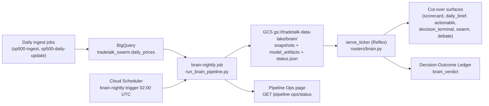

# Finance Brain — GCP pipeline cutover and Pipeline Ops

The finance brain (`backend/brain/`) is the model-agnostic scoring engine that
replaces the legacy swarm/debate/predictor/scorecard scoring. It is wired into
the GCP data pipeline as a nightly snapshot job and served at request time
behind feature flags. Data ingestion (BigQuery) is unchanged; only scoring moves
to the brain.

## Architecture

## Feature flags (all default OFF — safe)

| Env var | Effect |
|---|---|
| `BRAIN_SERVE_ENABLE=1` | Enables `/brain/*` serving. Required for any cutover. |
| `BRAIN_CUTOVER_ALL=1` | Routes every surface to the brain. |
| `BRAIN_CUTOVER_SCORECARD=1` | Scorecard verdict from brain. |
| `BRAIN_CUTOVER_DAILY_BRIEF=1` | Daily-brief mover verdicts from brain. |
| `BRAIN_CUTOVER_ACTIONABLE=1` | Actionable screener score/verdict from brain. |
| `BRAIN_CUTOVER_DECISION_TERMINAL=1` | Decision-terminal headline verdict from brain. |
| `BRAIN_CUTOVER_SWARM=1` | Swarm consensus verdict + grounded memo from brain. |
| `BRAIN_CUTOVER_DEBATE=1` | Debate verdict + grounded moderator memo from brain. |
| `STORAGE_BACKEND=gcp` | Brain artifacts in GCS (else local dir). |
| `BRAIN_GCS_BUCKET` / `BRAIN_GCS_PREFIX` | Bucket/prefix (default `tradetalk-data-lake` / `brain`). |
| `BRAIN_TIMESFM_ENABLE=1` | Nightly job fetches TimesFM bands per ticker. |

A surface only switches when its flag is on **and** a snapshot exists for the
ticker; otherwise it transparently falls back to the legacy engine. This is why
the legacy modules (`agents.py`, `debate_agents.py`, `predictor/`) remain in the
tree — they are the fallback until production verification, after which they can
be decommissioned.

## Recommended rollout order

1. Deploy: `bash scripts/deploy_brain_job.sh` (Cloud Run Job + Scheduler).
2. Run once: `gcloud run jobs execute brain-nightly --region us-central1 --wait`.
3. Verify on the **Pipeline Ops** page (Developer suite) that the brain section
   shows fresh `as_of_date` and a healthy snapshot count.
4. Set `BRAIN_SERVE_ENABLE=1`, smoke-test `GET /brain/ticker?ticker=AAPL`.
5. Flip surfaces one at a time (`BRAIN_CUTOVER_SCORECARD=1`, etc.), verifying each.
6. After all surfaces are verified in prod, remove the legacy fallback modules.

## IAM

The brain job runs as `tradetalk-etl@<project>.iam.gserviceaccount.com` and needs:

- `roles/bigquery.dataViewer` + `roles/bigquery.jobUser` (read prices).
- `roles/storage.objectAdmin` on `gs://tradetalk-data-lake` (read/write `brain/`).

The Cloud Scheduler trigger uses the same SA with `roles/run.invoker` on the job.

The API service account additionally needs, for the **Pipeline Ops** page:

- `roles/run.viewer` (list Cloud Run job executions).
- `roles/cloudscheduler.viewer` (list scheduler jobs).
- `roles/storage.objectViewer` on the bucket (read `brain/status.json`).

Without these, Pipeline Ops simply marks those sections `available: false` and
still renders everything else (including locally, with no GCP creds).

## Off switch

Unset `BRAIN_SERVE_ENABLE` (or any per-surface flag) and redeploy — all surfaces
revert to the legacy engines immediately. The nightly job and ledger emits are
independent and harmless if left running.
