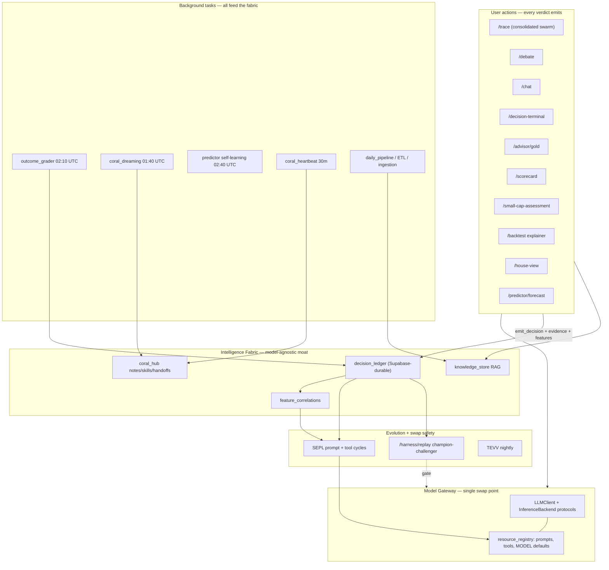

# Phase F — Model-Agnostic Financial Intelligence Fabric (architecture plan)

**Status:** PLAN (no code changes in this phase doc)
**Audience:** agent architects / operators
**Goal:** every user action and background task contributes to the swarm's finance/stock intelligence, and the LLM underneath can be swapped without degrading that intelligence.

Related docs: [`DECISION_LEDGER.md`](DECISION_LEDGER.md), [`SEPL.md`](SEPL.md), [`RESOURCE_REGISTRY.md`](RESOURCE_REGISTRY.md), [`PHASE_HARNESS_SUPERINVESTOR.md`](PHASE_HARNESS_SUPERINVESTOR.md), [`CONTINUAL_LEARNING_ASSESSMENT.md`](CONTINUAL_LEARNING_ASSESSMENT.md), [`PHASE_B_DREAMING.md`](PHASE_B_DREAMING.md), [`RAG_POLICY.md`](RAG_POLICY.md).

---

## 1. Design principle

> **The intelligence lives in the harness, not the model.**

The model is a *replaceable inference engine*. What the app owns — and what survives a model swap — is:

| Asset | Where it lives today |
|-------|----------------------|
| Decisions + market-truth outcomes | `backend/decision_ledger.py` (`decision_events`, `outcome_observations`) |
| Evidence lineage (RAG chunks per decision) | `decision_evidence` via `knowledge_store.query_with_refs(...)` |
| Feature snapshots + hit-rate correlations | `feature_snapshots`, `backend/feature_correlations.py` |
| Versioned prompts and tool configs | `backend/resource_registry.py`, `backend/tool_configs.py` |
| Accumulated memory | `backend/knowledge_store.py` (21 collections), `backend/coral_hub.py` (notes/skills/handoffs) |
| Evolution machinery | `backend/sepl.py`, `backend/sepl_tool.py`, `backend/coral_dreaming.py` |
| Swap-safety harness | `backend/model_swap_replay.py`, `backend/harness/replay_service.py`, TEVV (`backend/eval/tevv_runner.py`) |

A model swap therefore must be: **config change → replay gate → deploy → drill verification**, never a code change.

---

## 2. Current-state scorecard

| Dimension | Rating | Evidence |
|-----------|--------|----------|
| Signal capture (user actions) | **Good, with holes** | ~12 ledger producers; but `/trace` emits only per-factor rows (no consolidated swarm verdict), `/small-cap-assessment` and `/backtest` explainer emit nothing |
| Evidence completeness | **Inconsistent** | `debate`, `house_view`, `macro_flow_signal` attach `query_with_refs` evidence; `decision_terminal`, `gold_advisor`, `swarm_factor`, `scorecard` do not |
| Model abstraction | **Mostly centralized, leaky** | `LLMClient` (`backend/llm_client.py`) handles NVIDIA → OpenRouter → Gemini cascade; but `backend/predictor/synthesizer.py` and `reviewer.py` call NVIDIA via raw `httpx`, and default model IDs are hardcoded in ~6 modules |
| Attribution fidelity | **Over-broad** | `registry_attribution()` in `backend/decision_ledger_registry.py` stamps **all** active prompt versions on every decision, not the roles actually used |
| Durability | **At risk** | Default `DECISION_BACKEND=sqlite` on ephemeral Cloud Run disk; Supabase path exists but `DecisionLedgerReflectionSource` returns `[]` on Supabase (TODO in `backend/sepl.py`) |
| Loop closure | **Built, gated off** | `SEPL_ENABLE=0`, `SEPL_AUTOCOMMIT=0`, `SEPL_TOOL_ENABLE=0`; dreaming is rule-based v1 |
| Dead paths | **Yes** | `swarm_reflections` writer (`add_swarm_reflection`, `generate_swarm_reflection`) never called in production, yet `AgentPair._fetch_prior_lessons()` still reads the collection |
| Swap safety | **Strong foundation** | `/harness/replay`, `champion_challenger_gate()`, `resolved_model_label()`, TEVV nightly, `e2e:smoke` |

---

## 3. Target architecture



Two contracts make this work:

1. **Capture contract** (extends the AGENTS.md ledger rule): every user-facing verdict surface emits `DecisionEvent` + `EvidenceRef`s (`query_with_refs`) + `FeatureValue`s + registry stamps. Background jobs never emit decisions; they log `coral_hub.log_handoff_event` and write to RAG/fixtures so they still enrich the fabric.
2. **Gateway contract**: no module outside the gateway names a provider, model ID, or provider SDK. Swapping the model touches only env/registry; intelligence assets are stamped with the *resolved* model label so analytics segment cleanly per model.

---

## 4. Workstreams

### F1 — Total capture: close the producer gaps

Every user action contributes; today some are invisible to SEPL/correlations/replay.

| Change | File(s) | decision_type / horizon |
|--------|---------|--------------------------|
| Emit consolidated swarm verdict after synthesis in `/trace` | `backend/routers/analysis.py` (`_execute_swarm_trace`), `backend/agents.py` | `swarm` / `5d` |
| Emit small-cap assessment | `backend/routers/small_cap.py` | `small_cap_assessment` / `21d` |
| Emit backtest explainer verdict | `backend/routers/backtest.py` | `backtest_verdict` / `none` |
| Emit daily-brief deep refresh (per-user batch verdicts) | `backend/daily_brief.py` / `backend/routers/daily_brief.py` | `daily_brief` / `1d` |
| Enrich `decision_terminal` with `query_with_refs` evidence + `FeatureValue`s | `backend/decision_terminal.py` | existing |
| Enrich `gold_advisor` with macro-regime evidence refs | `backend/gold_advisor_service.py` | existing |
| Enrich `swarm_factor` with the RAG refs the agent pair actually retrieved | `backend/agents.py::_emit_factor_decision` | existing |
| Enrich `scorecard` with features (`sitg_score`, `execution_risk`) | `backend/routers/scorecard.py` | existing |

Tests: extend `backend/tests/test_decision_ledger_producers.py` (temp `DECISIONS_DB_PATH`, assert `decision_events` + `decision_evidence` + `feature_snapshots` rows). Offline, per the AGENTS.md rule. All emits stay inside `try/except` — ledger failure never breaks UX.

Acceptance: a "capture coverage" check (see F6) reports 100% of verdict routes emitting, and ≥90% of emits carrying ≥1 evidence ref and ≥1 feature.

### F2 — Single model gateway: make the swap a config change

1. **Migrate stragglers onto the gateway.** `backend/predictor/synthesizer.py` and `backend/predictor/reviewer.py` currently re-implement the NVIDIA/Gemini cascade with raw `httpx`. Move them onto `LLMClient` (roles `predictor_synthesizer`, `predictor_reviewer`) or an `LLMVerdictBackend` from `backend/harness/backend_protocol.py`. This also gives them `llm_api_calls` cost logging and prompt-version lineage for free.
2. **Centralize model defaults.** Hardcoded IDs (`moonshotai/kimi-k2.6`, `deepseek-ai/deepseek-v4-pro`, `google/gemma-4-31b-it:free`, `gemini-3.5-flash`, `veo-3.1-lite-generate-preview`) live in `llm_client.py`, `gemini_llm.py`, `openrouter_pool.py`, `predictor/*`, `video_generation_agent.py`. Consolidate into one module (e.g. `backend/model_defaults.py`) or MODEL-kind records in `resource_registry`, read everywhere else. One place to change, one place to audit.
3. **Per-decision attribution.** Replace blanket `registry_attribution()` stamping with the actual roles used: `generate_with_meta()` already returns `{prompt_name, prompt_version}` — thread those into `prompt_versions_json` per decision, keep `registry_snapshot_id` global. Replay and SEPL kill-switch cohorting become precise.
4. **Stamp the resolved model everywhere.** `resolved_model_label()` (`nvidia:…` / `openrouter:…` / `gemini:…` / `rule_based_fallback`) must be on every `DecisionEvent.model` — required for per-model hit-rate segmentation after a swap.
5. **Registry hygiene.** Add `ingestion_judge` (and predictor roles) to `backend/resources/prompts/*.yaml`; keep prompts provider-neutral (no provider-specific tags/syntax) so a swap never requires prompt edits.

Tests: `backend/tests/test_llm_smoke.py`-style offline tests asserting the predictor path goes through the gateway (mock client), and a grep-style guard test asserting no provider base URL / model ID literals outside the gateway module.

Acceptance: `rg "integrate.api.nvidia|openrouter.ai|kimi-k2|deepseek|gemma-4|gemini-3" backend/ --glob '!backend/model_defaults.py' --glob '!backend/llm_client.py' ...` returns only the gateway modules.

### F3 — Durable fabric: intelligence must survive redeploys

1. **Supabase as production ledger default.** `DECISION_BACKEND=supabase` in Cloud Run env; apply `backend/supabase_decisions_bootstrap.sql`. SQLite stays the dev/test default.
2. **Finish the Supabase reflection path.** `DecisionLedgerReflectionSource` in `backend/sepl.py` returns `[]` without a raw SQLite conn — implement the Supabase query (or the materialized-view path already sketched), plus the ungraded-decisions query used by `outcome_grader`.
3. **Feature correlations on Supabase.** Apply `backend/supabase_feature_correlations.sql`; make `top_features()` backend-aware.
4. **Registry + CORAL durability decision.** `resources.db` reseeds from YAML (acceptable, but SEPL-committed versions are lost on redeploy — unacceptable once SEPL is live) and `progress.db` (CORAL) is ephemeral. Plan: move both to the same Postgres/Supabase instance, or snapshot-restore on boot. This must land **before** F4 enables autocommit.

Acceptance: redeploy the backend; `GET /learning-health` shows non-zero ledger stats and the same active prompt versions as before the deploy.

### F4 — Close the loop: gated, kill-switched, but ON

1. **Retire or revive `swarm_reflections`.** The writer is dead; readers (`AgentPair._fetch_prior_lessons`, legacy SEPL source) query a stale/empty collection. Preferred: retire — point readers at the composite ledger source, and have `outcome_grader` write a compact graded-lesson note into RAG (`agent_learnings_rag`) so the hot path still gets outcome-grounded priors. Delete `generate_swarm_reflection` or wire it; do not leave it ambiguous.
2. **Fixture coverage.** Only 4 SEPL fixture files exist; missing fixtures means Evaluate can never pass for most learnable prompts. Extend `backend/sepl_market_fixtures.py` (already regenerating nightly at 02:40 UTC from graded rows) to generate fixtures for all `learnable: true` roles with sufficient graded volume.
3. **Staged enablement.** (a) `SEPL_ENABLE=1`, `SEPL_AUTOCOMMIT=0` — dry-run cycles, review `CycleReport`s; (b) autocommit for one low-risk role (e.g. `swarm_analyst`) with `SEPLKillSwitch` armed; (c) widen role-by-role; same staging for `SEPL_TOOL_ENABLE`. Rollback is `registry.restore()` + kill switch — already built.
4. **Dreaming v2 (optional, last).** Upgrade `backend/coral_dreaming.py` from rule-based digest to an LLM summarization through the gateway (pinned prompt, `learnable: false`), writing skills that swarm prior blocks consume.

Acceptance: at least one SEPL commit promoted by fixture margin on production-graded data, with the kill switch verified by test (`backend/tests/test_sepl_kill_switch.py`) and one rehearsed restore.

### F5 — Model-swap drill: the proof of model-agnosticism

Codify the swap as a runbook (and a script under `scripts/`):

1. **Replay gate:** `POST /harness/replay` candidate vs incumbent over the last N graded decisions; require `champion_challenger_gate()` pass (hit-rate within tolerance, calibration not degraded).
2. **Config swap only:** change `NVIDIA_LLM_MODEL_PRO` / `OPENROUTER_MODEL` / `GEMINI_MODEL` (or `LLM_HTTP_PROVIDER`). Zero code edits — guaranteed by F2.
3. **Regression:** TEVV (`PYTHONPATH=. python -m backend.eval.tevv_runner`), backend smoke (`./scripts/run_backend_tests.sh`), `npm run e2e:smoke`, FaultHunter API profile (`FH_PROFILE=smoke`).
4. **Post-swap watch:** `GET /harness/hit-rates` segmented by `decision_events.model`; `contract_violations` rate; `GET /learning-health`. The grader keeps grading both models' decisions, so the fabric accumulates cross-model truth automatically.

Acceptance (definition of "swap without impacting intelligence"): after a swap, (a) evidence contracts and ledger emits are unchanged in shape, (b) TEVV deterministic axes pass, (c) hit-rate over the next graded window stays within the gate tolerance, (d) zero references to the old model remain outside env/config.

### F6 — Observability: make the fabric inspectable

- Extend `GET /learning-health` (`backend/routers/debug.py`) with: capture coverage (% verdict routes emitting in last 24h, by `source_route`), evidence completeness (% emits with refs/features), per-model decision counts and hit rates, SEPL cycle status, grader lag.
- Surface the same on the Observer UI banner (UBDS `dashboard_alert` path).
- Doc refresh: update `DECISION_LEDGER.md` §4 producer table (3 listed, ~12 exist) and `CONTINUAL_LEARNING_ASSESSMENT.md` ("library-only" claim is stale — `/harness/*` APIs exist).

---

## 5. Sequencing and dependencies

```
F2 (gateway) ──┐
               ├──> F5 (swap drill becomes trustworthy)
F3 (durability)┤
               └──> F4 (loop ON — requires durable registry + ledger volume)
F1 (capture) ──> feeds F4 fixtures + F5 replay corpus + F6 metrics   [parallel to F2/F3]
F6 (observability) — start early, cheap, de-risks everything else
```

- **F2 + F3 are the foundation** — without them a model swap can silently bypass attribution, and a redeploy can wipe learned state.
- **F1 is parallel and additive** — each producer fix is an isolated, offline-testable commit (good FaultHunter-loop granularity).
- **F4 strictly after F3** — never autocommit prompt versions into an ephemeral registry.
- **F5 is continuous** — run the drill on every model change forever.

## 6. Risks

| Risk | Mitigation |
|------|------------|
| Supabase latency on hot-path emits | Emits already `try/except` + non-blocking; batch evidence inserts; keep `DECISION_LEDGER_ENABLE=0` off switch |
| Attribution change (F2.3) breaks replay cohorts | Keep `registry_snapshot_id` global; version the `prompt_versions_json` semantics; replay reads both shapes |
| SEPL autocommit degrades a live prompt | Per-role staging, fixture margin gate (`SEPL_MIN_MARGIN`), `SEPLKillSwitch`, `registry.restore()` |
| Ledger volume/cost growth | Horizon-bounded grading already caps work; add retention policy to `RAG_POLICY.md` (no TTL today) |
| Free-tier model churn (default IDs go stale) | F2.2 single defaults module makes rotation a one-line change + replay gate |

## 7. Non-goals

- No new agent personas or user-facing features — this phase hardens the fabric under the existing swarm.
- No live A/B traffic splitting — offline fixtures + replay gates remain the evaluation mechanism.
- No ledgering of non-user-facing jobs (ETL, warmers) — they stay on `coral_hub.log_handoff_event`, per the AGENTS.md rule.
