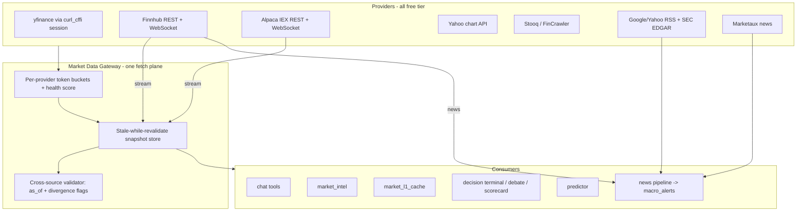

# Phase G — Live Market Data, Prediction & News Plan (free-API-first)

**Status:** RESEARCH PLAN (no code changes in this doc)
**Goal:** fetch live stock quotes, predictions, and market news **more accurately, faster, and more efficiently** while staying on free tiers.

Related: [`PHASE_F_INTELLIGENCE_FABRIC.md`](PHASE_F_INTELLIGENCE_FABRIC.md), `docs/ARCHITECTURE.md` §5.9–5.10 (truthful-data contract, resilient free-API fetching), [`docs/CRON.md`](CRON.md).

---

## 1. Research findings

### 1.1 Current state (what the code does today)

| Concern | Today | Weakness |
|---------|-------|----------|
| Quotes/prices | ~95% **yfinance** (unofficial scraper), plus Yahoo chart API, Stooq, FinCrawler fallbacks (`backend/connectors/quote_fallbacks.py`) | One fragile unofficial provider carries the whole app; Yahoo TLS-fingerprints clients and can 429/blacklist at any time |
| Batch defense | `connectors/yfinance_batch.py` — 50-symbol chunks, 0.35s inter-chunk delay, 3 retries | Only batch paths use it; many call sites do sequential `fast_info`/`.info` loops (`market_l1_cache._quotes`, `price_movements` ~80 tickers, chat `get_stock_quote`) |
| Duplicate fetches | MIL scheduled movers + MIL live movers = **two full S&P 500 downloads**; `market_l1_cache` keeps its own quote loop; `/debate` and `/decision-terminal` both invoke `fetch_debate_data` + `macro_fetch` | Wasted Yahoo quota, slower endpoints, higher 429 risk |
| Caching | In-memory only: L1 15min, MIL 10/30min, RT quotes 60s, live movers 120s, connector cache 5min | Not shared across workers/instances; restarts lose everything; no SWR on most paths |
| News | Google News RSS poll every 60s (`news_scan_loop`), Yahoo RSS, yfinance `.news`, optional NewsAPI (gold only) | In-memory dedup (`_seen_hashes`) lost on restart; keyword sentiment MVP; RSS-only ≈ minutes of latency; MIL headline failures silently swallowed |
| Predictor | Data-lake Parquet only (`PREDICTOR_USE_DATA_LAKE=1`), ≥64 closes, TimesFM microservice | **No live-history fallback** when the lake is stale; batch path skips the macro stale gate |
| Accuracy | Truthful-data contract (`InsufficientDataError` → 503), parity tests vs Yahoo chart (`test_market_data_parity.py`, 1% price tolerance) | Parity is opt-in (`RUN_MARKET_PARITY=1`) and offline; no continuous cross-source validation; `provider_audit` text drifted from actual `debate_data` behavior |

### 1.2 Free-API landscape (researched June 2026)

| Provider | Free tier | Strengths | Caveats |
|----------|-----------|-----------|---------|
| **yfinance / Yahoo** | No hard limit (~2k req/h soft) | Fastest median latency, richest fields, zero setup | Unofficial; TLS fingerprinting → use `curl_cffi` browser impersonation; broke for ~48h once in Dec 2025; no SLA |
| **Finnhub** | **60 calls/min** + **free WebSocket** (trades + news), honest 429 + `Retry-After`, sentiment-tagged news | Best free real-time complement; clean API | Fundamentals excluded on free tier; English news only |
| **Alpaca (data API)** | Real-time US equities (IEX feed), **no hard daily cap**, ~5 req/s, free WebSocket | Most generous genuinely-free real-time source | IEX-only consolidation (slight price differences vs SIP); needs account signup |
| **Twelve Data** | 800 credits/day (~100 time-series calls) | Stable; good daily snapshots | **Silently returns stale cached data** past ~400 req/day with no error — dangerous; treat as low-trust |
| **Alpha Vantage** | 25 req/day | News & Sentiment endpoint decent | Quote tier effectively unusable in 2026 — skip for quotes |
| **Polygon.io** | 5 req/min, delayed | Excellent docs | Effectively a paid trial; not a free-tier building block |
| **Marketaux** | 100 req/day | Entity-first news, 30+ languages, sentiment with confidence | REST polling only at free tier |
| **Stooq / FRED CSV / SEC EDGAR / Google News RSS** | Free, keyless | Already integrated | Stooq bot-walls; RSS latency in minutes |

**Key insights:**

1. **Don't replace Yahoo — wrap and diversify it.** yfinance stays the breadth provider (fields nothing else gives for free), but every quote-critical path needs a second *officially rate-limited* provider (Finnhub and/or Alpaca) behind one gateway.
2. **Latency wins come from architecture, not providers**: shared snapshots, stale-while-revalidate, and one fetch plane eliminate more user-visible latency than any provider swap.
3. **Free real-time streaming exists** (Finnhub WS, Alpaca WS) — polling `fast_info` every 60s for a watchlist is strictly worse than one WebSocket connection.
4. **News accuracy = multi-source + entity tagging + durable dedup**, with a two-phase "fast raw headline now, enrich later" pipeline (the pattern used by commercial low-latency news stacks).
5. **Accuracy = continuous cross-source agreement**, not one-off parity tests: when two independent providers disagree beyond tolerance, flag and prefer the fresher `as_of`.

---

## 2. Target architecture

Two invariants:

- **One fetch plane.** No consumer calls a provider SDK directly; everything goes through the gateway, which owns budgets, caching, fallback order, and `source`/`as_of` stamping. (Mirrors the Phase F model-gateway contract, applied to data.)
- **Truthful contract preserved.** The gateway returns `(value, source, as_of, degraded_flags)`; consumers keep raising `InsufficientDataError` when nothing real is available. Diversification must never become fabrication.

---

## 3. Workstreams

### G1 — Market Data Gateway (accuracy + resilience)

New `backend/market_data_gateway.py` consolidating `quote_fallbacks.py` and growing it:

1. **Provider adapters**: `yfinance` (default), `finnhub` (`FINNHUB_API_KEY`), `alpaca` (`ALPACA_API_KEY_ID`/`ALPACA_API_SECRET_KEY`), `yahoo_chart`, `stooq`, `fincrawler`. Each adapter returns a normalized `Quote{symbol, price, change_pct, volume, as_of, source}`.
2. **Token buckets per provider** (Finnhub 55/min, Alpaca 4/s, Yahoo soft budget) with jittered backoff honoring `Retry-After`; budget exhaustion → next provider, never a blind retry storm.
3. **Health scoring**: rolling error/429/latency stats per provider; cascade order re-ranks on health (e.g. when Yahoo starts 429ing, Finnhub takes spot-quote traffic automatically).
4. **Cross-source validation** (accuracy): for ledger-feeding surfaces, sample-check quotes against a second provider; divergence > the existing parity tolerances (1% / $1) → log `quote_divergence` handoff event and prefer the fresher `as_of`. This turns the offline parity test into a continuous signal.
5. Update `provider_audit` in `decision_terminal.py` to reflect the real cascade (it currently documents a debate spot cascade that no longer exists).

Files: new gateway + edits in `quote_fallbacks.py` callers (`scorecard_data.py`, `debate_data.py` staleness path), `decision_terminal.py`.
Env: `FINNHUB_API_KEY`, `ALPACA_API_KEY_ID`, `ALPACA_API_SECRET_KEY`, `MARKET_GATEWAY_ORDER`, `QUOTE_DIVERGENCE_TOLERANCE_PCT`.

### G2 — One shared fetch plane (efficiency)

1. **Consolidate the S&P 500 batch downloads**: one shared universe snapshot job feeding MIL scheduled movers, MIL live movers, and `price_movements` (today: 2–3 overlapping full-universe `yf.download`s). Single writer, many readers.
2. **`market_l1_cache` reads the snapshot** instead of running its own ~30-symbol `fast_info` loop.
3. **Chat `get_stock_quote` becomes cache-first**: serve the RT-quote/L1 entry instantly when fresh (≤60s), refresh in background (stale-while-revalidate), only block on a live fetch for cache misses. This is the single biggest user-visible latency win (today: 1–3 blocking Yahoo round-trips per chat quote).
4. **Parallelize FRED**: `connectors/fred.py` fetches 5 CSVs sequentially — gather them concurrently (they're independent keyless GETs).
5. **Batch `price_movements`**: replace ~80 sequential `.info` calls with one `yfinance_batch` download + a cached info-lite map (24h TTL for slow-moving fields like sector/name).

### G3 — yfinance hardening (resilience under free tier)

1. **Shared `curl_cffi` Chrome-impersonated session** for all yfinance usage (2026 standard practice — Yahoo TLS-fingerprints plain `requests`); one session, connection pooling, consistent headers.
2. **Global Yahoo token bucket** wrapping non-batch `Ticker` calls (today only batch paths are throttled); jittered exponential backoff on 429.
3. **429/latency telemetry** per provider surfaced in a new `data` block of `GET /learning-health` (extends Phase F `capture_coverage_24h` pattern).
4. Field-level caching: `.info` blobs cached 24h for slow-moving fields; only price/volume fields treated as live.

### G4 — Streaming + news upgrade (speed + accuracy)

**Quotes:** one **Finnhub WebSocket** (or Alpaca WS) connection subscribing to the active watchlist (MIL priority tickers + symbols users touched in the last hour). Trades stream into the RT-quote cache, making "live" quotes push-based and nearly free — replacing 60s polling for hot symbols. Gate behind `MARKET_WS_ENABLE=1`; fall back to polling when the socket is down.

**News pipeline** (two-phase, like commercial low-latency stacks):

1. **Fast path (seconds):** keep the 60s RSS loop but add **Finnhub company/market news** (free, ticker-tagged, sentiment included) and **SEC EDGAR 8-K/filing RSS** as parallel sources; raw headlines hit SSE/alerts immediately.
2. **Enrich path (async):** ticker/entity tagging + sentiment + dedup-cluster, then `knowledge_store.add_macro_alert` and ledger-adjacent storage. Marketaux (100 req/day) reserved for entity-first lookups on demand, not polling.
3. **Durable dedup:** replace in-memory `_seen_hashes` with a SQLite table (hash, first_seen, source) so restarts don't re-alert; cluster near-duplicate headlines by normalized title similarity before alerting.
4. **Truthful headlines:** MIL `_fetch_headlines` currently swallows RSS failures into an empty list — stamp `headlines_as_of` + `degraded` so the chat layer can say "news feed stale since X" instead of silently showing nothing.
5. **Sentiment:** keep LLM-light classification through the Phase F gateway (role `news_impact_classifier`, already registered) but batch it; optionally add FinBERT-class local scoring later — not required for v1.

### G5 — Predictor data freshness (accuracy)

1. **Live-history fallback**: when `daily_prices/{TICKER}.parquet` is missing or stale (> `PREDICTOR_LAKE_MAX_AGE_DAYS`, default 5 trading days), fetch the missing tail via the gateway (`yfinance` history) and stitch — stamped `price_source: "data_lake+live_tail"` so lineage stays honest.
2. **Intraday anchor**: include the latest RT quote as the anchor price for 1d-horizon bands so forecasts made mid-session don't reference yesterday's close.
3. **Batch job stale gate**: `predictor/batch_forecast.py` runs with `tool_registry=None`, skipping the macro stale gate — pass a real registry or a direct `macro_fetch` so nightly forecasts respect the same freshness rules as user forecasts.
4. Freshness features into the ledger: emit `price_data_age_days` as a `FeatureValue` on `price_forecast` decisions so feature-correlation analytics can show whether stale data degrades hit-rate (closes the loop with Phase F).

### G6 — Measurement & rollout

- **Data-health telemetry**: per-provider request counts, 429s, p50/p95 latency, cache hit rates, WS connection state, news source lag — in `/learning-health` (or `GET /data-health`) and the Observer UI.
- **Continuous parity**: schedule the existing parity checks (`RUN_MARKET_PARITY=1` suite) as a nightly low-volume job against 3 tickers; record drift in CORAL handoffs (infra signal, not ledger decisions, per AGENTS.md).
- **Rollout order:** G3 (hardening, zero behavior change) → G2 (consolidation) → G1 (gateway + Finnhub/Alpaca keys) → G4 (streaming + news) → G5 (predictor). Each step is independently shippable and FaultHunter-verifiable via the parity E2E.

---

## 4. Free-tier budget plan (steady state)

| Provider | Budget | Used for |
|----------|--------|----------|
| Yahoo (yfinance) | soft ~2k/h, batched | Universe snapshots (1 batch/10min), history, fundamentals, options |
| Finnhub | 60/min REST + 1 WS | Hot-symbol live quotes (WS), spot fallback, ticker-tagged news |
| Alpaca | ~5/s + 1 WS | Optional second real-time stream / spot cross-check |
| Marketaux | 100/day | On-demand entity news lookups (chat deep-news) |
| FRED / EDGAR / RSS | keyless | Macro series, filings, headline fast path |
| FinCrawler / Stooq | self-hosted / best-effort | Last-resort spot + deep scrape |

Yahoo remains <50% of quote-critical traffic after G1/G4; any single provider outage degrades to the next provider instead of a 503, while still honoring the truthful-data contract when *all* sources fail.

## 5. Risks

| Risk | Mitigation |
|------|------------|
| Free-tier ToS (Twelve Data/FMP non-commercial clauses) | Prefer Finnhub/Alpaca/keyless sources; treat Twelve Data as excluded by default |
| Cross-provider price discrepancies (IEX vs consolidated tape) | Tolerances reuse parity constants; prefer fresher `as_of`; stamp `source` everywhere |
| WebSocket lifecycle on scale-to-zero Cloud Run | WS only when instance warm; polling fallback automatic; document in `CRON.md` |
| Silent stale data (Twelve Data-style) | Gateway requires `as_of` on every quote; staleness > threshold = degraded, never silently served |
| Added keys = new secrets | All optional; gateway works keyless (Yahoo-only) with today's behavior as the floor |

## 6. Non-goals

- No paid data subscriptions; no SIP-grade real-time guarantees.
- No tick-level storage or HFT-style latency targets — "fast" means sub-second cache reads and seconds-fresh hot quotes, not milliseconds.
- No weakening of the truthful-data contract or FaultHunter parity checks.
