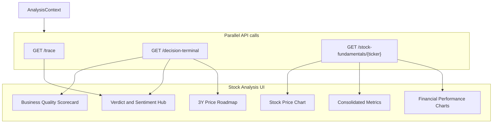

# Stock Analysis Metrics Reference

**Audience:** engineers, quants, product, and reviewers who need to understand what the TradeTalk **Stock Analysis** page measures, where each number comes from, and what to distrust.

**Scope:** Route `/dashboard` only — UI in [`frontend/src/UnifiedDashboardUI.jsx`](../frontend/src/UnifiedDashboardUI.jsx) (lazy-loaded as `ConsumerUI` in [`frontend/src/App.jsx`](../frontend/src/App.jsx)), orchestrated by [`frontend/src/AnalysisContext.jsx`](../frontend/src/AnalysisContext.jsx).

**Related docs:** [ARCHITECTURE.md](./ARCHITECTURE.md) (§5.9 truthful-data, §5.10 resilient fetching), [DECISION_LEDGER.md](./DECISION_LEDGER.md) (decision emit for verdict-producing surfaces), [STOCK_ANALYSIS_METRIC_CONSISTENCY_AUDIT.md](./STOCK_ANALYSIS_METRIC_CONSISTENCY_AUDIT.md) (PM consistency audit), [STOCK_ANALYSIS_METRIC_CONSISTENCY_REMEDIATION.md](./STOCK_ANALYSIS_METRIC_CONSISTENCY_REMEDIATION.md) (implementation tech-spec), [STOCK_ANALYSIS_PARITY_TEST_PLAN.md](./STOCK_ANALYSIS_PARITY_TEST_PLAN.md) (Yahoo + Stooq automated parity tests).

---

## 1. Executive summary

The Stock Analysis page is a **multi-agent valuation hub** and **fundamentals terminal**. For a single ticker it runs parallel backend jobs that combine:

- **Stock Chart** (yfinance price history with 1D, 5D, 1M, 6M, YTD, 1Y, 5Y, MAX granularities)
- **Business Quality Heuristics** (ROIC, Moat, FCF, Debt leverage, Gross margin, Current ratio)
- **Swarm factor verification** (short interest, social sentiment, Polymarket, fundamentals)
- **Decision-terminal fusion** (verdict headline, 3Y scenario roadmap)
- **Consolidated Metrics** (TTM valuation ratios, cash flow margins, growth rates, balance sheet, dividends)
- **Financial Performance** (quarterly and annual revenue + net income bar charts)

The page follows the **truthful-data contract**: if required live data cannot be fetched, the analysis fails with `503 insufficient_data` rather than showing fabricated partial results. See [ARCHITECTURE.md §5.9](./ARCHITECTURE.md).

### UI panel → API → backend module

| UI panel | Primary API | Backend module(s) |
|----------|-------------|-------------------|
| Business Quality | `GET /decision-terminal` | [`backend/decision_terminal.py`](../backend/decision_terminal.py) |
| Stock Price Chart | `GET /stock-fundamentals/{ticker}` | [`backend/connectors/stock_fundamentals.py`](../backend/connectors/stock_fundamentals.py) |
| Verdict & Sentiment | `/decision-terminal` + `/trace` | `decision_terminal.py`, [`backend/agents.py`](../backend/agents.py) |
| Future Price Roadmap | `/decision-terminal` | `decision_terminal.py`, optional [`backend/predictor/agent.py`](../backend/predictor/agent.py) |
| Consolidated Metrics | `GET /stock-fundamentals/{ticker}` | `stock_fundamentals.py` |
| Financial Performance | `GET /stock-fundamentals/{ticker}` | `stock_fundamentals.py` |

---

## 2. Page architecture

---

## 3. Analysis pipeline

Triggered when the user clicks **Analyze** (or deep-links `/?ticker=SYMBOL`). Implementation: [`AnalysisContext.jsx`](../frontend/src/AnalysisContext.jsx) `analyzeTicker`.

| Step | Action | Timeout |
|------|--------|---------|
| 1 | `GET /metrics/validate/{ticker}` — Yahoo chart probe (+ Stooq/FinCrawler fallback) | ~30s |
| 2 | Parallel API calls (below) | 30s (fast) / 120s (LLM) |

**Parallel jobs (six calls; swarm embedded in decision-terminal — no separate `/trace`):**

1. `GET /decision-terminal?ticker=` → terminal payload + embedded `swarm` + `debate` (+ post-remediation: `spot`, `scorecard_summary`, `reconciliation`)
2. `GET /stock-fundamentals/{ticker}` → price history, metrics, financials
3. `GET /scorecard/{ticker}?preset=balanced&skip_llm_scores=true` → risk-return profile (may be superseded by `scorecard_summary` on DT)
4. `GET /metrics/{ticker}` → investor metrics (fetched; RSI used for cache refresh heuristic)
5. `GET /prediction-markets?ticker=` → crowd events for Verdict hub
6. `GET /small-cap-assessment/{ticker}` → only for Small/Micro cap bucket (fetched, not always rendered)

**Success rule:** `successCount > 0` **and** no `err.isInsufficientData` from any job. Any `503 insufficient_data` marks the **entire** dashboard as failed (no partial-success illusion).

**Cache:** Results stored in `AnalysisContext` + `recentAnalyses` (last 10 tickers). Re-fetch skipped unless forced refresh or key metrics (RSI) were `N/A`.

**Typical latency:** 30–120 seconds (LLM-heavy routes).

---

## 4. Metrics catalog (by UI panel)

### A. Business Quality Scorecard

**UI:** 3×2 tile grid (“ROIC”, “Moat”, “FCF”, “Debt”, “Margin”, “Current ratio”).

**Source:** `decisionData.quality.rows` from `GET /decision-terminal` → [`decision_terminal.py`](../backend/decision_terminal.py) `TerminalQualityPanel`.

| Tile ID | Label | Formula / source | Status heuristic |
|---------|-------|------------------|------------------|
| `roic` | ROIC (proxy) | `0.8 × ROE` where ROE = yfinance `returnOnEquity` × 100 | “See note” if ROE present |
| `moat` | Moat | Rule on ROE + gross margin ratio (see below) | Strong / Moderate / Weak |
| `fcf` | Free cash flow | yfinance `freeCashflow` (TTM snapshot, compact USD) | “TTM snapshot” |
| `debt` | Leverage | `totalDebt ÷ EBITDA` | “Low” if &lt; 2.5×, else “Review” |
| `margin` | Gross margin | yfinance `grossMargins` × 100 | “Good” if ≥ 18%, else “Thin” |
| `current_ratio` | Current ratio | yfinance `currentRatio` | “High” if ≥ 1.5, else “Watch” |

**Moat heuristic** (`_moat_heuristic`):

- ROE ≥ 18% **and** gross margin ≥ 22% → “Wide (heuristic)” / Strong
- ROE ≥ 12% **and** gross margin ≥ 15% → “Narrow (heuristic)” / Moderate
- Else → “Limited (heuristic)” / Weak

Each tile includes `provenance` (source, formula note, confidence, missing reason) — hover via `ProvenanceTip` in the UI.

---

### B. Verdict & Sentiment Hub

**Sources:** `decisionData.verdict` + `traceData.factors.social_sentiment`.

| Display | Field / logic | Notes |
|---------|---------------|-------|
| Social Sentiment gauge | `trace.factors.social_sentiment.trading_signal` + `confidence` | Semi-circular gauge; bullish if signal &gt; 0 |
| Expert Consensus | `verdict.expert_bullish_pct` | `0.5 × (bull_score / total_stances × 100) + 0.5 × (consensus_confidence × 100)` |
| Aggregate Verdict | `verdict.headline_verdict` (fallback: `trace.global_verdict`) | Fused from debate + swarm; capped if swarm REJECTED |

---

### C. Stock Price Chart

**UI:** Area chart showing price trajectory for selected period tabs (1D, 5D, 1M, 6M, YTD, 1Y, 5Y, MAX).

**Source:** `fundamentalsData.price_history` from `GET /stock-fundamentals/{ticker}` → [`stock_fundamentals.py`](../backend/connectors/stock_fundamentals.py) `fetch_stock_fundamentals`.

- Uses `yf.Ticker(ticker).history()` mapping:
  - 1d: 5m interval
  - 5d: 15m interval
  - 1mo / 6mo / ytd / 1y: 1d interval
  - 5y: 1wk interval
  - max: 1mo interval
- Visual styling: Color-coded green (if price_change >= 0) or red (if price_change < 0), with matching linear gradient fill.

---

### D. Future Price Roadmap (3Y)

**Source:** `decisionData.roadmap` from `/decision-terminal`.

- Stacked compact line chart showing Bull, Base, and Bear scenarios.
- Current spot price from `decisionData.valuation.current_price_usd` or `fundamentalsData.company_info.current_price`.
- Predicted CAGR calculated as `(base/spot)^(1/3) - 1` × 100.

---

### E. Consolidated Metrics

**UI:** 2-column key-value metrics panel.

**Source:** `fundamentalsData.metrics` from `GET /stock-fundamentals/{ticker}`.

| Section | Metric | Source `yf.Ticker.info` key / formula |
|---------|--------|---------------------------------------|
| **Valuation** | Market Cap | `marketCap` |
| | PE Ratio (TTM) | `trailingPE` |
| | Price to Sales | `priceToSalesTrailing12Months` |
| | EV / EBITDA | `enterpriseToEbitda` |
| **Margins & Growth** | Profit Margin | `profitMargins` |
| | Operating Margin | `operatingMargins` |
| | Earnings Growth YoY | `earningsGrowth` |
| | Revenue Growth YoY | `revenueGrowth` |
| **Cash Flow** | Free Cash Flow | `freeCashflow` |
| | FCF Yield | `freeCashflow ÷ marketCap` |
| | FCF Per Share | `freeCashflow ÷ sharesOutstanding` |
| **Balance Sheet** | Total Cash | `totalCash` |
| | Total Debt | `totalDebt` |
| **Dividends** | Dividend Yield | `dividendYield` |
| | Payout Ratio | `payoutRatio` |

---

### F. Financial Performance

**UI:** Toggleable Quarterly/Annually Revenue and Net Income BarCharts.

**Source:** `fundamentalsData.financials` from `GET /stock-fundamentals/{ticker}`.

- Revenue maps to yfinance income statement keys `"Total Revenue"`, `"Revenue"`, or `"Operating Revenue"`.
- Net Income maps to yfinance income statement keys `"Net Income"` or `"Net Income Common Stockholders"`.
- Values are chronologically sorted (oldest first).

---

## 5. Removed / relocated panels (historical)

The following were **removed or relocated** in an earlier redesign. **Current `/dashboard` (2026-06) also includes** Risk-Reward Scorecard and Investment Committee Debate — see [STOCK_ANALYSIS_METRIC_CONSISTENCY_AUDIT.md](./STOCK_ANALYSIS_METRIC_CONSISTENCY_AUDIT.md) §3.

| Panel | Status on `/dashboard` today |
|-------|------------------------------|
| AI Debate | **Shown** — `DebateThreadPanel`; also at `/debate` |
| Risk-Reward Scorecard | **Shown** — `DashboardScorecardPanel`; also at `/scorecard` |
| Prediction Markets | Summary in Verdict hub only (not full events table) |
| Small Cap Panel | Not shown; `/small-cap-assessment` fetched conditionally only |

**Pipeline note:** `/trace` is **not** called separately; swarm comes from embedded `decision-terminal` → `swarm` ([`AnalysisContext.jsx`](../frontend/src/AnalysisContext.jsx)).

---

## 6. Known flaws & architect review

### Data quality & proxies

- **yfinance single source of truth:** Rate-limited and subject to blocks.
- **Label vs formula mismatches:** EV/EBIT uses EBITDA; ROIC is 0.8×ROE.
- **Interest coverage:** Assumes 5% interest rate.

### Operational

- **Duplicate compute:** `/decision-terminal` runs swarm+debate internally (no separate `/trace` on dashboard).
- **All-or-nothing errors:** Truthful-data: one `insufficient_data` fails the whole page.

---

## 7. Metric consistency audit (PM / finance-domain review)

**Author lens:** product manager with a finance background. **Goal:** confirm that the many metrics on `/dashboard` agree with one another, do not contradict, and help the user study a stock without confusion or false precision.

**Verdict:** the page is signal-rich but **un-reconciled**. There are **8 overlapping verdict/score surfaces** (Aggregate Verdict, Expert Consensus, Social Sentiment, Prediction Markets, Valuation gauge, Risk-Reward Scorecard, 3Y Roadmap, Debate stances) and several metrics — ROIC, FCF, P/E, gross margin, spot price, "bullish %", "confidence" — that are computed more than once, by different modules, with different definitions or units. Each component is internally defensible, but nothing guarantees they agree and there is no hierarchy telling the user which to trust.

### 7.1 Severity legend

- **Critical** — the same labeled metric can show different numbers, or a signal is presented with more authority than its math supports.
- **High** — independently derived signals can legitimately disagree and are shown side by side with no reconciliation.
- **Medium** — vocabulary/units/labelling inconsistencies that erode trust or invite misreading.

### 7.2 Critical findings

| ID | Finding | Evidence | User impact | Recommendation |
|----|---------|----------|-------------|----------------|
| **C1** | **"ROIC" means two different numbers.** Business Quality tile `roic` = `0.8 × ROE` labeled "ROIC (proxy)". The `/metrics` `roic_roe` field computes the same `roic = roe*0.8` internally but **displays raw ROE**. | [`decision_terminal.py`](../backend/decision_terminal.py) L628; [`investor_metrics.py`](../backend/connectors/investor_metrics.py) L92, L187 | Same stock could read e.g. ROIC 16% in one panel and 20% in another. (Latent today — `metricsData` is fetched but not rendered on `/dashboard`.) | One definition repo-wide via a shared helper; label honestly ("ROE" vs "ROIC proxy"). |
| **C2** | **Risk-Reward Scorecard signal is a non-comparative "preview" shown as a buy/sell verdict.** The page calls `/scorecard/{t}?skip_llm_scores=true`, which runs `score_single` **without industry medians** (every stock lands mid-scale) and defaults exec_risk=5 / SITG=3 / verdict="Balanced". | [`routers/scorecard.py`](../backend/routers/scorecard.py) L293; [`scorecard.py`](../backend/scorecard.py) L400 docstring | "Strong buy / Favorable / Caution / Avoid" rendered with the same authority as the fused Aggregate Verdict, but it is not a comparative rating. | Feed industry-median denominators, or relabel as "relative profile (not a rating)" and drop buy/sell vocabulary on the single-ticker page. |
| **C3** | **"Current / spot price" comes from up to three independent fetches.** Valuation/roadmap spot from `debate_data` (yfinance→Stooq→FinCrawler) with a yfinance `.info` fallback that also flips `market_data_degraded`; chart header from `/stock-fundamentals`; `/metrics` from yfinance `currentPrice`. | [`decision_terminal.py`](../backend/decision_terminal.py) L507–L522; [`stock_fundamentals.py`](../backend/connectors/stock_fundamentals.py); [`investor_metrics.py`](../backend/connectors/investor_metrics.py) L151 | Chart header price, valuation-gauge spot, and roadmap-slider "current price" can disagree for the same stock — most visibly when degraded. | Compute spot once server-side; thread one `spot` (+ source + timestamp) into every panel. |

### 7.3 High findings

| ID | Finding | Evidence | Recommendation |
|----|---------|----------|----------------|
| **H1** | **Eight overlapping verdicts, only one reconciliation.** Only swarm-vs-debate is reconciled via `fusion_note`; valuation, scorecard, roadmap, and crowd are not tied in. The page can show "BUY" + "OVERVALUED" + scorecard "Caution" + negative roadmap CAGR at once with no explanation. | [`decision_terminal.py`](../backend/decision_terminal.py) `_fuse_headline_verdict` L302 | One ranked headline + a "why the signals (dis)agree" note spanning all surfaces. |
| **H2** | **Three "bullish %"/crowd reads with different gates.** Swarm `factors.polymarket` gates on prob > 0.5; terminal `prediction_market_bullish_pct` gates on relevance ≥ 0.45; `/prediction-markets` exposes a third events list. | [`decision_terminal.py`](../backend/decision_terminal.py) L705; [`agents.py`](../backend/agents.py) (Polymarket pair) | One relevance+gating function, one number. |
| **H3** | **`expert_bullish_pct` blends direction with confidence** (`0.5×stance + 0.5×confidence`). A 50/50 split but confident committee reads as ">=55% Bullish". | [`decision_terminal.py`](../backend/decision_terminal.py) L295–L299 | Show stance % and confidence as two separate labeled values. |
| **H4** | **FCF appears in three panels from three sources** — Quality tile (yfinance/data-lake TTM, compact USD), Consolidated Metrics `free_cash_flow`/`fcf_yield`/`fcf_per_share`, and `/metrics` `fcf_yield = fcf/marketCap`. Different connectors/fallbacks. | [`decision_terminal.py`](../backend/decision_terminal.py) L611; [`stock_fundamentals.py`](../backend/connectors/stock_fundamentals.py); [`investor_metrics.py`](../backend/connectors/investor_metrics.py) L98 | Single FCF source of truth + consistent period label (TTM vs MRQ). |
| **H5** | **P/E shown as TTM but scored as forward.** UI shows "PE Ratio (TTM)" (`trailingPE`); scorecard risk math uses `forward_pe` vs `historical_avg_pe`; debate uses another `pe_ratio`. | UI L757; [`scorecard.py`](../backend/scorecard.py) L155–L156 | Surface both trailing and forward; label which drives the risk score. |
| **H6** | **Roadmap CAGR vs valuation gauge never cross-checked.** Predictor 3Y base CAGR and the fair-value gauge are independent and can point opposite directions. | [`decision_terminal.py`](../backend/decision_terminal.py) L832 (roadmap), L593 (gauge) | Add a divergence note when trajectory and valuation disagree. |

### 7.4 Medium findings

- **M1 — Verdict vocabularies don't align.** Six scales with no legend: STRONG BUY…REJECTED (aggregate/swarm/debate); Exceptional…Avoid (scorecard signal); Strong…Stretched (scorecard verdict); UNDER/OVERVALUED (valuation); Sell over/Buy under (roadmap slider); Compelling/Watch/Avoid (small cap); BULLISH/BEARISH/NEUTRAL (debate stance). → Shared tone scale + tooltip mapping.
- **M2 — Gross-margin fraction-vs-percent ambiguity.** `gross_m` is treated as a percent (`>=18` → "Good") but `×100` is applied only on the data-lake fallback path, and the moat helper re-divides by 100 only if `>1.0`. See [`decision_terminal.py`](../backend/decision_terminal.py) L625, L673. → Normalize to one unit at ingestion.
- **M3 — "Confidence" is overloaded.** Swarm `confidence`, debate `consensus_confidence`, `expert_bullish_pct`, roadmap `confidence_0_1`, and social-factor confidence all use the word with different scales/meanings on one page.
- **M4 — Two Graham-based valuations that won't match.** Terminal gauge = mean(Graham, Multiples) vs price; `/metrics` `margin_of_safety` = Graham-only vs price. Same root math, different blend → possibly opposite "undervalued" reads. See [`decision_terminal.py`](../backend/decision_terminal.py) L589; [`investor_metrics.py`](../backend/connectors/investor_metrics.py) L155.
- **M5 — Mixed truthful-data posture.** `/metrics` is honestly all-"N/A" for history/trend while neighboring panels show heuristic values, which can look more authoritative than their disclaimers convey.

### 7.5 Conflict matrix (which surfaces can contradict)

| Signal pair | Why they can disagree |
|-------------|------------------------|
| Aggregate Verdict ↔ Valuation gauge | Verdict fuses swarm+debate momentum/sentiment; gauge is Graham+Multiples fair value. A bullish verdict on an "OVERVALUED" name is unexplained. |
| Aggregate Verdict ↔ Risk-Reward Scorecard | Scorecard is self-normalized preview (C2); not directionally tied to the verdict. |
| Aggregate Verdict ↔ Roadmap CAGR | Roadmap is predictor/heuristic extrapolation; can be negative under a BUY (H6). |
| Expert Consensus % ↔ Debate stances | `expert_bullish_pct` blends confidence (H3); hides the actual bull/bear split. |
| Prediction Markets (hub) ↔ Swarm Polymarket factor | Different relevance gates (H2). |
| Quality FCF ↔ Consolidated FCF | Different connectors/periods (H4). |
| Valuation gauge ↔ `/metrics` margin of safety | Different Graham blend (M4). |

### 7.6 Cross-cutting recommendation

Introduce a server-side **reconciliation layer** in [`decision_terminal.py`](../backend/decision_terminal.py) that: (a) computes shared primitives once (spot, ROIC, FCF, P/E, gross margin, crowd %); (b) emits **one ranked headline verdict with an explicit "why the signals (dis)agree" note** spanning verdict + valuation + scorecard + roadmap + crowd; and (c) drives a shared verdict-tone legend on the frontend. This preserves the rich detail while giving the user one trustworthy anchor and a transparent account of any divergence.

**Detailed implementation:** [STOCK_ANALYSIS_METRIC_CONSISTENCY_REMEDIATION.md](./STOCK_ANALYSIS_METRIC_CONSISTENCY_REMEDIATION.md). **Test plan:** [STOCK_ANALYSIS_PARITY_TEST_PLAN.md](./STOCK_ANALYSIS_PARITY_TEST_PLAN.md).

### 7.7 Prioritized remediation backlog

1. Unify spot price (C3) — one server-computed spot threaded everywhere.
2. Fix/relabel ROIC (C1) via a shared metric helper.
3. Reframe the single-ticker Scorecard (C2) as a non-comparative profile or add medians.
4. Add a reconciliation note across the 8 verdict surfaces (H1).
5. Collapse the three Polymarket reads into one (H2).
6. Split `expert_bullish_pct` into stance % + confidence (H3).
7. Single FCF / P/E source-of-truth with period labels (H4, H5).
8. Normalize gross-margin units; add a shared verdict-tone legend (M1, M2).

---

## 8. Changelog

| Date | Change |
|------|--------|
| 2026-06-16 | Linked remediation tech-spec and parity test plan docs |
| 2026-06-16 | Added §7 metric consistency audit (PM / finance-domain review) |
| 2026-06-11 | Updated Stock Analysis page redesign with stock-fundamentals endpoint |
| 2026-06-10 | Initial reference doc for `/dashboard` Stock Analysis page |
