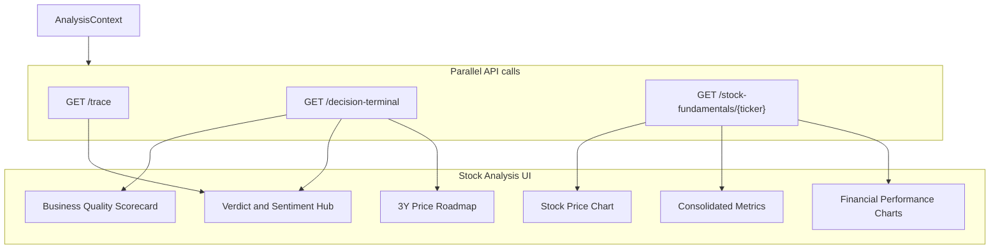

# Stock Analysis Metrics Reference

**Audience:** engineers, quants, product, and reviewers who need to understand what the TradeTalk **Stock Analysis** page measures, where each number comes from, and what to distrust.

**Scope:** Route `/dashboard` only — UI in [`frontend/src/UnifiedDashboardUI.jsx`](../frontend/src/UnifiedDashboardUI.jsx) (lazy-loaded as `ConsumerUI` in [`frontend/src/App.jsx`](../frontend/src/App.jsx)), orchestrated by [`frontend/src/AnalysisContext.jsx`](../frontend/src/AnalysisContext.jsx).

**Related docs:** [ARCHITECTURE.md](./ARCHITECTURE.md) (§5.9 truthful-data, §5.10 resilient fetching), [DECISION_LEDGER.md](./DECISION_LEDGER.md) (decision emit for verdict-producing surfaces).

---

## 1. Executive summary

The Stock Analysis page is a **multi-agent valuation hub** and **fundamentals terminal**. For a single ticker it runs parallel backend jobs that combine:

- **Stock Chart** (yfinance price history with 1D, 5D, 1M, 6M, YTD, 1Y, 5Y, MAX granularities)
- **Business Quality Heuristics** (ROIC, Moat, FCF, Debt leverage, Gross margin, Current ratio)
- **Swarm factor verification** (short interest, social sentiment, Polymarket, fundamentals)
- **Decision-terminal fusion** (verdict headline, 3Y scenario roadmap)
- **Consolidated Metrics** (TTM valuation ratios, cash flow margins, growth rates, balance sheet, dividends)
- **Financial Performance** (quarterly and annual revenue + net income bar charts)

The page follows the **truthful-data contract**: if required live data cannot be fetched, the analysis fails with `503 insufficient_data` rather than showing fabricated partial results. See [ARCHITECTURE.md §5.9](./ARCHITECTURE.md).

### UI panel → API → backend module

| UI panel | Primary API | Backend module(s) |
|----------|-------------|-------------------|
| Business Quality | `GET /decision-terminal` | [`backend/decision_terminal.py`](../backend/decision_terminal.py) |
| Stock Price Chart | `GET /stock-fundamentals/{ticker}` | [`backend/connectors/stock_fundamentals.py`](../backend/connectors/stock_fundamentals.py) |
| Verdict & Sentiment | `/decision-terminal` + `/trace` | `decision_terminal.py`, [`backend/agents.py`](../backend/agents.py) |
| Future Price Roadmap | `/decision-terminal` | `decision_terminal.py`, optional [`backend/predictor/agent.py`](../backend/predictor/agent.py) |
| Consolidated Metrics | `GET /stock-fundamentals/{ticker}` | `stock_fundamentals.py` |
| Financial Performance | `GET /stock-fundamentals/{ticker}` | `stock_fundamentals.py` |

---

## 2. Page architecture

---

## 3. Analysis pipeline

Triggered when the user clicks **Analyze** (or deep-links `/?ticker=SYMBOL`). Implementation: [`AnalysisContext.jsx`](../frontend/src/AnalysisContext.jsx) `analyzeTicker`.

| Step | Action | Timeout |
|------|--------|---------|
| 1 | `GET /metrics/validate/{ticker}` — Yahoo chart probe (+ Stooq/FinCrawler fallback) | ~30s |
| 2 | Parallel API calls (below) | 30s (fast) / 120s (LLM) |

**Parallel jobs:**

1. `GET /stock-fundamentals/{ticker}` → stock price history, metrics, income stmt financials (quarterly + annual)
2. `GET /trace?ticker=` → swarm consensus (4 factors)
3. `GET /decision-terminal?ticker=` → full analyze pipeline + terminal payload (runs swarm+debate again internally)

**Success rule:** `successCount > 0` **and** no `err.isInsufficientData` from any job. Any `503 insufficient_data` marks the **entire** dashboard as failed (no partial-success illusion).

**Cache:** Results stored in `AnalysisContext` + `recentAnalyses` (last 10 tickers). Re-fetch skipped unless forced refresh or key metrics (RSI) were `N/A`.

**Typical latency:** 30–120 seconds (LLM-heavy routes).

---

## 4. Metrics catalog (by UI panel)

### A. Business Quality Scorecard

**UI:** 3×2 tile grid (“ROIC”, “Moat”, “FCF”, “Debt”, “Margin”, “Current ratio”).

**Source:** `decisionData.quality.rows` from `GET /decision-terminal` → [`decision_terminal.py`](../backend/decision_terminal.py) `TerminalQualityPanel`.

| Tile ID | Label | Formula / source | Status heuristic |
|---------|-------|------------------|------------------|
| `roic` | ROIC (proxy) | `0.8 × ROE` where ROE = yfinance `returnOnEquity` × 100 | “See note” if ROE present |
| `moat` | Moat | Rule on ROE + gross margin ratio (see below) | Strong / Moderate / Weak |
| `fcf` | Free cash flow | yfinance `freeCashflow` (TTM snapshot, compact USD) | “TTM snapshot” |
| `debt` | Leverage | `totalDebt ÷ EBITDA` | “Low” if &lt; 2.5×, else “Review” |
| `margin` | Gross margin | yfinance `grossMargins` × 100 | “Good” if ≥ 18%, else “Thin” |
| `current_ratio` | Current ratio | yfinance `currentRatio` | “High” if ≥ 1.5, else “Watch” |

**Moat heuristic** (`_moat_heuristic`):

- ROE ≥ 18% **and** gross margin ≥ 22% → “Wide (heuristic)” / Strong
- ROE ≥ 12% **and** gross margin ≥ 15% → “Narrow (heuristic)” / Moderate
- Else → “Limited (heuristic)” / Weak

Each tile includes `provenance` (source, formula note, confidence, missing reason) — hover via `ProvenanceTip` in the UI.

---

### B. Verdict & Sentiment Hub

**Sources:** `decisionData.verdict` + `traceData.factors.social_sentiment`.

| Display | Field / logic | Notes |
|---------|---------------|-------|
| Social Sentiment gauge | `trace.factors.social_sentiment.trading_signal` + `confidence` | Semi-circular gauge; bullish if signal &gt; 0 |
| Expert Consensus | `verdict.expert_bullish_pct` | `0.5 × (bull_score / total_stances × 100) + 0.5 × (consensus_confidence × 100)` |
| Aggregate Verdict | `verdict.headline_verdict` (fallback: `trace.global_verdict`) | Fused from debate + swarm; capped if swarm REJECTED |

---

### C. Stock Price Chart

**UI:** Area chart showing price trajectory for selected period tabs (1D, 5D, 1M, 6M, YTD, 1Y, 5Y, MAX).

**Source:** `fundamentalsData.price_history` from `GET /stock-fundamentals/{ticker}` → [`stock_fundamentals.py`](../backend/connectors/stock_fundamentals.py) `fetch_stock_fundamentals`.

- Uses `yf.Ticker(ticker).history()` mapping:
  - 1d: 5m interval
  - 5d: 15m interval
  - 1mo / 6mo / ytd / 1y: 1d interval
  - 5y: 1wk interval
  - max: 1mo interval
- Visual styling: Color-coded green (if price_change >= 0) or red (if price_change < 0), with matching linear gradient fill.

---

### D. Future Price Roadmap (3Y)

**Source:** `decisionData.roadmap` from `/decision-terminal`.

- Stacked compact line chart showing Bull, Base, and Bear scenarios.
- Current spot price from `decisionData.valuation.current_price_usd` or `fundamentalsData.company_info.current_price`.
- Predicted CAGR calculated as `(base/spot)^(1/3) - 1` × 100.

---

### E. Consolidated Metrics

**UI:** 2-column key-value metrics panel.

**Source:** `fundamentalsData.metrics` from `GET /stock-fundamentals/{ticker}`.

| Section | Metric | Source `yf.Ticker.info` key / formula |
|---------|--------|---------------------------------------|
| **Valuation** | Market Cap | `marketCap` |
| | PE Ratio (TTM) | `trailingPE` |
| | Price to Sales | `priceToSalesTrailing12Months` |
| | EV / EBITDA | `enterpriseToEbitda` |
| **Margins & Growth** | Profit Margin | `profitMargins` |
| | Operating Margin | `operatingMargins` |
| | Earnings Growth YoY | `earningsGrowth` |
| | Revenue Growth YoY | `revenueGrowth` |
| **Cash Flow** | Free Cash Flow | `freeCashflow` |
| | FCF Yield | `freeCashflow ÷ marketCap` |
| | FCF Per Share | `freeCashflow ÷ sharesOutstanding` |
| **Balance Sheet** | Total Cash | `totalCash` |
| | Total Debt | `totalDebt` |
| **Dividends** | Dividend Yield | `dividendYield` |
| | Payout Ratio | `payoutRatio` |

---

### F. Financial Performance

**UI:** Toggleable Quarterly/Annually Revenue and Net Income BarCharts.

**Source:** `fundamentalsData.financials` from `GET /stock-fundamentals/{ticker}`.

- Revenue maps to yfinance income statement keys `"Total Revenue"`, `"Revenue"`, or `"Operating Revenue"`.
- Net Income maps to yfinance income statement keys `"Net Income"` or `"Net Income Common Stockholders"`.
- Values are chronologically sorted (oldest first).

---

## 5. Removed Panels

The following panels were removed from the redesigned `/dashboard` view to focus on core fundamentals and glanceable terminal outputs. They remain functional and accessible via their own routes:

- **AI Debate Panel** — Still accessible via `/debate`.
- **Risk-Return Scorecard** — Still accessible via `/scorecard`.
- **Prediction Markets** — Moved entirely to backend and expert consensus aggregation.
- **Small Cap Panel** — Replaced by consolidated metrics.

---

## 6. Known flaws & architect review

### Data quality & proxies

- **yfinance single source of truth:** Rate-limited and subject to blocks.
- **Label vs formula mismatches:** EV/EBIT uses EBITDA; ROIC is 0.8×ROE.
- **Interest coverage:** Assumes 5% interest rate.

### Operational

- **Duplicate compute:** `/decision-terminal` re-runs full swarm+debate even after `/trace`.
- **All-or-nothing errors:** Truthful-data: one `insufficient_data` fails the whole page.

---

## 7. Changelog

| Date | Change |
|------|--------|
| 2026-06-11 | Updated Stock Analysis page redesign with stock-fundamentals endpoint |
| 2026-06-10 | Initial reference doc for `/dashboard` Stock Analysis page |
