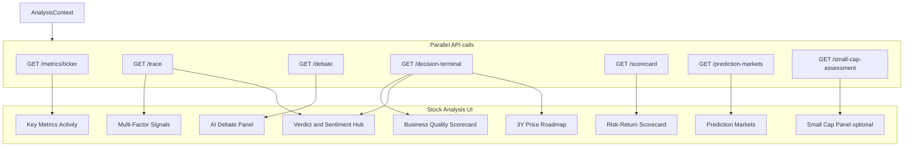

# Stock Analysis Metrics Reference

**Audience:** engineers, quants, product, and reviewers who need to understand what the TradeTalk **Stock Analysis** page measures, where each number comes from, and what to distrust.

**Scope:** Route `/dashboard` only — UI in [`frontend/src/UnifiedDashboardUI.jsx`](../frontend/src/UnifiedDashboardUI.jsx) (lazy-loaded as `ConsumerUI` in [`frontend/src/App.jsx`](../frontend/src/App.jsx)), orchestrated by [`frontend/src/AnalysisContext.jsx`](../frontend/src/AnalysisContext.jsx).

**Related docs:** [ARCHITECTURE.md](./ARCHITECTURE.md) (§5.9 truthful-data, §5.10 resilient fetching), [DECISION_LEDGER.md](./DECISION_LEDGER.md) (decision emit for verdict-producing surfaces).

---

## 1. Executive summary

The Stock Analysis page is a **multi-agent valuation hub**. For a single ticker it runs six parallel backend jobs that combine:

- **Quantitative snapshots** (yfinance fundamentals, scorecard math, debate market data)
- **Swarm factor verification** (short interest, social RSS, Polymarket, fundamentals — each with analyst + QA loop)
- **LLM investment debate** (five personas + moderator)
- **Decision-terminal fusion** (quality tiles, verdict headline, 3Y scenario roadmap)
- **Prediction markets** (Polymarket + Kalshi crowd probabilities)

The page follows the **truthful-data contract**: if required live data cannot be fetched, the analysis fails with `503 insufficient_data` rather than showing fabricated partial results. See [ARCHITECTURE.md §5.9](./ARCHITECTURE.md).

### UI panel → API → backend module

| UI panel | Primary API | Backend module(s) |
|----------|-------------|-------------------|
| Business Quality Scorecard | `GET /decision-terminal` | [`backend/decision_terminal.py`](../backend/decision_terminal.py) |
| Verdict & Sentiment Hub | `/decision-terminal` + `/trace` | `decision_terminal.py`, [`backend/agents.py`](../backend/agents.py) |
| Risk-Return Scorecard | `GET /scorecard/{ticker}?preset=balanced&skip_llm_scores=true` | [`backend/scorecard.py`](../backend/scorecard.py), [`backend/connectors/scorecard_data.py`](../backend/connectors/scorecard_data.py) |
| Future Price Roadmap (3Y) | `/decision-terminal` | `decision_terminal.py`, optional [`backend/predictor/agent.py`](../backend/predictor/agent.py) |
| Multi-Factor Analysis Signals | `GET /trace` | [`backend/routers/analysis.py`](../backend/routers/analysis.py), `agents.py` |
| Key Metrics Activity | `GET /metrics/{ticker}` | [`backend/connectors/investor_metrics.py`](../backend/connectors/investor_metrics.py) |
| AI Debate Panel | `GET /debate` | [`backend/debate_agents.py`](../backend/debate_agents.py), [`backend/connectors/debate_data.py`](../backend/connectors/debate_data.py) |
| Prediction Markets | `GET /prediction-markets` | [`backend/connectors/polymarket.py`](../backend/connectors/polymarket.py), [`backend/connectors/kalshi.py`](../backend/connectors/kalshi.py) |
| Small Cap Panel (conditional) | `GET /small-cap-assessment/{ticker}` | [`backend/connectors/small_cap_metrics.py`](../backend/connectors/small_cap_metrics.py) |

---

## 2. Page architecture



---

## 3. Analysis pipeline

Triggered when the user clicks **Analyze** (or deep-links `/?ticker=SYMBOL`). Implementation: [`AnalysisContext.jsx`](../frontend/src/AnalysisContext.jsx) `analyzeTicker`.

| Step | Action | Timeout |
|------|--------|---------|
| 1 | `GET /metrics/validate/{ticker}` — Yahoo chart probe (+ Stooq/FinCrawler fallback) | ~30s |
| 2 | Six parallel jobs (below) | 30s (fast) / 120s (LLM) |
| 3 | If `cap_bucket` ∈ {Small Cap, Micro Cap} → `GET /small-cap-assessment/{ticker}` | 30s |

**Parallel jobs:**

1. `GET /metrics/{ticker}` → investor metrics + market-cap bucket
2. `GET /prediction-markets?ticker=` → Polymarket + Kalshi merged events
3. `GET /trace?ticker=` → swarm consensus (4 factors)
4. `GET /debate?ticker=` → 5-agent debate + moderator
5. `GET /decision-terminal?ticker=` → full analyze pipeline + terminal payload (runs swarm+debate again internally)
6. `GET /scorecard/{ticker}?preset=balanced&skip_llm_scores=true` → risk-return ratio (objective math only)

**Success rule:** `successCount > 0` **and** no `err.isInsufficientData` from any job. Any `503 insufficient_data` marks the **entire** dashboard as failed (no partial-success illusion).

**Cache:** Results stored in `AnalysisContext` + `recentAnalyses` (last 10 tickers). Re-fetch skipped unless forced refresh or key metrics (RSI) were `N/A`.

**Typical latency:** 30–120 seconds (LLM-heavy routes).

---

## 4. Metrics catalog (by UI panel)

### A. Business Quality Scorecard

**UI:** 3×2 tile grid (“ROIC”, “Moat”, “FCF”, “Debt”, “Margin”, “Current ratio”).

**Source:** `decisionData.quality.rows` from `GET /decision-terminal` → [`decision_terminal.py`](../backend/decision_terminal.py) `TerminalQualityPanel`.

| Tile ID | Label | Formula / source | Status heuristic |
|---------|-------|------------------|------------------|
| `roic` | ROIC (proxy) | `0.8 × ROE` where ROE = yfinance `returnOnEquity` × 100 | “See note” if ROE present |
| `moat` | Moat | Rule on ROE + gross margin ratio (see below) | Strong / Moderate / Weak |
| `fcf` | Free cash flow | yfinance `freeCashflow` (TTM snapshot, compact USD) | “TTM snapshot” |
| `debt` | Leverage | `totalDebt ÷ EBITDA` | “Low” if &lt; 2.5×, else “Review” |
| `margin` | Gross margin | yfinance `grossMargins` × 100 | “Good” if ≥ 18%, else “Thin” |
| `current_ratio` | Current ratio | yfinance `currentRatio` | “High” if ≥ 1.5, else “Watch” |

**Moat heuristic** (`_moat_heuristic`):

- ROE ≥ 18% **and** gross margin ≥ 22% → “Wide (heuristic)” / Strong
- ROE ≥ 12% **and** gross margin ≥ 15% → “Narrow (heuristic)” / Moderate
- Else → “Limited (heuristic)” / Weak

Each tile includes `provenance` (source, formula note, confidence, missing reason) — hover via `ProvenanceTip` in the UI.

---

### B. Verdict & Sentiment Hub

**Sources:** `decisionData.verdict` + `traceData.factors.social_sentiment`.

| Display | Field / logic | Notes |
|---------|---------------|-------|
| Social Sentiment gauge | `trace.factors.social_sentiment.trading_signal` + `confidence` | Semi-circular gauge; bullish if signal &gt; 0 |
| Expert Consensus | `verdict.expert_bullish_pct` | `0.5 × (bull_score / total_stances × 100) + 0.5 × (consensus_confidence × 100)` |
| Aggregate Verdict | `verdict.headline_verdict` (fallback: `trace.global_verdict`) | Fused from debate + swarm; capped if swarm REJECTED |

**Headline fusion** (`_fuse_headline_verdict`):

- Base headline = debate `verdict`
- If swarm contains `REJECTED` and debate is BUY → headline capped to **NEUTRAL**
- Fusion note explains mixed signals (swarm neutral vs debate bullish, etc.)

**Prediction market gating (internal to terminal, affects badge text):**

- Best Polymarket event scored by `score_polymarket_relevance(title, description, ticker, tokens)`
- PM bullish % shown only if relevance ≥ **0.45** and probability exists
- Dashboard PM badge averages direct-ticker events first, then sector events, else terminal PM %

---

### C. Risk-Return Scorecard

**UI:** [`DashboardScorecardPanel.jsx`](../frontend/src/components/DashboardScorecardPanel.jsx) — mini risk/return scatter, ratio, signal band.

**API:** `GET /scorecard/{ticker}?preset=balanced&skip_llm_scores=true`

**Data ingestion:** [`scorecard_data.py`](../backend/connectors/scorecard_data.py) → [`scorecard.py`](../backend/scorecard.py) deterministic math.

#### Return-side inputs (normalized 0–10 vs basket max)

| Input | yfinance / source field | Notes |
|-------|-------------------------|-------|
| EPS growth % | Forward / consensus EPS growth | `eps_growth_pct` |
| Revenue growth % | `revenueGrowth` | TTM |
| PT upside % | `(targetMeanPrice / currentPrice - 1) × 100` | Analyst consensus |
| Dividend yield % | `dividendYield` (cleaned) | |
| SITG score (0–10) | LLM persona | **Skipped on dashboard** (`skip_llm_scores=true` → default/neutral) |

#### Risk-side inputs

| Input | Source | Notes |
|-------|--------|-------|
| PE stretch | `(forward_pe / historical_avg_pe) - 1` | Only **premiums** scored; discount → 0 |
| Beta | `beta` | |
| Execution risk (1–10) | LLM persona | **Skipped on dashboard** |
| Debt/equity leverage | `debtToEquity` (yfinance % scale) | |

#### Balanced preset weights (`PRESETS["balanced"]`)

| Weight | Component | Value |
|--------|-----------|-------|
| w1 | EPS growth (return) | 3 |
| w2 | Revenue growth (return) | 3 |
| w3 | PT upside (return) | 2 |
| w4 | Dividend yield (return) | 1 |
| w5 | PE stretch (risk) | 3 |
| w6 | Beta (risk) | 2 |
| w7 | Execution risk (risk) | 3 |
| w8 | D/E leverage (risk) | 2 |
| w9 | Skin-in-the-game (return amplifier) | 4 |

**Normalization:** `norm(v) = clamp((v / max_in_basket) × 10, 0, 10)` for single-ticker; basket uses peer set maxima.

**Outputs:**

- `return_score.weighted`, `risk_score.weighted` (0–10)
- `ratio` = return_weighted / risk_weighted
- `signal` / `action` from interpretation bands (Exceptional → Avoid)
- `quadrant` — top-left (high return, low risk) through bottom-right

---

### D. Future Price Roadmap (3Y)

**Source:** `decisionData.roadmap` from `/decision-terminal`.

| Field | Priority / formula |
|-------|-------------------|
| `bull_price_usd`, `base_price_usd`, `bear_price_usd` | 1) Predictor/TimesFM quantile path (if service available) 2) LLM JSON roadmap 3) Historical 3Y CAGR heuristic **only** (no arbitrary spot multiples) |
| `predicted_cagr_base_pct` | `(base/spot)^(1/3) - 1` × 100 |
| `assumptions` | Explicit notes when data insufficient (truthful-data contract) |
| `horizon_quantile_bands` | Optional multi-horizon q10/q50/q90 from predictor |

**Sanitization:** Misscaled LLM scenarios (outside 0.35×–2.75× spot band) are **dropped**, not replaced with fabricated multiples.

**UI:** Line chart via `buildRoadmapChartData` / `roadmapScenarioPrices`; current spot from `decisionData.valuation.current_price_usd`.

---

### E. Multi-Factor Swarm Signals

**API:** `GET /trace` → `_execute_swarm_trace` in [`backend/routers/analysis.py`](../backend/routers/analysis.py).

Four **AgentPair** factors run in parallel ([`backend/agents.py`](../backend/agents.py)); each has Analyst → QA_Verifier loop (max 3 iterations for shorts).

| Factor key | Connector | Raw inputs |
|------------|-----------|------------|
| `short_interest` | [`shorts.py`](../backend/connectors/shorts.py) | `shortPercentOfFloat`, `shortRatio` (days to cover) |
| `social_sentiment` | [`social.py`](../backend/connectors/social.py) | Google News RSS + YouTube RSS title lists |
| `polymarket` | Polymarket connector via swarm pair | Event probabilities |
| `fundamentals` | [`fundamentals.py`](../backend/connectors/fundamentals.py) | Cash, debt, liquidity |

#### Short-interest classifier defaults

From `agents.py` `_SIR_CLASSIFIER_DEFAULTS` / [`tool_handlers.py`](../backend/tool_handlers.py):

| Parameter | Default | Meaning |
|-----------|---------|---------|
| `sir_bull_threshold` | 15.0% | SIR above → bullish squeeze signal |
| `sir_ambiguous_min` | 10.0% | Ambiguous band → may invoke LLM |
| `sir_ambiguous_max` | 20.0% | |
| `dtc_confirm_threshold` | 5.0 days | Days-to-cover confirmation on revision |
| `bearish_csi_threshold` | 1.1 | QA rejects bullish short signal if credit stress index exceeds |

#### Social sentiment

Keyword counts on RSS titles:

- **Bull:** buy, bull, soar, moon, squeeze, surge, up, rally, breakout, target, high, gem
- **Bear:** sell, bear, crash, plunge, down, dump, alert, warning, drop, collapse, fake

Signal = net bull vs bear keyword hits (not NLP embedding sentiment).

#### Global swarm verdict

```
weighted_signal = Σ(confidence × trading_signal) / Σ(confidence)   # verified factors only
```

| Condition | Verdict | `global_signal` |
|-----------|---------|-----------------|
| Any factor REJECTED | `REJECTED (MACRO/RISK STRESS)` | 0 |
| weighted_signal &gt; 0.7 | STRONG BUY | 1 |
| weighted_signal &gt; 0.4 | BUY | 1 |
| weighted_signal &lt; -0.7 | STRONG SELL | -1 |
| weighted_signal &lt; -0.4 | SELL | -1 |
| else | NEUTRAL | 0 |

On factor conflict, optional LLM `generate_swarm_synthesis` may override `global_verdict` and confidence (unless stale-macro gate blocks synthesis).

Each factor exposes: `trading_signal` (-1/0/1), `confidence`, `status` (VERIFIED/REJECTED), `rationale`, `history` (analyst/QA transcript).

---

### F. Key Metrics Activity (+ full `/metrics` payload)

**API:** `GET /metrics/{ticker}` → [`investor_metrics.py`](../backend/connectors/investor_metrics.py).

#### Displayed on Stock Analysis UI (3 tiles only)

| Key | Label | Formula |
|-----|-------|---------|
| `momentum_rsi` | RSI (14D) | 14-period RSI on 3-month daily closes from yfinance history |
| `institutional_ownership` | Inst. Ownership | `heldPercentInstitutions` × 100; fallback from `debate_data` |
| `short_interest` | Short Interest | `shortPercentOfFloat` × 100; fallback from `debate_data` |

All three return `historical: "N/A"`, `trend: "N/A"`, `history: []` (truthful-data — no fabricated sparklines).

#### Fetched but NOT rendered on `/dashboard`

These 10 metrics are computed and returned by `/metrics` but **not shown** on the Stock Analysis page (legacy UI exists in [`ConsumerUI.jsx`](../frontend/src/ConsumerUI.jsx), which is **not routed**):

| Key | UI label (legacy) | Formula | Proxy / flaw |
|-----|-------------------|---------|--------------|
| `roic_roe` | ROIC / ROE (Moat) | `ROE × 0.8` if ROE &gt; 0 else ROA | Not true ROIC |
| `fcf_yield` | Free Cash Flow Yield | `freeCashflow / marketCap × 100` | |
| `ev_ebit` | EV / EBIT | **`enterpriseValue / ebitda`** | Label says EBIT, code uses EBITDA |
| `owner_earnings` | Owner Earnings | `operatingCashflow + capitalExpenditures` | Buffett-style proxy |
| `reinvest_capacity` | Capacity to Reinvest | `revenueGrowth × 100` | Revenue growth ≠ reinvestment capacity |
| `interest_coverage` | Interest Coverage | `EBITDA / (totalDebt × 0.05)` | **Assumes 5% interest rate** |
| `price_tangible_book` | Price to Tangible Book | `priceToBook` | **P/B proxy**, not tangible book |
| `gross_margins` | Gross Margins | `grossMargins × 100` | |
| `shareholder_yield` | Shareholder Yield | dividend yield + estimated buyback yield | Buyback often estimated |
| `margin_of_safety` | Margin of Safety | Graham number vs price: `√(22.5 × EPS × book) ` discount % | 0% shown as “Premium” |

**Response metadata:** `market_cap`, `cap_bucket` (Mega/Large/Mid/Small/Micro via [`paper_portfolio.py`](../backend/paper_portfolio.py) `_classify_market_cap`).

---

### G. AI Debate Panel

**API:** `GET /debate` → [`debate_agents.py`](../backend/debate_agents.py) `run_full_debate`.

**Market data:** `fetch_debate_data` (tool registry) — see §5 below.

**Macro context:** `macro_fetch` → credit stress index, VIX, regime.

| Agent role | Focus | RAG collections (examples) |
|------------|-------|------------------------------|
| `bull` | Upside thesis | price_movements, stock_profiles, earnings_memory |
| `bear` | Downside risks | debate_history, strategy_backtests |
| `macro` | Regime / rates | macro state from live macro connector |
| `value` | Valuation / quality | sp500_fundamentals_narratives, earnings_memory |
| `momentum` | Price action | youtube_insights, price_movements |

**Moderator outputs:**

- `verdict` — STRONG BUY / BUY / NEUTRAL / SELL / STRONG SELL
- `bull_score`, `bear_score`, `neutral_score`
- `consensus_confidence`
- `moderator_summary`
- Per-agent `headline`, `argument`, `stance`

Debate failures on insufficient LLM/data raise `InsufficientDataError` for verdict roles.

---

### H. Prediction Markets

**API:** `GET /prediction-markets?ticker=` — merges Polymarket + Kalshi.

| Field | Meaning |
|-------|---------|
| `events[]` | Title, Yes probability, volume, source (Polymarket/Kalshi) |
| `relevance_type` | `direct` (company keywords) or `sector` (index/ETF terms) |
| `has_relevant_data` | false only when APIs succeed but no matches (not on API failure) |

**Relevance:** Static ticker keyword map + yfinance company name; sector/index terms from [`market_context.py`](../backend/connectors/market_context.py).

Sector blacklist filters crypto/SPAC/private-market noise from sector matches.

---

### I. Small Cap Panel (conditional)

Shown when `cap_bucket` ∈ {**Small Cap**, **Micro Cap**}.

**API:** `GET /small-cap-assessment/{ticker}` → [`small_cap_metrics.py`](../backend/connectors/small_cap_metrics.py).

Typical outputs:

- Revenue YoY growth series (quarterly financials)
- Gross / operating margin trends
- 5-year revenue history (`company_revenue_history_5y`)
- Segment revenue breakdown when available in yfinance financials
- Growth-stage scoring heuristics (not standard value metrics)

Banner in UI: *“Standard valuation metrics not applicable — growth-stage framework applied.”*

---

## 5. Underlying market data (`debate_data`)

Shared baseline for debate agents and metrics hydration fallback.

**Module:** [`backend/connectors/debate_data.py`](../backend/connectors/debate_data.py)

**Requires:** 6-month price history from yfinance (raises `InsufficientDataError` if unavailable).

| Field | Description |
|-------|-------------|
| `current_price` | Last close |
| `price_return_1m`, `_3m`, `_6m` | % returns (21/63/126 trading days) |
| `pct_of_52wk_high`, `pct_of_52wk_low` | Position in 52-week range |
| `week_52_high`, `week_52_low` | |
| `beta` | yfinance `beta` |
| `short_interest_ratio`, `short_percent_float` | |
| `market_cap`, `pe_ratio`, `pb_ratio`, `roe`, `debt_to_equity` | |
| `free_cashflow`, `revenue_growth`, `gross_margins`, `dividend_yield` | |
| `held_percent_institutions` | |
| `sector`, `industry`, `company_name` | |
| `spot_price_source` | e.g. `yfinance_history` |

---

## 6. Valuation models (fetched, partially hidden on `/dashboard`)

`GET /decision-terminal` also returns `decisionData.valuation`:

| Model | Available? | Formula |
|-------|------------|---------|
| DCF | **No** | Intentionally deferred — `missing_reason` explains no LLM-only DCF |
| Graham | If EPS &amp; book &gt; 0 | `√(22.5 × trailing_EPS × book_value_per_share)` |
| Multiples | If EPS present | Heuristic fair P/E anchored 12–28 from ROE, scaled vs trailing P/E |
| Average fair value | Mean of available models | |
| `pct_vs_average` | `(avg_fair - spot) / avg_fair × 100` | Gauge label: UNDERVALUED / OVERVALUED / NEAR FAIR |

**UI gap:** `UnifiedDashboardUI` computes `valFill = valuationArcRatio(pct_vs_average)` but **does not render a valuation gauge panel** on `/dashboard`. Spot price is shown on the roadmap header only. Full valuation UI lives on `/decision-terminal` ([`DecisionTerminalUI.jsx`](../frontend/src/DecisionTerminalUI.jsx)).

---

## 7. Known flaws & architect review

Severity tags: **HIGH** (misleading for decisions), **MED** (limit understanding), **LOW** (operational/UX).

### Data quality & proxies

| Sev | Issue | Detail |
|-----|-------|--------|
| HIGH | yfinance single source of truth | Most fundamentals via `Ticker.info` — stale, incomplete, rate-limited, datacenter IP blocks |
| HIGH | Label vs formula mismatches | EV/**EBIT** uses EBITDA; ROIC is 0.8×ROE; P/Tangible Book uses P/B |
| MED | Assumed constants | Interest coverage uses 5% on all debt; buyback yield often estimated |
| MED | TTM snapshots only | No point-in-time fundamentals; no audited 10-K reconciliation on page |
| MED | Moat / quality heuristics | Rule-based, not economic moat analysis |
| LOW | RSI on 3mo history | Needs ≥15 daily closes; thin history → N/A |

### UI / product gaps

| Sev | Issue | Detail |
|-----|-------|--------|
| HIGH | 10 investor metrics hidden | `/metrics` returns full elite-investor set; UI shows only RSI, inst. ownership, short interest |
| MED | Valuation panel not shown | Graham/multiples/average fair value fetched but no gauge on `/dashboard` |
| MED | Scorecard subjective scores off | `skip_llm_scores=true` — SITG and execution risk use defaults; ratio lacks LLM rubric |
| LOW | Orphan legacy UI | [`ConsumerUI.jsx`](../frontend/src/ConsumerUI.jsx) tabbed “Elite Investor” sections not routed |
| LOW | `global_signal >= 2` check dead | UnifiedDashboardUI sets `isBullish` from `global_signal >= 2` but signal is only -1/0/1 |

### Agent & fusion risks

| Sev | Issue | Detail |
|-----|-------|--------|
| HIGH | LLM verdict override | Swarm synthesis can change `global_verdict` on factor conflict |
| MED | Social ≠ sentiment | RSS keyword counting, not NLP or labeled sentiment |
| MED | PM relevance ≠ causality | Token/keyword match on market titles; sector events may not relate to ticker |
| MED | Duplicate compute | `/decision-terminal` re-runs full swarm+debate even after `/trace` and `/debate` |
| LOW | Expert % blend | 50% stance + 50% confidence — arbitrary weighting |

### Operational

| Sev | Issue | Detail |
|-----|-------|--------|
| MED | Six heavy endpoints | 30–120s; user waits on slowest LLM path |
| MED | All-or-nothing errors | Truthful-data: one `insufficient_data` fails whole page (by design) |
| LOW | Partial browser cache | `recentAnalyses` survives navigation; not server-side |

---

## 8. Quick reference

### Metric → API → file → yfinance field

| Metric (UI) | API | Backend file | yfinance / source |
|-------------|-----|--------------|-------------------|
| Quality ROIC proxy | `/decision-terminal` | `decision_terminal.py` | `returnOnEquity` |
| Quality FCF | `/decision-terminal` | `decision_terminal.py` | `freeCashflow` |
| Quality leverage | `/decision-terminal` | `decision_terminal.py` | `totalDebt`, `ebitda` |
| RSI 14D | `/metrics` | `investor_metrics.py` | `history(3mo).Close` |
| Short interest % | `/metrics` | `investor_metrics.py` | `shortPercentOfFloat` |
| Inst. ownership | `/metrics` | `investor_metrics.py` | `heldPercentInstitutions` |
| Scorecard EPS growth | `/scorecard` | `scorecard_data.py` | forward EPS / earnings estimates |
| Scorecard beta | `/scorecard` | `scorecard_data.py` | `beta` |
| Swarm SIR | `/trace` | `shorts.py` | `shortPercentOfFloat`, `shortRatio` |
| Debate momentum | `/debate` | `debate_data.py` | 6mo price history |
| PM probability | `/prediction-markets` | `polymarket.py`, `kalshi.py` | External APIs |

### Swarm short-interest thresholds (defaults)

See §4.E — configurable via `short_interest_classifier` tool config / resource registry dual-read.

### Scorecard interpretation bands

Ratio → signal mapping in `scorecard.py` `_INTERPRETATION_BANDS` (highest threshold first): Exceptional, Strong buy, Favorable, Balanced, Caution, Avoid.

---

## 9. Changelog

| Date | Change |
|------|--------|
| 2026-06-10 | Initial reference doc for `/dashboard` Stock Analysis page |
