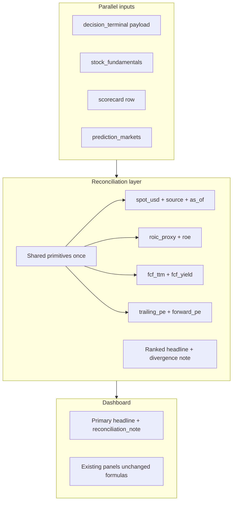

# Stock Analysis Page — Metric Consistency Audit

**Audience:** product, engineering, quants, and design reviewers.

**Author lens:** product manager with a finance background.

**Goal:** verify that every metric on the Stock Analysis page is internally consistent, does not contradict sibling metrics without explanation, and helps users study a stock accurately — without confusion or false precision.

**Scope:** Primary Stock Analysis page only — route `/dashboard`, UI in [`frontend/src/UnifiedDashboardUI.jsx`](../frontend/src/UnifiedDashboardUI.jsx), orchestrated by [`frontend/src/AnalysisContext.jsx`](../frontend/src/AnalysisContext.jsx).

**Related docs:** [STOCK_ANALYSIS_METRICS.md](./STOCK_ANALYSIS_METRICS.md) (metrics catalog and formulas), [STOCK_ANALYSIS_METRIC_CONSISTENCY_REMEDIATION.md](./STOCK_ANALYSIS_METRIC_CONSISTENCY_REMEDIATION.md) (implementation tech-spec), [STOCK_ANALYSIS_PARITY_TEST_PLAN.md](./STOCK_ANALYSIS_PARITY_TEST_PLAN.md) (Yahoo + Stooq parity tests), [ARCHITECTURE.md](./ARCHITECTURE.md) (truthful-data contract), [DECISION_LEDGER.md](./DECISION_LEDGER.md) (verdict emit).

**Status:** Report only — no code changes in this deliverable.

---

## 1. Executive summary

The Stock Analysis page is **signal-rich but un-reconciled**. For a single ticker it surfaces:

- **8 overlapping verdict/score surfaces** — Aggregate Verdict, Expert Consensus %, Social Sentiment gauge, Prediction Markets summary, Valuation gauge (UNDER/OVERVALUED), Risk-Reward Scorecard signal+verdict, 3Y Future Price Roadmap, and five Debate agent stances.
- **Several metrics computed more than once** with different definitions or units — ROIC, FCF, P/E, gross margin, spot price, "bullish %", and "confidence".

Each backend module is internally defensible, but **nothing guarantees the panels agree**, and there is **no hierarchy** telling the user which signal to trust when they diverge.

### Severity summary

| Severity | Count | Theme |
|----------|-------|-------|
| **Critical** | 3 | Same label, different number; or buy/sell authority without comparative math |
| **High** | 6 | Legitimate disagreement shown side-by-side with no reconciliation |
| **Medium** | 5 | Vocabulary, units, and labelling inconsistencies |

### Top-line verdict

The page can help a sophisticated user **if** they read provenance tooltips and understand that panels are independent. For a typical investor, overlapping BUY/SELL language, multiple "current prices," and unreconciled bullish/undervalued signals **will cause confusion** and erode trust. A server-side **reconciliation layer** (shared primitives + one ranked headline + explicit divergence note) is the recommended cross-cutting fix.

---

## 2. Scope and method

### 2.1 In scope

- Route `/dashboard` → `UnifiedDashboardUI.jsx`
- All displayed metrics, scores, badges, and verdicts
- Six parallel API jobs fired by `AnalysisContext.analyzeTicker`

### 2.2 Out of scope

- Legacy `/decision-terminal` page (subset of the same decision-terminal payload)
- `/trace` and `/debate` as standalone routes (embedded in `/decision-terminal` on dashboard)
- Gold advisor, macro dashboard, daily brief

### 2.3 Data pipeline

Triggered on **Analyze** or deep-link `?ticker=SYMBOL`:

| Step | Call | Timeout | Stored as |
|------|------|---------|-----------|
| 0 | `GET /metrics/validate/{ticker}` | ~30s | Yahoo chart probe |
| 1 | `GET /decision-terminal?ticker=` | 120s | `decisionData` (+ embedded `swarm` → `traceData`, `debate` → `debateData`) |
| 2 | `GET /stock-fundamentals/{ticker}` | 30s | `fundamentalsData` |
| 3 | `GET /scorecard/{ticker}?preset=balanced&skip_llm_scores=true` | 30s | `scorecardData` |
| 4 | `GET /metrics/{ticker}` | 30s | `metricsData` (**fetched, not rendered**) |
| 5 | `GET /prediction-markets?ticker=` | 30s | `predMarketsData` |
| 6 | `GET /small-cap-assessment/{ticker}` | 30s | `smallCapData` (**conditional, not rendered**) |

**Success rule:** `successCount > 0` and no `503 insufficient_data` from any job; otherwise the whole dashboard fails (truthful-data contract).

### 2.4 Method

1. Map every UI field → API field → backend module/formula (§3).
2. Identify duplicate computations and independent verdict producers.
3. Classify conflicts by severity (same-number vs legitimate-disagreement vs labelling).
4. Document finance rationale and user-impact for each finding (§4–§5).
5. Propose reconciliation architecture and prioritized backlog (§6–§7).

---

## 3. Metric inventory (displayed on `/dashboard`)

Every metric shown to the user, grouped by UI panel. **Bold** rows appear in more than one place or have a known consistency risk.

### 3.1 Page chrome and status

| UI label | Component | Data field | Producer |
|----------|-----------|------------|----------|
| Ticker input / S&P suggestions | `UnifiedDashboardUI.jsx` | local `ticker`, `SP500_TICKERS` | static |
| Analysis progress % | same | derived `progressPct` | loading flags |
| Step checklist (6 steps) | same | `metricsLoading`, `scorecardLoading`, `debateLoading`, `traceLoading`, `decisionLoading`, `predMarketsLoading` | `AnalysisContext` |
| Error banner | same | `localError` \| `analysisError` | API errors |
| Debate quality warning | same | `debateData.quality_warning` | `debate_agents.py` |

### 3.2 Business Quality Scorecard

**Source:** `decisionData.quality.rows` → [`backend/decision_terminal.py`](../backend/decision_terminal.py) `TerminalQualityPanel`.

| UI label | Field | Formula / source | Status heuristic |
|----------|-------|------------------|------------------|
| **ROIC (proxy)** | `rows[id=roic].value_label` | `0.8 × ROE` (yfinance `returnOnEquity` × 100; data-lake fallback) | "See note" / N/A |
| Moat | `rows[id=moat].value_label` | `_moat_heuristic(roe_pct, gross_margin_ratio)` | Strong / Moderate / Weak |
| **Free cash flow** | `rows[id=fcf].value_label` | yfinance `freeCashflow` or debate_data / data-lake | "TTM snapshot" |
| Leverage (debt) | `rows[id=debt].value_label` | `totalDebt ÷ EBITDA` | Low (&lt;2.5×) / Review / Unknown |
| **Gross margin** | `rows[id=margin].value_label` | yfinance `grossMargins` | Good (≥18%) / Thin |
| Current ratio | `rows[id=current_ratio].value_label` | yfinance `currentRatio` | High (≥1.5) / Watch |
| Provenance tooltip | `rows[].provenance` | per-tile | hover `ProvenanceTip` |

### 3.3 Stock chart center panel

**Source:** `fundamentalsData` → [`backend/connectors/stock_fundamentals.py`](../backend/connectors/stock_fundamentals.py).

| UI label | Field | Producer |
|----------|-------|----------|
| Company name | `company_info.company_name` | yfinance `.info` |
| **Current price** | `company_info.current_price` | yfinance `.info` `currentPrice` / `regularMarketPrice` |
| Daily change % | `company_info.price_change_pct` | derived vs `previous_close` |
| Absolute change | `company_info.price_change` | derived |
| Freshness badge | `data_freshness` | `freshness.assess` in router |
| Period tabs (1D…MAX) | local `period` | — |
| Price chart line | `price_history[period][].close` | yfinance `.history()` |
| Chart tooltip | `payload[0].value` (= close) | same |

### 3.4 Verdict & Sentiment Hub

**Sources:** `decisionData.verdict`, `traceData.factors.social_sentiment`, `predMarketsData`.

| UI label | Field | Producer |
|----------|-------|----------|
| Prediction Markets summary | `predMarketsData.events[].probability` (direct → sector fallback) or `verdict.prediction_market_bullish_pct` | [`analysis.py`](../backend/routers/analysis.py) + Polymarket/Kalshi connectors; gated in `decision_terminal.py` L705 |
| Social Sentiment gauge | `trace.factors.social_sentiment.trading_signal`, `.confidence` | [`agents.py`](../backend/agents.py) `SocialSentimentAgentPair` |
| Expert Consensus | `verdict.expert_bullish_pct` | `0.5×stance_pct + 0.5×consensus_confidence×100` — `decision_terminal.py` L295 |
| **Aggregate Verdict** | `verdict.headline_verdict` (fallback: `trace.global_verdict`) | `_fuse_headline_verdict(swarm, debate)` — `decision_terminal.py` L302 |

### 3.5 Future Price Roadmap (compact)

**Source:** `decisionData.roadmap` + spot.

| UI label | Field | Producer |
|----------|-------|----------|
| Bull / Base / Bear legend | `roadmap.{bull,base,bear}_price_usd` | predictor → LLM JSON → historical-CAGR heuristic (`decision_terminal.py`) |
| Roadmap chart | `buildRoadmapChartData(r, spot)` | frontend `roadmapChartData.js` |
| **Spot anchor** | `valuation.current_price_usd` **or** `fundamentalsData.company_info.current_price` | debate_data pipeline **or** stock_fundamentals |

### 3.6 Financial Health & Performance — Consolidated Metrics

**Source:** `fundamentalsData.metrics` → `stock_fundamentals.py`.

| Section | UI label | Field | yfinance key / formula |
|---------|----------|-------|------------------------|
| Valuation | Market Cap | `metrics.valuation.market_cap` | `marketCap` |
| Valuation | **PE Ratio (TTM)** | `metrics.valuation.trailing_pe` | `trailingPE` |
| Valuation | Price to Sales | `metrics.valuation.price_to_sales` | `priceToSalesTrailing12Months` |
| Valuation | EV / EBITDA | `metrics.valuation.ev_to_ebitda` | `enterpriseToEbitda` |
| Margins | Profit Margin | `metrics.margins_and_growth.profit_margins` | `profitMargins` × 100 in UI |
| Margins | Operating Margin | `metrics.margins_and_growth.operating_margins` | `operatingMargins` × 100 |
| Growth | Earnings Growth YoY | `metrics.margins_and_growth.earnings_growth_yoy` | `earningsGrowth` × 100 |
| Growth | Revenue Growth YoY | `metrics.margins_and_growth.revenue_growth_yoy` | `revenueGrowth` × 100 |
| Cash flow | **Free Cash Flow** | `metrics.cash_flow.free_cash_flow` | `freeCashflow` |
| Cash flow | **FCF Yield** | `metrics.cash_flow.fcf_yield` | `freeCashflow ÷ marketCap` |
| Cash flow | FCF Per Share | `metrics.cash_flow.fcf_per_share` | `freeCashflow ÷ sharesOutstanding` |
| Balance | Total Cash | `metrics.balance.total_cash` | `totalCash` |
| Balance | Total Debt | `metrics.balance.total_debt` | `totalDebt` |
| Dividends | Dividend Yield | `metrics.dividend.dividend_yield` | `dividendYield` × 100 |
| Dividends | Payout Ratio | `metrics.dividend.payout_ratio` | `payoutRatio` × 100 |

### 3.7 Financial Performance chart

| UI label | Field | Producer |
|----------|-------|----------|
| Revenue bars | `financials[perfPeriod][].revenue` | yfinance income statement |
| Net Income bars | `financials[perfPeriod][].net_income` | yfinance income statement |
| Period toggle | local `perfPeriod` → `quarterly` \| `annual` | — |

### 3.8 Consensus Valuation Signal

**Source:** `decisionData.valuation` → `decision_terminal.py`.

| UI label | Field | Formula |
|----------|-------|---------|
| Gauge fill | derived from `pct_vs_average` | frontend `valuationArcRatio` |
| Gauge caption | `gauge_label` | `(avg_fair - price) / avg_fair × 100` → UNDER/OVERVALUED / NEAR FAIR VALUE |
| **Spot** | `current_price_usd` | debate_data spot (see C3) |
| Avg fair value | `average_fair_value_usd` | mean(available Graham, Multiples); DCF omitted |
| DCF model | `models[name=DCF]` | intentionally `not_implemented` |
| Graham fair value | `models[name=Graham].fair_value_usd` | `√(22.5 × EPS × book value)` |
| Multiples fair value | `models[name=Multiples].fair_value_usd` | ROE-adjusted target P/E × EPS heuristic |

### 3.9 Risk-Reward Scorecard

**Source:** `scorecardData` → [`backend/routers/scorecard.py`](../backend/routers/scorecard.py) + [`backend/scorecard.py`](../backend/scorecard.py).  
**Call:** `skip_llm_scores=true`, `score_single` without industry medians.

| UI label | Field | Producer |
|----------|-------|----------|
| Return score | `return_score.weighted` | normalized EPS/rev/PT/dividend/SITG × balanced weights |
| Risk score | `risk_score.weighted` | normalized PE-stretch/beta/exec/leverage × weights |
| Ratio | `ratio` | return_weighted / risk_weighted |
| SITG boost | `sitg_boost` | ratio lift vs SITG=0 run |
| **Signal** | `signal` | Exceptional…Avoid bands (`interpret_ratio`) |
| **Verdict** | `verdict` | LLM one-word (defaults "Balanced" when skip LLM) |
| Quadrant | `quadrant` | risk-return 2×2 |
| Action | `action` | band text e.g. "Buy on weakness" |
| Scatter dot | `return_score.weighted`, `risk_score.weighted` | `DashboardScorecardPanel` |
| One-line reason | `one_line_reason` | LLM (empty when skip LLM) |

### 3.10 Investment Committee Debate

**Source:** `debateData.arguments` → [`backend/debate_agents.py`](../backend/debate_agents.py).

| UI label | Field | Producer |
|----------|-------|----------|
| Agent name | `arguments[].agent_role` | bull / bear / macro / value / momentum |
| Stance badge | `arguments[].stance` | BULLISH / BEARISH / NEUTRAL (LLM or heuristic) |
| Headline | `arguments[].headline` | LLM |
| Bullet points | `arguments[].key_points[]` | LLM |
| Confidence bar | `arguments[].confidence` | LLM (0 if degraded) |
| "Heuristic only" | `arguments[].degraded` | fallback flag |

**Not displayed on dashboard** (but present in API): `debate.verdict`, `consensus_confidence`, `moderator_summary`, `bull_score`, `bear_score`, `neutral_score`.

### 3.11 Fetched but not rendered

| API | Stored as | Notes |
|-----|-----------|-------|
| `GET /metrics/{ticker}` | `metricsData` | RSI, margin of safety, duplicate ROIC/FCF — legacy `ConsumerUI` only |
| `GET /small-cap-assessment/{ticker}` | `smallCapData` | Small/Micro cap only |

---

## 4. Findings — Critical

Critical = the same labeled metric can show **different numbers**, or a signal is presented with **more authority than its math supports**.

### C1 — "ROIC" means two different numbers

| | |
|--|--|
| **Evidence** | Business Quality tile: `roic_proxy = round(roe_pct * 0.8, 1)` labeled "ROIC (proxy)" — [`decision_terminal.py`](../backend/decision_terminal.py) L628. `/metrics` connector: computes `roic = roe * 0.8` but displays **raw ROE** in field `roic_roe` — [`investor_metrics.py`](../backend/connectors/investor_metrics.py) L92, L187. |
| **Finance rationale** | ROIC (return on invested capital) and ROE (return on equity) are distinct ratios; using 0.8×ROE as a proxy is acceptable **only if labeled consistently**. Showing ROE under a ROIC-named key is misleading. |
| **User impact** | Same stock could read e.g. 16% (proxy) vs 20% (actual ROE). Latent today because `metricsData` is not rendered on `/dashboard`, but the API is still called and any future UI surfacing reintroduces the conflict. |
| **Recommendation** | One shared helper (`metric_primitives.roic_proxy(roe)`); display either "ROE" or "ROIC (0.8×ROE proxy)" everywhere; never show ROE under a ROIC label. |

### C2 — Risk-Reward Scorecard is a non-comparative preview shown as buy/sell

| | |
|--|--|
| **Evidence** | Dashboard calls `/scorecard/{t}?preset=balanced&skip_llm_scores=true` — [`AnalysisContext.jsx`](../frontend/src/AnalysisContext.jsx) L369. Router runs `score_single(inp, preset)` **without** `industry_medians` — [`routers/scorecard.py`](../backend/routers/scorecard.py) L293. `score_single` docstring: without medians, ticker lands mid-scale — "useful for UI previews but not for buy/sell" — [`scorecard.py`](../backend/scorecard.py) L400–404. With `skip_llm_scores`, exec_risk=5, SITG=3, verdict defaults to "Balanced". |
| **Finance rationale** | Risk-return ratio methodology (Step 1) requires a **comparison set** for normalization `norm(v) = v/max(set)×10`. Self-normalizing a single name produces a ratio that is not comparable to peers or to the methodology's worked examples. |
| **User impact** | "Exceptional / Strong buy / Favorable / Caution / Avoid" appears with the same visual authority as the fused Aggregate Verdict, but it is **not a comparative rating** and uses default subjective scores. |
| **Recommendation** | (a) Feed industry-median denominators for single-ticker mode, or (b) relabel panel as "Risk-return profile (single-name preview — not a rating)" and suppress buy/sell vocabulary; enable LLM personas when product accepts latency/cost. |

### C3 — Spot price from up to three independent fetches

| | |
|--|--|
| **Evidence** | Valuation/roadmap: `debate_data.current_price` via yfinance→Stooq→FinCrawler; fallback to yfinance `.info` sets `market_data_degraded=true` — [`decision_terminal.py`](../backend/decision_terminal.py) L507–522. Chart header: `fundamentalsData.company_info.current_price` — separate `/stock-fundamentals` call. `/metrics`: yfinance `currentPrice` — [`investor_metrics.py`](../backend/connectors/investor_metrics.py) L151. Frontend spot: `v?.current_price_usd \|\| fundamentalsData?.company_info?.current_price` — [`UnifiedDashboardUI.jsx`](../frontend/src/UnifiedDashboardUI.jsx) L330. |
| **Finance rationale** | Fair-value %, roadmap CAGR, and chart P&amp;L all anchor to "current price." Different snapshots (live vs delayed vs fallback) make valuation and trajectory **mathematically inconsistent** even when each source is individually reasonable. |
| **User impact** | Chart header price, valuation gauge spot, and roadmap paths can disagree — most visible when `market_data_degraded` is true. |
| **Recommendation** | Compute spot once per analyze request; return `spot_usd`, `spot_source`, `spot_captured_at_utc` in a shared envelope; all panels and APIs consume the same value. |

---

## 5. Findings — High

High = independently derived signals can **legitimately disagree** and are shown **side by side with no reconciliation**.

### H1 — Eight overlapping verdicts, only one partial reconciliation

| | |
|--|--|
| **Evidence** | Only swarm-vs-debate is fused in `_fuse_headline_verdict` with optional `fusion_note` — [`decision_terminal.py`](../backend/decision_terminal.py) L302–316. Valuation gauge, scorecard, roadmap, prediction markets, and debate stances are independent. |
| **Finance rationale** | Momentum (verdict), intrinsic value (gauge), risk-adjusted return (scorecard), and forward trajectory (roadmap) **should** sometimes disagree — but finance UIs must explain *why* (e.g. "growth story vs stretched multiples"). |
| **User impact** | Simultaneous "BUY" + "OVERVALUED" + scorecard "Caution" + negative roadmap CAGR with no narrative. |
| **Recommendation** | Emit `reconciliation_note` spanning all surfaces; rank one primary headline; secondary signals as "supporting / conflicting factors." |

### H2 — Three "bullish %" / crowd reads with different gates

| | |
|--|--|
| **Evidence** | Swarm `factors.polymarket`: top event prob &gt; 0.5 — [`agents.py`](../backend/agents.py). Terminal `prediction_market_bullish_pct`: relevance score ≥ 0.45 — [`decision_terminal.py`](../backend/decision_terminal.py) L705. Frontend `getBriefText()`: averages direct events, then sector, then falls back to terminal % — [`UnifiedDashboardUI.jsx`](../frontend/src/UnifiedDashboardUI.jsx) L279–314. |
| **User impact** | Crowd "bullish" in one row, "No Active Markets" or gated-out in another. |
| **Recommendation** | Single `score_polymarket_relevance` + one gated probability; UI reads one field. |

### H3 — `expert_bullish_pct` blends direction with confidence

| | |
|--|--|
| **Evidence** | `0.5 × (bull_score/total×100) + 0.5 × (consensus_confidence×100)` — [`decision_terminal.py`](../backend/decision_terminal.py) L295–299. UI: "Bullish" if `expertPct >= 55` — [`UnifiedDashboardUI.jsx`](../frontend/src/UnifiedDashboardUI.jsx) L327–328. |
| **User impact** | A 50/50 bull/bear split with high moderator confidence reads as "Bullish (58%)"; actual stance votes are hidden on dashboard. |
| **Recommendation** | Display `debate_bull_pct` and `debate_confidence_pct` separately; optional composite as tertiary. |

### H4 — FCF in three panels from three sources

| | |
|--|--|
| **Evidence** | Quality tile: `ext.freeCashflow` / debate_data / data-lake — L611. Consolidated: `stock_fundamentals` `freeCashflow`. `/metrics`: `fcf_yield = fcf/marketCap` — [`investor_metrics.py`](../backend/connectors/investor_metrics.py) L98. |
| **User impact** | Absolute FCF and yield can differ between Business Quality and Financial Health for the same analyze. |
| **Recommendation** | Single FCF primitive + explicit period label (TTM vs MRQ). |

### H5 — P/E shown as TTM but scored as forward

| | |
|--|--|
| **Evidence** | UI "PE Ratio (TTM)" → `trailingPE`. Scorecard PE-stretch → `forward_pe` vs `historical_avg_pe` — [`scorecard.py`](../backend/scorecard.py) L155–156. Debate `supporting_data.pe_ratio` from debate_data. |
| **User impact** | User infers risk from displayed TTM P/E; scorecard risk axis uses forward P/E stretch. |
| **Recommendation** | Show trailing and forward P/E; label which drives scorecard risk. |

### H6 — Roadmap CAGR vs valuation gauge never cross-checked

| | |
|--|--|
| **Evidence** | Gauge: `pct_vs_average` from Graham+Multiples mean — L593. Roadmap: predictor / LLM / historical-CAGR heuristic — L738–831. No cross-reference in payload. |
| **User impact** | Positive 3Y base CAGR on an "OVERVALUED" name (growth vs price) without explanation. |
| **Recommendation** | When `sign(cagr) ≠ sign(pct_vs_average)`, append `valuation_trajectory_note` to roadmap or verdict panel. |

---

## 6. Findings — Medium

| ID | Finding | Evidence | Recommendation |
|----|---------|----------|----------------|
| **M1** | Six+ verdict vocabularies, no legend | STRONG BUY…REJECTED; Exceptional…Avoid; Strong…Stretched; UNDER/OVERVALUED; Sell over/Buy under; BULLISH/BEARISH | Shared 5-tone legend + tooltip mapping table in UI |
| **M2** | Gross-margin unit ambiguity | `gross_m` compared as percent (≥18) but `×100` only on data-lake path; moat uses ratio if ≤1 — L625, L673 | Normalize to decimal 0–1 at ingestion |
| **M3** | "Confidence" overloaded | swarm, debate, expert_%, roadmap, social — different scales | Rename per surface: "factor confidence", "moderator confidence", etc. |
| **M4** | Two Graham valuations | Terminal mean(Graham, Multiples) vs `/metrics` margin_of_safety (Graham only) | One valuation primitive or explicit "Graham-only" vs "blended fair value" labels |
| **M5** | Mixed truthful-data posture | `/metrics` history/trend honestly N/A; neighbors show heuristics without equal visual deference | Consistent "heuristic" badge on all non-audited numbers |

---

## 7. Consistency matrix

Which displayed signal pairs can contradict and why.

| Signal A | Signal B | Why they can disagree |
|----------|----------|------------------------|
| Aggregate Verdict | Valuation gauge | Verdict = swarm+debate momentum/sentiment; gauge = Graham+Multiples fair value. Bullish verdict on OVERVALUED name is common and unexplained. |
| Aggregate Verdict | Risk-Reward Scorecard | Scorecard is self-normalized preview (C2); not directionally coupled to headline verdict. |
| Aggregate Verdict | Roadmap base CAGR | Roadmap extrapolates price paths; verdict reflects near-term agent consensus. Negative CAGR under BUY possible (H6). |
| Expert Consensus % | Debate stances | Composite blends confidence (H3); hides bull/bear/neutral vote split. |
| Prediction Markets (hub text) | Swarm Polymarket factor | Different relevance gates and event selection (H2). |
| Quality FCF | Consolidated FCF | Different connectors and fallbacks (H4). |
| Valuation gauge | `/metrics` margin of safety | Blended vs Graham-only fair value (M4). |
| Chart header price | Valuation spot | Independent fetches (C3). |
| Scorecard signal | Scorecard verdict | Two labels from same ratio + separate LLM verdict word — can sound contradictory ("Favorable" signal + "Stretched" verdict). |

---

## 8. Cross-cutting recommendation — reconciliation layer

Introduce a server-side **reconciliation block** in [`backend/decision_terminal.py`](../backend/decision_terminal.py) (or a sibling `metric_reconciliation.py`) that runs **after** all parallel fetches complete:

**Deliverables for a future implementation phase:**

1. **Shared primitives** — spot, ROIC proxy, FCF, P/E (trailing + forward), gross margin, single Polymarket %.
2. **`reconciliation_note`** — explicit bullet list when verdict, valuation, scorecard signal, and roadmap CAGR point different directions.
3. **`primary_headline`** — one ranked call (e.g. verdict wins unless swarm REJECTED, with valuation/scorecard as modifiers).
4. **Frontend verdict-tone legend** — map all vocabularies to 5 tones: Strong positive / Positive / Neutral / Caution / Negative.

This preserves analytical depth while giving users **one anchor** and **transparent disagreement**.

---

## 9. Prioritized remediation backlog

Ordered for impact vs effort. **No implementation in this report.**

| Priority | Item | Finding | Effort |
|----------|------|---------|--------|
| 1 | Unify spot price per analyze | C3 | Medium |
| 2 | Fix/relabel ROIC via shared helper | C1 | Low |
| 3 | Reframe scorecard on single-ticker page or add medians | C2 | Medium |
| 4 | Add `reconciliation_note` across verdict surfaces | H1 | Medium |
| 5 | Collapse Polymarket to one gated read | H2 | Low |
| 6 | Split expert consensus into stance % + confidence | H3 | Low |
| 7 | Single FCF + P/E source with period labels | H4, H5 | Medium |
| 8 | Valuation vs roadmap divergence note | H6 | Low |
| 9 | Normalize gross-margin units; verdict-tone legend | M1, M2 | Low |

---

## 10. Appendix — Verdict producer map

| Surface | Producer module | Scale | Fused into headline? |
|---------|-----------------|-------|----------------------|
| Aggregate Verdict | `decision_terminal._fuse_headline_verdict` | STRONG BUY…SELL, REJECTED caps | **Yes (primary)** |
| Swarm `global_verdict` | `analysis._execute_swarm_trace` | Same + REJECTED | Caps bullish debate |
| Debate `verdict` | `debate_agents` moderator LLM | Same | Feeds headline |
| Valuation `gauge_label` | `decision_terminal` valuation panel | UNDER/OVERVALUED | No |
| Scorecard `signal` | `scorecard.interpret_ratio` | Exceptional…Avoid | No |
| Scorecard `verdict` | LLM persona (skipped on dashboard) | Strong…Stretched | No |
| Roadmap scenarios | predictor / LLM / heuristic | Bull/Base/Bear USD | No |
| Debate stances | per-agent LLM | BULLISH/BEARISH/NEUTRAL | No (aggregate hidden) |
| Prediction Markets text | frontend `getBriefText` | Positive/Negative/Neutral % | No |

---

## 11. Follow-up documentation

The audit backlog in §9 is implemented per:

- **[STOCK_ANALYSIS_METRIC_CONSISTENCY_REMEDIATION.md](./STOCK_ANALYSIS_METRIC_CONSISTENCY_REMEDIATION.md)** — phased backend + frontend tech-spec (locked: parallel calls + cache, scorecard preview, scorecard_summary in DT, expert_bullish_pct deprecation).
- **[STOCK_ANALYSIS_PARITY_TEST_PLAN.md](./STOCK_ANALYSIS_PARITY_TEST_PLAN.md)** — Yahoo-primary + Stooq cross-check parity, cross-endpoint consistency tests, degraded-skip gating, E2E extensions.

---

## Changelog

| Date | Change |
|------|--------|
| 2026-06-16 | Linked remediation and parity test plan docs |
| 2026-06-16 | Initial metric consistency audit (report only) |
