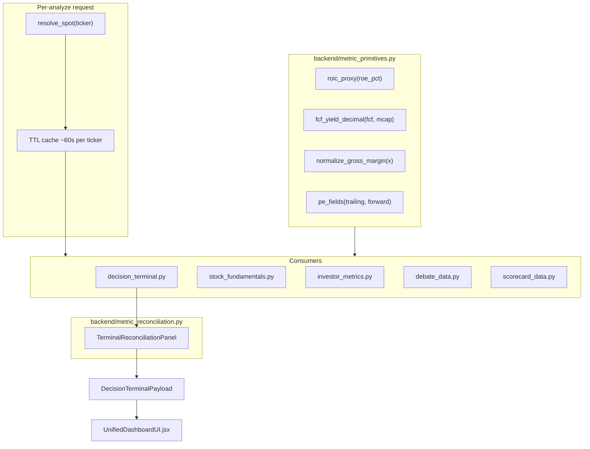

# Stock Analysis — Metric Consistency Remediation (Technical Spec)

**Audience:** engineers implementing the fixes identified in [STOCK_ANALYSIS_METRIC_CONSISTENCY_AUDIT.md](./STOCK_ANALYSIS_METRIC_CONSISTENCY_AUDIT.md).

**Scope:** Full stack — backend shared primitives, single spot price, reconciliation layer, Polymarket unification, verdict semantics, and frontend `/dashboard` (`UnifiedDashboardUI.jsx`).

**Out of scope:** Legacy `/decision-terminal` route (inherits same payload once backend changes land).

**Testing:** See companion doc [STOCK_ANALYSIS_PARITY_TEST_PLAN.md](./STOCK_ANALYSIS_PARITY_TEST_PLAN.md).

**Status:** Implementation spec — no code changes until an engineer picks up a phase.

---

## Locked product decisions (2026-06-16)

These override open questions in the pre-implementation review. Implementers must follow them.

| # | Decision | Rationale |
|---|----------|-----------|
| 1 | **Keep six parallel HTTP calls** + shared spot cache (no bundle endpoint) | Same ticker data within one analyze should converge via `resolve_spot` TTL cache; avoids a large API redesign while fixing inconsistency. |
| 2 | **Scorecard short-term: Option B — relabel as honest preview** | Fastest path that is **100% accurate in meaning**: the panel shows a single-name risk-return **profile**, not a comparative buy/sell rating. No fake precision from self-normalized `score_single` without industry medians. |
| 3 | **`expert_bullish_pct` deprecation** | See §8.3 — three-release timeline; split fields are canonical for new UI. |
| 4 | **Embed scorecard summary in `/decision-terminal`** | `DecisionTerminalPayload.scorecard_summary` feeds reconciliation server-side; frontend reconciliation banner does not depend on a separate scorecard request completing first. |

---

## 1. Problem summary

The Stock Analysis page fires **six parallel API calls** per ticker. Each call independently fetches or computes overlapping metrics (spot, ROIC, FCF, P/E, gross margin, Polymarket %, verdicts). There is no shared primitive layer, so the same label can show different numbers and eight verdict surfaces can disagree without explanation.

### Audit corrections (verified in codebase)

| Assumption in early audit | Actual behavior |
|---------------------------|-----------------|
| `debate_data` uses Stooq/FinCrawler for spot | **Only** yfinance 6-month history last close (`spot_price_source="yfinance_history"`) — [`backend/connectors/debate_data.py`](../backend/connectors/debate_data.py) L109–153 |
| Stooq/FinCrawler chain in debate_data | Lives in [`quote_fallbacks.fetch_us_equity_spot`](../backend/connectors/quote_fallbacks.py) L168+ and [`live_quote.py`](../backend/connectors/live_quote.py); used by scorecard, not debate |
| FCF yield same unit everywhere | `stock_fundamentals` = decimal ratio; `investor_metrics` = percent |
| `ScorecardRowOut` in schemas.py | Defined in [`backend/routers/scorecard.py`](../backend/routers/scorecard.py) L101–116 |

---

## 2. Target architecture



**Design principles:**

1. **Single source of truth** per primitive per request (spot, ROIC proxy, FCF TTM, gross margin, gated Polymarket %).
2. **Backward-compatible schemas** — add fields; deprecate `expert_bullish_pct` over two releases.
3. **Truthful-data contract** — if spot cannot be resolved, fail with `503 insufficient_data`; never substitute fabricated prices.
4. **Ledger-safe** — reconciliation changes are display/orchestration; `decision_ledger.emit_decision` continues to use `headline_verdict`.

---

## 3. Phase 1 — Shared metric primitives

### 3.1 New module: `backend/metric_primitives.py`

Pure functions with **no I/O**. Unit-test in `backend/tests/test_metric_primitives.py`.

| Function | Signature | Canonical behavior | Replaces |
|----------|-----------|-------------------|----------|
| `roic_proxy` | `(roe_pct: float) -> float` | `round(roe_pct * 0.8, 1)` when `roe_pct > 0` | `decision_terminal.py` L628; `investor_metrics.py` L92 |
| `fcf_yield_decimal` | `(fcf, market_cap) -> Optional[float]` | `fcf / market_cap` clamped; `None` if invalid | `stock_fundamentals._build_metrics`; `investor_metrics` L98 |
| `fcf_yield_percent` | `(fcf, market_cap) -> Optional[float]` | `fcf_yield_decimal * 100` | UI display only |
| `normalize_gross_margin` | `(raw) -> GrossMargin` | Dataclass: `ratio` (0–1), `percent` (0–100). If `raw > 1`, treat as percent | `decision_terminal.py` L625, L673 ambiguity |
| `format_usd_compact` | `(n: float) -> str` | `$X.XXB/M/K` | `decision_terminal._format_usd_compact` L273 |
| `graham_fair_value` | `(eps, book_ps) -> Optional[float]` | `sqrt(22.5 * eps * book)` | `decision_terminal._graham_fair_value` L247 |
| `verdict_tone` | `(label: str) -> str` | Maps any verdict string → `strong_positive \| positive \| neutral \| caution \| negative` | New; shared with frontend |

**Gross margin normalization (fixes M2):**

```python
@dataclass(frozen=True)
class GrossMargin:
    ratio: float   # 0.0–1.0 for math
    percent: float # 0–100 for display

def normalize_gross_margin(raw: Optional[float]) -> Optional[GrossMargin]:
    if raw is None:
        return None
    x = float(raw)
    if x > 1.0:  # already percent (e.g. data-lake fallback)
        return GrossMargin(ratio=x / 100.0, percent=x)
    return GrossMargin(ratio=x, percent=x * 100.0)
```

### 3.2 Unit convention policy (document in module docstring)

| Metric | API storage | UI display |
|--------|-------------|------------|
| FCF yield | **decimal** (0.042 = 4.2%) | percent with `%` suffix |
| Gross margin | **ratio** internally | percent in labels |
| ROE | percent (18.5) | `18.5%` |
| ROIC proxy | percent (14.8 = 0.8×18.5) | label must say "ROIC (0.8×ROE proxy)" |
| P/E | raw multiple (28.3) | label trailing vs forward |

---

## 4. Phase 2 — Single spot price (C3)

### 4.0 Architecture decision: parallel calls + shared cache (locked)

The dashboard **keeps six parallel requests** ([`AnalysisContext.jsx`](../frontend/src/AnalysisContext.jsx)): `/decision-terminal`, `/stock-fundamentals`, `/scorecard`, `/metrics`, `/prediction-markets`, `/small-cap-assessment` (conditional). There is **no** new bundle endpoint.

**Consistency mechanism:** every endpoint that needs spot calls the same `resolve_spot(ticker)` backed by a **module-level TTL cache** (default 60s, key = `ticker.upper()`). The first request in an analyze burst populates the cache; the other five read the same `SpotQuote`.

**Multi-worker caveat:** cache is per process. Under horizontal scale, parallel calls may hit different workers and miss the cache once. Mitigations (document only for v1):

- Accept rare cross-worker drift within `_price_tol` until a shared cache (Redis) is justified.
- Optional follow-up: `X-Analyze-Burst: {uuid}` header from frontend for stickier routing (infra-dependent).

**Implementation note (reuse existing canonical module — do NOT create a new one):** A canonical provenance-stamped spot accessor **already exists**: [`backend/connectors/spot.py::get_spot_with_freshness`](../backend/connectors/spot.py) (the "Data Trust Layer"), already covered by [`test_spot_freshness.py`](../backend/tests/test_spot_freshness.py). Its docstring already states new code should prefer it. **Extend this module** rather than adding `spot_resolver.py`:

1. Add a richer return surface (`source`, `degraded`, `captured_at_utc`) so it can populate `SpotEnvelope`. `assess_spot` already computes `degraded`; expose the provider string too.
2. Add the **module-level 60s TTL cache** here so all six parallel callers share one resolved value.
3. **Precedence decision (locked): Yahoo-chart-first** so app spot aligns with the Yahoo parity reference. Today `get_spot_with_freshness` → `fetch_us_equity_spot` is **Stooq-first** with Yahoo chart gated behind `QUOTE_FALLBACK_ALLOW_YAHOO_CHART`; change the chain (or the env default for the analysis path) so Yahoo chart is attempted **first**, then Stooq, then FinCrawler.
4. Do **not** duplicate [`live_quote.py`](../backend/connectors/live_quote.py) (Yahoo-fast-info-first, **S&P-500-only**, 45s cache). Reconcile the TTL: use a single constant (`SPOT_CACHE_TTL_S`, default 60) and have `live_quote` read the same value, or document why they differ.
5. Keep the accessor **synchronous** (matches existing sync connectors `fetch_stock_fundamentals`, `debate_data._sync_fetch`). Async callers (`run_decision_terminal_request`) wrap it via `asyncio.to_thread`, exactly as `decision_terminal` already does for `_sync_extended_snapshot`. Fix Stooq helper name: `_stooq_us_spot` (not `_stooq_spot`).

### 4.1 Display spot vs momentum anchor (required)

[`debate_data.py`](../backend/connectors/debate_data.py) today uses `prices.iloc[-1]` for **both** displayed spot and return math. After unification:

| Field | Source | Used for |
|-------|--------|----------|
| `display_spot` | `resolve_spot()` | Valuation, chart header, scorecard inputs, reconciliation |
| `momentum_anchor_price` | Last close from 6mo history (unchanged) | `price_return_1m/3m/6m`, 52-week positioning |

Debate `current_price` in agent context should use **`display_spot`** for narrative consistency; momentum percentages stay anchored to history closes. Document both in `SpotEnvelope` optional `momentum_anchor_usd` when they differ by more than `_price_tol`.

### 4.2 Extend existing module: `backend/connectors/spot.py`

**Do not create `spot_resolver.py`.** Extend the existing canonical [`get_spot_with_freshness`](../backend/connectors/spot.py) so it returns the provider string alongside the price + freshness, and add the shared cache. Keep it **synchronous**.

```python
@dataclass(frozen=True)
class SpotQuote:
    price: float
    source: str          # yahoo_chart | stooq | fincrawler | yfinance_history | yfinance_info
    captured_at_utc: str # ISO8601
    degraded: bool       # True when source is not primary live Yahoo

# Thin typed wrapper over the extended get_spot_with_freshness (sync).
def resolve_spot(ticker: str, *, strict_when_open: bool = False) -> SpotQuote:
    ...  # reads/writes the module-level TTL cache, then calls get_spot_with_freshness
```

**Resolution precedence (locked: Yahoo-first), single chain for the whole app:**

1. **Yahoo chart** `regularMarketPrice` — primary, `degraded=False`. (Today this is gated behind `QUOTE_FALLBACK_ALLOW_YAHOO_CHART` inside `fetch_us_equity_spot`; move it to the front of the chain for the analysis path.)
2. **Stooq CSV** via [`quote_fallbacks._stooq_us_spot`](../backend/connectors/quote_fallbacks.py) — `degraded=True`.
3. **FinCrawler** when configured — `degraded=True`.
4. **yfinance history last close** / `.info` — `degraded=True`.
5. If all fail → `(None, stale envelope)`, and `strict_when_open=True` raises `InsufficientDataError` (existing behavior).

**Cache:** module-level dict keyed by `ticker.upper()` with TTL `SPOT_CACHE_TTL_S` (default **60**), living in `spot.py`. All parallel endpoints in one analyze share the same resolved spot within the TTL window. Align `live_quote.py`'s 45s cache to the same constant.

**Sync/async:** `resolve_spot` is sync. `run_decision_terminal_request` (async) calls it via `asyncio.to_thread`; sync connectors call it directly.

### 4.2 Wire consumers

| File | Change |
|------|--------|
| [`debate_data.py`](../backend/connectors/debate_data.py) | `display_spot` from `resolve_spot`; keep history for momentum; set `market_data_degraded` from `SpotQuote.degraded` |
| [`decision_terminal.py`](../backend/decision_terminal.py) L496–522 | Remove ad-hoc `ext` price fallback loop; use `resolve_spot` result passed in from `run_decision_terminal_request` |
| [`stock_fundamentals.py`](../backend/connectors/stock_fundamentals.py) `_build_company_info` | Set `current_price` from `resolve_spot`; keep `previous_close` from yfinance for change % |
| [`investor_metrics.py`](../backend/connectors/investor_metrics.py) | Use resolved spot for margin-of-safety calc |
| [`scorecard_data.py`](../backend/connectors/scorecard_data.py) L113–119 | Replace dual yfinance + `fetch_us_equity_spot` with `resolve_spot` |

### 4.4 Schema additions

Add to `DecisionTerminalPayload` (and optionally `StockFundamentalsResponse`):

```python
class SpotEnvelope(BaseModel):
    price_usd: float
    source: str
    captured_at_utc: str
    degraded: bool

# DecisionTerminalPayload:
spot: Optional[SpotEnvelope] = None  # canonical; valuation.current_price_usd mirrors spot.price_usd
```

Frontend: **one** `spot` from `decisionData.spot.price_usd` (fallback `valuation.current_price_usd` during migration). Show `FreshnessBadge` + source chip (`Yahoo live`, `Delayed`, etc.).

---

## 5. Phase 3 — ROIC, FCF, gross margin, P/E (C1, H4, H5, M2)

### 5.1 ROIC / ROE (C1)

| Surface | Before | After |
|---------|--------|-------|
| Quality tile `roic` | "ROIC (proxy)" = 0.8×ROE | unchanged formula; provenance cites `metric_primitives.roic_proxy` |
| `/metrics` `roic_roe` | Displays **ROE** under misleading key | Split: `roe_pct` (display ROE), `roic_proxy_pct` (display proxy); **or** rename key to `roe` only |
| Investor metrics connector | Computes roic, shows roe | Use `roic_proxy()` for proxy field; show ROE as `roe` |

**Migration:** Add new keys; keep `roic_roe` as alias to `roe` for one release with deprecation log.

### 5.2 FCF (H4)

| Surface | Field | Source after fix |
|---------|-------|------------------|
| Quality tile | `fcf` compact USD | `resolve_spot` session + yfinance `freeCashflow` TTM |
| Consolidated metrics | `free_cash_flow`, `fcf_yield`, `fcf_per_share` | Same yfinance snapshot; `fcf_yield` = `fcf_yield_decimal` |
| `/metrics` | `fcf_yield.current` | `fcf_yield_percent()` formatted |

Add `period_label: "TTM"` to quality row provenance and fundamentals `metrics.cash_flow`.

### 5.3 Gross margin (M2)

All paths call `normalize_gross_margin()` before moat heuristic and status labels:

- [`decision_terminal.py`](../backend/decision_terminal.py) `_moat_heuristic(roe_pct, gm.ratio)` — always ratio
- Status "Good" if `gm.percent >= 18`
- Quality row displays `f"{gm.percent:.1f}%"`

### 5.4 P/E (H5)

**[`stock_fundamentals.py`](../backend/connectors/stock_fundamentals.py)** — extend `metrics.valuation`:

```python
trailing_pe: Optional[float]   # existing
forward_pe: Optional[float]    # NEW: info.forwardPE
```

**Frontend** [`UnifiedDashboardUI.jsx`](../frontend/src/UnifiedDashboardUI.jsx) Consolidated Metrics:

- Show "PE Ratio (TTM)" and "PE Ratio (Forward)" on separate rows.
- Tooltip on scorecard panel: "Risk score uses forward P/E vs 5Y average."

**Scorecard** already uses `forward_pe` from [`scorecard_data.py`](../backend/connectors/scorecard_data.py) L130 — no math change; labeling only.

---

## 6. Phase 4 — Reconciliation layer + embedded scorecard (H1, H6, C2)

### 6.0 Embed scorecard summary in `/decision-terminal` (locked)

Reconciliation must include scorecard **server-side**, not via frontend merge after two async calls.

**In [`run_decision_terminal_request`](../backend/decision_terminal.py):** after swarm/debate/poly/ext fetches, run scorecard in parallel (same preset/flags as dashboard):

```python
# Same as dashboard: balanced preset, skip LLM personas for latency
row = await _build_dashboard_scorecard_summary(ticker, preset="balanced", skip_llm_scores=True)
```

Reuse [`fetch_scorecard_data`](../backend/connectors/scorecard_data.py) + [`score_single`](../backend/scorecard.py) + existing `_fetch_subjective_scores` / `_data_to_scorecard_input` / `_fetch_verdicts_single` helpers from [`routers/scorecard.py`](../backend/routers/scorecard.py). Extract a shared helper (e.g. `backend/scorecard_service.py::build_single_ticker_scorecard`) to avoid duplicating router logic.

> **CR3 — avoid Decision-Outcome Ledger double-emit.** [`single_ticker_scorecard`](../backend/routers/scorecard.py) calls `decision_ledger.emit_decision(decision_type="scorecard", ...)`. The extracted `scorecard_service.build_single_ticker_scorecard` must be **compute-only (no ledger emit)**. Keep the `emit_decision` call in the `/scorecard` *route*; the DT-embedded build must not emit, otherwise every analyze records the scorecard decision twice (once embedded, once from the dashboard's `/scorecard` call) and pollutes SEPL / feature-correlation. The existing `/decision-terminal` ledger emit (DT verdict) is unaffected.

**Add to `DecisionTerminalPayload`:**

```python
class TerminalScorecardSummary(BaseModel):
    """Slim scorecard row for reconciliation + dashboard; not a comparative rating."""
    ticker: str
    preset: str = "balanced"
    is_comparative: bool = False  # always False for dashboard/DT path until industry medians ship
    ratio: float
    signal: str          # e.g. "Balanced", "Favorable" — UI must frame as profile label
    action: str
    verdict: str
    quadrant: str
    return_score_weighted: float
    risk_score_weighted: float
    framing_note: str = (
        "Single-name preview (balanced preset). Not a buy/sell rating — "
        "compare multiple tickers on /scorecard for relative rankings."
    )
    one_line_reason: str = ""
    data_freshness: Optional[DataFreshness] = None

# DecisionTerminalPayload:
scorecard_summary: Optional[TerminalScorecardSummary] = None
```

**Frontend:** `DashboardScorecardPanel` prefers `decisionData.scorecard_summary` when present; may still call `GET /scorecard/{t}` as fallback for full scatter `inputs` echo until migration completes. Reconciliation banner reads **only** from `decisionData.reconciliation` (which already includes scorecard tone).

### 6.1 New module: `backend/metric_reconciliation.py`

```python
@dataclass
class SignalChip:
    source: str       # "verdict" | "valuation" | "roadmap" | "scorecard"
    label: str        # human-readable
    tone: str         # verdict_tone() output
    detail: str       # one line

def build_reconciliation(
    *,
    headline_verdict: str,
    fusion_note: str,
    pct_vs_average: Optional[float],
    gauge_label: str,
    predicted_cagr_base_pct: Optional[float],
    swarm_rejected: bool,
    scorecard_summary: Optional[TerminalScorecardSummary] = None,
) -> TerminalReconciliationPanel:
    ...
```

**Logic:**

1. Map each input to a tone via `verdict_tone()`.
2. `primary_headline` = existing `headline_verdict` (unchanged authority).
3. `supporting_signals` = inputs with same tone as primary.
4. `conflicting_signals` = inputs with opposing tone (e.g. BUY + OVERVALUED).
5. Include **scorecard** `signal` / `verdict` as a `source="scorecard"` chip when `scorecard_summary` is present. Map `Exceptional`/`Strong buy`/`Favorable` → positive tones; `Caution`/`Avoid` → caution/negative. Always append scorecard `framing_note` to reconciliation when scorecard is non-neutral vs headline.
6. `reconciliation_note` = templated prose when conflicts exist, e.g.:
   - *"Debate leans bullish while valuation models suggest the stock trades above fair value (+12% overvalued). Roadmap base case implies +8% CAGR over 3Y. Risk-return profile is 'Balanced' (single-name preview, not a comparative rating). Consider whether growth expectations justify the premium."*
7. Roadmap vs valuation (H6): if `sign(cagr) > 0` and `pct_vs_average < -5` (overvalued), always add conflict chip.

### 6.2 Schema: `TerminalReconciliationPanel`

Add to [`backend/schemas.py`](../backend/schemas.py):

```python
class ReconciliationSignal(BaseModel):
    source: str
    label: str
    tone: str  # strong_positive | positive | neutral | caution | negative
    detail: str = ""

class TerminalReconciliationPanel(BaseModel):
    primary_headline: str
    supporting_signals: List[ReconciliationSignal] = Field(default_factory=list)
    conflicting_signals: List[ReconciliationSignal] = Field(default_factory=list)
    reconciliation_note: str = ""

# DecisionTerminalPayload:
reconciliation: Optional[TerminalReconciliationPanel] = None
scorecard_summary: Optional[TerminalScorecardSummary] = None
spot: Optional[SpotEnvelope] = None
```

Populate in `build_decision_terminal_payload` after verdict + valuation + roadmap + scorecard_summary are assembled.

---

## 7. Phase 5 — Polymarket single read (H2)

### 7.1 Canonical gate

Keep [`score_polymarket_relevance`](../backend/decision_terminal.py) L116–141 as the **only** relevance function. Export to `backend/connectors/polymarket_gating.py` so agents and routers import it.

**Gated event selection:**

```python
def select_gated_polymarket_event(events: list, ticker: str, company_tokens: list) -> Optional[GatedEvent]:
    # Returns best event with relevance >= 0.45, or None
```

### 7.2 Wire consumers

| Consumer | Change |
|----------|--------|
| `decision_terminal.build_decision_terminal_payload` | Already uses gate at L705 — move to shared `select_gated_polymarket_event` |
| `agents.PolymarketAgentPair._analyst_step` | Replace `events[0]` volume-first with gated event; same prob threshold for `trading_signal` |
| `routers/analysis.py` `prediction_markets` | Add `gated_probability`, `gated_event_title`, `gated_out` top-level fields mirroring terminal |
| `UnifiedDashboardUI.getBriefText` | Read only `verdict.prediction_market_bullish_pct` + `gated_out`; remove independent event averaging |

---

## 8. Phase 6 — Verdict semantics + legend (H3, M1, M3)

### 8.1 Split expert consensus (H3)

Extend `TerminalVerdictPanel`:

```python
debate_stance_bull_pct: Optional[float] = Field(
    default=None, description="0-100, bull_score / total stances only"
)
debate_confidence_pct: Optional[float] = Field(
    default=None, description="0-100, moderator consensus_confidence only"
)
expert_bullish_pct: Optional[float] = Field(
    default=None, description="DEPRECATED: 0.5*stance + 0.5*confidence. Use split fields."
)
```

Compute in `_expert_bullish_pct` refactor:

```python
def _debate_stance_bull_pct(debate) -> float:
    s = debate.bull_score + debate.bear_score + debate.neutral_score
    return round(100.0 * debate.bull_score / s, 1) if s else 50.0

def _debate_confidence_pct(debate) -> float:
    return round(float(debate.consensus_confidence) * 100.0, 1)
```

**Frontend:** Replace single "Bullish (58%)" with:
- `Stance: 50% bull · 50% bear/neutral`
- `Moderator confidence: 72%`

### 8.3 `expert_bullish_pct` deprecation timeline (locked recommendation)

The composite field is misleading (H3). Use this **three-release** plan:

| Release | Backend | Frontend | Tests |
|---------|---------|----------|-------|
| **R1** (remediation ship) | Add `debate_stance_bull_pct`, `debate_confidence_pct`; **keep** populating `expert_bullish_pct` for backward compat | Show split stance + confidence; hide composite from UI | Assert split fields present; composite still optional |
| **R2** (+1 deploy) | Mark `expert_bullish_pct` `deprecated` in OpenAPI description; log warning if clients read it | Remove all UI reads of `expert_bullish_pct` | FaultHunter adds split fields to `requiredFields`; composite optional |
| **R3** (+2 deploys) | Stop populating `expert_bullish_pct` (field `null` or omitted) | n/a | Remove composite assertions |

**Rationale:** One release is too abrupt for external consumers; three releases gives E2E and FaultHunter time to migrate without breaking the dashboard mid-remediation.

### 8.2 Verdict tone legend (M1)

**Backend:** `metric_primitives.verdict_tone(label) -> str`

**Frontend:** New `frontend/src/components/VerdictToneLegend.jsx`

| Tone | Color token | Example labels |
|------|-------------|----------------|
| `strong_positive` | `--accent-green` | STRONG BUY, Exceptional, UNDERVALUED (value opportunity) |
| `positive` | green-muted | BUY, Favorable, BULLISH |
| `neutral` | `--dt-muted` | NEUTRAL, Balanced, NEAR FAIR VALUE |
| `caution` | amber | Caution, Stretched, REJECTED (capped) |
| `negative` | red | SELL, Avoid, OVERVALUED (price risk), BEARISH |

Collapsible "What do these ratings mean?" below Verdict hub.

### 8.3 Confidence labeling (M3)

Rename UI strings (no schema break):

| Old label | New label |
|-----------|-----------|
| Social gauge (no text) | Add "Social factor confidence: N%" |
| Roadmap `confidence_0_1` | "Scenario confidence (model)" |
| Debate agent bar | "Agent confidence" |
| Swarm (hidden on dashboard) | unchanged |

---

## 9. Phase 7 — Frontend changes

### 9.1 [`UnifiedDashboardUI.jsx`](../frontend/src/UnifiedDashboardUI.jsx)

| Area | Change |
|------|--------|
| Spot | `const spot = decisionData?.spot?.price_usd ?? decisionData?.valuation?.current_price_usd`; show source chip from `decisionData.spot` |
| Chart header | Use same `spot` for consistency; `fundamentalsData.company_info.current_price` only for change % if needed |
| Verdict hub | Render `reconciliation.reconciliation_note` when `conflicting_signals.length > 0` |
| Expert consensus | Split stance + confidence (§8.1) |
| Prediction markets | Single read from `verdict.prediction_market_bullish_pct` |
| Consolidated metrics | Add forward P/E row |
| Roadmap | Use unified `spot` only |

### 9.2 [`DashboardScorecardPanel.jsx`](../frontend/src/components/DashboardScorecardPanel.jsx) (C2) — locked: Option B

**Ship in Phase 7 (fast + truthful):**

- Subtitle: `Balanced preset · risk-return profile (single-name preview — not a buy/sell rating)`
- Prefer data from `decisionData.scorecard_summary` when embedded in `/decision-terminal`.
- Do **not** style `signal`/`verdict` with strong buy/sell colors when `is_comparative === false`; use neutral profile styling.
- Show `framing_note` from payload (or static copy matching it).
- Link to `/scorecard` for **comparative** basket scoring.

**Deferred (not v1):** industry medians (option A) and `skip_llm_scores=false` (option C) — track when sector median parquet exists.

---

## 10. Scorecard framing decision record (C2)

| Option | Effort | Accuracy / honesty |
|--------|--------|-------------------|
| **B — Relabel as preview (LOCKED for v1)** | Low | **100% accurate in meaning** — does not claim comparative buy/sell authority |
| A — Industry medians | Medium | Mathematically comparative; needs data pipeline |
| C — Enable LLM scores | High latency | Better subjective inputs; still needs medians |

**Locked:** Ship **B** only in remediation v1. Option A remains a follow-up when sector median data is available.

---

## 11. Phasing, rollout, and off-switches

| Phase | Deliverable | Env off-switch | Tests required |
|-------|-------------|----------------|----------------|
| 1 | `metric_primitives.py` | n/a | `test_metric_primitives.py` |
| 2 | **Extend `spot.py`** (`resolve_spot` + cache + Yahoo-first) + wire | `SPOT_RESOLVER_ENABLE=0` → legacy paths | parity + cross-consistency |
| 3 | ROIC/FCF/GM/PE | n/a | parity field additions |
| 4 | `metric_reconciliation.py` + **scorecard embed in DT** | `RECONCILIATION_ENABLE=0` | unit + snapshot |
| 5 | Polymarket gating | n/a | cross-consistency |
| 6 | Verdict split + legend | n/a | schema contract tests |
| 7 | Frontend | feature flag `VITE_RECONCILIATION_UI=1` | Playwright parity |

**Order:** 1 → 2 → 3 → 4 → 5 → 6 → 7 (each phase mergeable independently).

**Decision ledger:** `emit_decision` in [`decision_terminal.py`](../backend/decision_terminal.py) L989 — add optional `reconciliation_note` to `output` JSON; do not change `verdict` field used by grader.

**Cache invalidation:** Spot cache clears on new analyze (force refresh) via `AnalysisContext` passing `?refresh=1` or cache-bust header.

---

## 12. File change checklist

| File | Action |
|------|--------|
| `backend/metric_primitives.py` | **Create** |
| `backend/connectors/spot.py` | **Extend** existing `get_spot_with_freshness` (add `resolve_spot`/`SpotQuote`, 60s cache, Yahoo-first precedence) — do NOT create `spot_resolver.py` |
| `backend/metric_reconciliation.py` | **Create** |
| `backend/connectors/polymarket_gating.py` | **Create** (extract from decision_terminal) |
| `backend/tests/test_metric_primitives.py` | **Create** |
| `backend/tests/test_metric_cross_consistency.py` | **Create** (see parity plan) |
| `backend/scorecard_service.py` | **Create** — shared single-ticker scorecard builder for router + DT. **Compute-only: NO `decision_ledger.emit_decision`** (keep the emit in `/scorecard` route to avoid double-emit when DT embeds the summary) |
| `backend/decision_terminal.py` | Refactor: primitives + spot + scorecard_summary + reconciliation |
| `backend/connectors/debate_data.py` | Use `resolve_spot` |
| `backend/connectors/stock_fundamentals.py` | Use `resolve_spot`; add `forward_pe` |
| `backend/connectors/investor_metrics.py` | Use primitives; fix `roic_roe` key |
| `backend/connectors/scorecard_data.py` | Use `resolve_spot` |
| `backend/agents.py` | Polymarket gated event |
| `backend/routers/analysis.py` | Prediction-markets gated fields |
| `backend/schemas.py` | `SpotEnvelope`, `TerminalScorecardSummary`, `TerminalReconciliationPanel`, verdict split fields |
| `frontend/src/UnifiedDashboardUI.jsx` | Spot, reconciliation, expert split, P/E |
| `frontend/src/components/DashboardScorecardPanel.jsx` | Preview framing |
| `frontend/src/components/VerdictToneLegend.jsx` | **Create** |

---

## 13. Acceptance criteria

- [ ] For tickers AAPL, MSFT, SPY when `spot.degraded=false`: cross-endpoint spot (`decision-terminal.spot`, `stock-fundamentals.company_info.current_price`, scorecard `inputs.current_price`) within **$0.01**; vs Yahoo chart within **`_price_tol`**.
- [ ] When `spot.degraded=true`, parity tests **skip** (do not fail).
- [ ] Quality ROIC proxy === 0.8 × ROE shown in `/metrics` `roe` field (not old `roic_roe` mismatch).
- [ ] FCF yield in fundamentals (decimal) × 100 === `/metrics` fcf_yield display within 0.1 pp.
- [ ] When verdict is BUY and gauge is OVERVALUED, `reconciliation_note` is non-empty and references scorecard framing when `scorecard_summary` present.
- [ ] `decision-terminal.scorecard_summary` present with `is_comparative=false` and non-empty `framing_note`.
- [ ] `prediction_market_bullish_pct` === gated probability on `/prediction-markets` for same ticker.
- [ ] Dashboard scorecard panel does not use strong buy/sell styling when `is_comparative=false`.
- [ ] `debate_stance_bull_pct` and `debate_confidence_pct` populated; `expert_bullish_pct` still populated in R1.
- [ ] All existing `test_market_data_parity` tests pass; new cross-consistency tests pass.
- [ ] `e2e:api-accuracy` passes with degraded-skip guard.

---

## Changelog

| Date | Change |
|------|--------|
| 2026-06-16 | Locked product decisions: parallel calls+cache, scorecard preview (B), expert_bullish_pct 3-release deprecation, scorecard_summary in DT |
| 2026-06-16 | Pre-impl double-check: (CR1) reuse existing `spot.py::get_spot_with_freshness` instead of new `spot_resolver.py`; (CR2) lock **Yahoo-chart-first** spot precedence for parity alignment; (CR3) `scorecard_service` is compute-only (no ledger emit) to prevent double-emit; (M1) spot accessor is **sync**, async callers use `asyncio.to_thread` |
| 2026-06-16 | Initial remediation technical spec |
