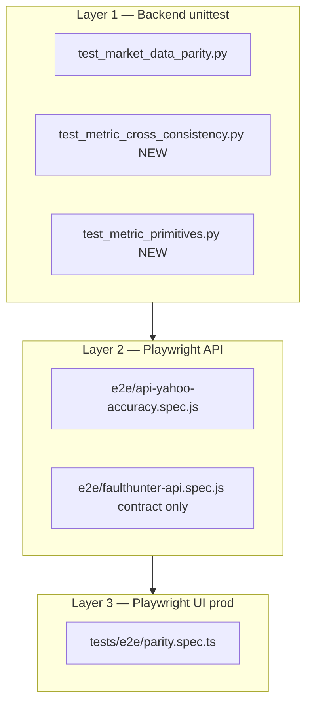

# Stock Analysis — Parity & Consistency Test Plan

**Audience:** engineers extending automated tests after [STOCK_ANALYSIS_METRIC_CONSISTENCY_REMEDIATION.md](./STOCK_ANALYSIS_METRIC_CONSISTENCY_REMEDIATION.md) lands.

**Goal:** Prove that (1) fixed metrics match **trusted external references** (Yahoo primary, Stooq cross-check), and (2) metrics are **internally consistent** across parallel endpoints on the same analyze.

**Related:** [STOCK_ANALYSIS_METRIC_CONSISTENCY_AUDIT.md](./STOCK_ANALYSIS_METRIC_CONSISTENCY_AUDIT.md), [STOCK_ANALYSIS_METRICS.md](./STOCK_ANALYSIS_METRICS.md), [STOCK_ANALYSIS_METRIC_CONSISTENCY_REMEDIATION.md](./STOCK_ANALYSIS_METRIC_CONSISTENCY_REMEDIATION.md).

**Trusted sources (locked):** Yahoo Finance (primary) + Stooq (independent cross-check). No Google Finance — no stable public API.

**Architecture (locked):** Dashboard keeps **six parallel HTTP calls**; consistency is enforced by shared `resolve_spot` TTL cache + embedded `scorecard_summary` on `/decision-terminal` (no bundle endpoint). See remediation doc §4.0 and §6.0.

**Spot source (locked):** `resolve_spot` is the thin wrapper added to the existing canonical [`backend/connectors/spot.py`](../backend/connectors/spot.py) (not a new `spot_resolver.py`), with **Yahoo-chart-first precedence** so the app's spot aligns with the Yahoo parity reference below. This minimizes spurious parity failures from a Stooq-vs-Yahoo source mismatch; Stooq/FinCrawler remain degraded fallbacks. See remediation §4.2.

---

## 1. Test pyramid



| Layer | When to run | Network | Blocks deploy? |
|-------|-------------|---------|----------------|
| L1 unittest | Every PR / `./scripts/run_backend_tests.sh` | Live Yahoo + Stooq | Yes (if not skipped) |
| L2 API accuracy | Nightly / pre-release | Live Yahoo | Advisory (opt-in expensive) |
| L3 prod parity | Post-deploy smoke | Live Yahoo | Advisory |

---

## 2. Reference source design

### 2.1 Yahoo (primary truth)

**Existing connector:** [`backend/connectors/yahoo_chart_reference.py`](../backend/connectors/yahoo_chart_reference.py)

| Function | Returns | Used for |
|----------|---------|----------|
| `fetch_yahoo_chart_quote(symbol)` | `YahooChartQuote` | Spot price, change % |
| `fetch_yahoo_chart_quotes(symbols)` | `dict[str, YahooChartQuote]` | Batch macro symbols |

**Fundamentals** (not in chart JSON): `yfinance.Ticker(ticker).info` for `grossMargins`, `returnOnEquity`, `trailingPE`, `forwardPE`, `freeCashflow`, `marketCap`.

**E2E helper:** [`e2e/helpers/yahooFinance.js`](../e2e/helpers/yahooFinance.js) — `fetchYahooQuote`, `fetchYahooSummary`, `priceTolerance`.

### 2.2 Stooq (cross-check)

**Existing path:** [`backend/connectors/quote_fallbacks.py`](../backend/connectors/quote_fallbacks.py) `_stooq_spot(symbol)` → CSV last close.

**New thin wrapper (implement in remediation):** `backend/connectors/stooq_reference.py`

```python
def fetch_stooq_spot(ticker: str) -> Optional[float]:
    """Returns last close from Stooq CSV, or None if bot-wall / unavailable."""
```

**E2E helper (new):** `e2e/helpers/stooqFinance.js`

```javascript
async function fetchStooqSpot(ticker) { /* GET stooq.com/q/l/?s=... */ }
function isStooqUnavailable(err) { ... }
```

### 2.3 Agreement rule (Yahoo vs Stooq vs app)

Before comparing app value to references:

1. Fetch Yahoo spot `y` and Stooq spot `s`.
2. If either is `None` → `skip` test with reason.
3. If `abs(y - s) > max($1, 0.02 * y)` → `skip` with `"reference sources disagree"` (do not fail app).
4. Else compare app value to **Yahoo** `y` within tolerance.
5. Optionally log Stooq delta as info.

This prevents flaky failures when Stooq serves a bot wall or stale close.

### 2.4 Degraded-skip guard (current gap)

**Problem:** Existing parity tests do not skip when the app used fallback sources.

**Rule:** Before numeric assert, read from API response:

| Endpoint | Flags to check |
|----------|----------------|
| `/decision-terminal` | `market_data_degraded`, `data_freshness.degraded`, `spot.degraded` (post-remediation) |
| `/stock-fundamentals` | `data_freshness.degraded` |
| `/metrics/{ticker}` | connector-level; infer from spot source if exposed |

If **any** `degraded === true` → `unittest.skip()` / `test.skip()` with message `"degraded spot; parity not applicable"`.

**Helper (implement):**

```python
# backend/tests/parity_helpers.py
def skip_if_degraded(payload: dict) -> None:
    if payload.get("market_data_degraded"):
        raise unittest.SkipTest("market_data_degraded")
    df = payload.get("data_freshness") or {}
    if df.get("degraded"):
        raise unittest.SkipTest("data_freshness.degraded")
    spot = payload.get("spot") or {}
    if spot.get("degraded"):
        raise unittest.SkipTest("spot.degraded")
```

Mirror in JS for Playwright:

```javascript
function skipIfDegraded(payload, test) {
  if (payload.market_data_degraded || payload.data_freshness?.degraded || payload.spot?.degraded) {
    test.skip(true, 'degraded spot; parity not applicable');
  }
}
```

---

## 3. Backend unittest extensions

### 3.1 Existing: [`backend/tests/test_market_data_parity.py`](../backend/tests/test_market_data_parity.py)

**Current coverage:**

| Test | Endpoint | Field | Reference | Tolerance |
|------|----------|-------|-----------|-----------|
| `test_decision_terminal_current_price_tracks_yahoo_chart` | `/decision-terminal` | `valuation.current_price_usd` | Yahoo chart price | `_price_tol` = max($1, 1%) |
| `test_metrics_endpoint_stable_percent_fields_track_yahoo` | `/metrics/{t}` | `gross_margins`, `roic_roe` | yfinance info | ±2.0 pp (fixed) |
| `test_macro_vix_tracks_yahoo_chart` | `/macro` | `vix_level` | ^VIX | `_macro_tol` = 5% |
| `test_macro_sector_daily_change_*` | `/macro` | sector `daily_change_pct` | Yahoo chart | `PCT_POINT_TOLERANCE` = 0.75 pp |
| `test_macro_capital_flow_daily_change_*` | `/macro` | flow `daily_change_pct` | Yahoo chart | 0.75 pp |
| `test_gold_advisor_context_prices_*` | `/advisor/gold` | gold, DXY, VIX | Yahoo chart | `_macro_tol` |

**Env:** `MARKET_PARITY_TICKERS` (default `SPY,AAPL,MSFT`).

**Skip:** Yahoo unreachable at `setUpClass`.

### 3.2 New tests to add (post-remediation)

Add to `TestMarketDataParity` or new class `TestStockAnalysisFieldParity`:

| Test name | Endpoint(s) | Field | Reference | Tolerance |
|-----------|-------------|-------|-----------|-----------|
| `test_spot_envelope_tracks_yahoo_and_stooq` | `/decision-terminal` | `spot.price_usd` | Yahoo + Stooq agreement | `_price_tol` |
| `test_fundamentals_spot_matches_terminal` | `/stock-fundamentals` + `/decision-terminal` | `company_info.current_price` vs `spot.price_usd` | internal | $0.01 |
| `test_fcf_yield_tracks_yahoo` | `/stock-fundamentals` | `metrics.cash_flow.fcf_yield` | `freeCashflow/marketCap` | 0.15 pp (decimal) |
| `test_trailing_pe_tracks_yahoo` | `/stock-fundamentals` | `metrics.valuation.trailing_pe` | yfinance `trailingPE` | 3% relative |
| `test_forward_pe_tracks_yahoo` | `/stock-fundamentals` | `metrics.valuation.forward_pe` | yfinance `forwardPE` | 3% relative |
| `test_roic_proxy_is_08_times_roe` | `/decision-terminal` | quality `roic` row | quality ROE × 0.8 | 0.2 pp |
| `test_metrics_roe_not_mislabeled_roic` | `/metrics` | `roe` key (post-rename) | yfinance ROE | ±2.0 pp |
| `test_scorecard_spot_matches_terminal` | `/scorecard/{t}` | `inputs.current_price` | terminal spot | `_price_tol` |
| `test_scorecard_summary_in_decision_terminal` | `/decision-terminal` | `scorecard_summary.{ratio,signal,is_comparative}` | present; `is_comparative=false` | exact |
| `test_scorecard_summary_matches_standalone` | DT + `/scorecard/{t}` | `scorecard_summary.ratio` vs standalone `ratio` | internal | 0.01 |
| `test_polymarket_gated_pct_consistent` | `/decision-terminal` + `/prediction-markets` | `verdict.prediction_market_bullish_pct` vs `gated_probability` | internal | 0.1 pp |
| `test_reconciliation_includes_scorecard` | `/decision-terminal` | `reconciliation.conflicting_signals` | contains `source=scorecard` when tones diverge | structural |

Each test calls `skip_if_degraded()` first.

### 3.3 New file: `backend/tests/test_metric_cross_consistency.py`

**Purpose:** Internal consistency **without** external truth — directly guards remediation regressions (C1–C3, H2, H4).

```python
"""Cross-endpoint consistency for a single ticker analyze (no Yahoo required for structure)."""
```

| Test | Assertion |
|------|-----------|
| `test_spot_identical_across_endpoints` | `\|DT.spot - SF.current_price\| < 0.01` and metrics implied spot |
| `test_roic_proxy_consistent` | DT quality roic == 0.8 × `/metrics` roe |
| `test_fcf_yield_unit_consistent` | SF fcf_yield_decimal × 100 == metrics fcf_yield_percent ± 0.1 |
| `test_gross_margin_consistent` | DT quality margin == SF gross margin display ± 0.5 pp |
| `test_polymarket_pct_consistent` | DT `prediction_market_bullish_pct` == PM `gated_probability` |
| `test_reconciliation_emitted_on_conflict` | `/decision-terminal` | BUY + OVERVALUED → `reconciliation_note` non-empty; mentions scorecard framing when `scorecard_summary` present |
| `test_expert_verdict_split_fields` | `/decision-terminal` | `debate_stance_bull_pct`, `debate_confidence_pct` present; `expert_bullish_pct` present in R1 only |

**Setup:** `TestClient(app)`; tickers from `MARKET_PARITY_TICKERS`; skip if any endpoint returns 503.

**Note:** Can run in CI without Yahoo if using mocked spot — add `METRIC_CONSISTENCY_MOCK=1` mode with fixtures for offline CI (optional phase 2).

### 3.4 New file: `backend/tests/test_metric_primitives.py`

Unit tests for [`metric_primitives.py`](../backend/metric_primitives.py) (no network):

- `test_roic_proxy`
- `test_normalize_gross_margin_percent_input`
- `test_normalize_gross_margin_ratio_input`
- `test_fcf_yield_decimal_and_percent`
- `test_verdict_tone_mapping`

---

## 4. Playwright E2E extensions

### 4.1 [`e2e/api-yahoo-accuracy.spec.js`](../e2e/api-yahoo-accuracy.spec.js)

**Run:**

```bash
E2E_API_BASE_URL=http://127.0.0.1:8000 npm run e2e:api-accuracy
```

**Env vars:**

| Var | Default | Purpose |
|-----|---------|---------|
| `E2E_API_BASE_URL` | `http://127.0.0.1:8000` | API base |
| `ACCURACY_TICKER` | `AAPL` | Primary ticker |
| `ACCURACY_PEER_TICKER` | `MSFT` | Peer for compare |
| `ACCURACY_PCT_TOLERANCE` | `0.85` | Percent-point tolerance |
| `RUN_EXPENSIVE_ACCURACY` | off | Mutating refresh tests |

**Add tests:**

| Describe block | Assert |
|----------------|--------|
| `stock analysis spot envelope` | `GET /decision-terminal` → `spot.price_usd` vs `fetchYahooQuote` + `fetchStooqSpot`; `skipIfDegraded` |
| `fundamentals forward pe` | `metrics.valuation.forward_pe` vs Yahoo summary |
| `cross-endpoint spot` | DT spot === SF `current_price` === scorecard `inputs.current_price` |
| `fcf yield parity` | SF `fcf_yield * 100` vs Yahoo-derived |
| `polymarket gated` | DT `prediction_market_bullish_pct` === PM `gated_probability` |

**New helper:** `e2e/helpers/stooqFinance.js` (see §2.2).

**New helper:** `e2e/helpers/parityGuards.js` — `skipIfDegraded`, `assertReferencesAgree(yahoo, stooq)`.

### 4.2 [`tests/e2e/parity.spec.ts`](../tests/e2e/parity.spec.ts) (production UI)

**Run:**

```bash
npm run e2e:prod-parity
```

**Env:** `APP_URL`, `PARITY_TICKER`, `PARITY_SCORECARD_TICKERS`.

**Existing:** Dashboard price vs Yahoo; macro VIX/flows; gold advisor; scorecard render.

**Add after remediation:**

| Test | Selector / behavior |
|------|---------------------|
| Spot source badge visible | `[data-testid="spot-source-badge"]` shows `yahoo_chart` or equivalent |
| Forward P/E row | Consolidated metrics shows "PE Ratio (Forward)" |
| Reconciliation banner | When conflict injected (staging), `[data-testid="reconciliation-note"]` visible |
| Expert consensus split | Stance % and confidence % as separate text nodes |
| Scorecard preview label | "single-name preview" copy present |

**Reference age gate (existing):** `MAX_REFERENCE_AGE_MS = 75 * 60 * 1000` — skip if Yahoo quote stale during market hours.

### 4.3 FaultHunter contract mirror

**File:** [`e2e/faulthunter-cases.js`](../e2e/faulthunter-cases.js)  
**Spec:** [`e2e/faulthunter-api.spec.js`](../e2e/faulthunter-api.spec.js)

FaultHunter checks **HTTP 200 + field presence only** — not numeric parity.

**Update `decision-aapl-today` requiredFields after remediation (R1):**

```javascript
requiredFields: [
  'generated_at_utc',
  'valuation.current_price_usd',
  'verdict.headline_verdict',
  'spot.price_usd',                      // NEW
  'spot.source',                         // NEW
  'verdict.debate_stance_bull_pct',      // NEW (R1)
  'verdict.debate_confidence_pct',       // NEW (R1)
  'scorecard_summary.ratio',             // NEW
  'scorecard_summary.is_comparative',    // NEW — expect false
  'reconciliation.primary_headline',     // NEW when RECONCILIATION_ENABLE=1
]
// expert_bullish_pct: optional in R1, remove from requiredFields in R3
```

Mirror changes in external FaultHunter repo `faulthunter/case_bank.py` when deploying.

**Run smoke:**

```bash
FH_PROFILE=smoke E2E_API_BASE_URL=http://127.0.0.1:8000 npm run e2e:smoke:api
```

---

## 5. Tolerance reference table

| Metric type | Tolerance | Helper | Notes |
|-------------|-----------|--------|-------|
| Spot price | max(**$1.00**, **1%** of expected) | `_price_tol` / `priceTolerance` | Aligns unittest + Playwright |
| Macro level (VIX, gold) | max($0.01, **5%**) | `_macro_tol` | |
| Daily change % | **0.75** pp | `PCT_POINT_TOLERANCE` | Sectors, flows |
| Fundamental % (margin, ROE) | max(**0.5** pp, **8%** relative) | `fundamentalTolerance` in api-yahoo-accuracy | |
| ROIC proxy vs 0.8×ROE | **0.2** pp | fixed | Internal consistency |
| FCF yield | **0.15** pp | fixed | Decimal vs percent conversion |
| P/E multiple | **3%** relative | | Forward can be stale on Yahoo |
| Yahoo vs Stooq cross-check | max(**$1**, **2%**) | `referenceAgreeTolerance` | Skip if disagree |
| Cross-endpoint spot | **$0.01** | fixed | Same analyze, same cache |

---

## 6. CI integration

### 6.1 Backend (every PR)

```bash
./scripts/run_backend_tests.sh
# includes test_metric_primitives, test_metric_cross_consistency, test_market_data_parity
```

**Offline CI:** `test_metric_primitives` and structural parts of `test_metric_cross_consistency` run without network. Live parity tests skip when Yahoo unreachable (existing behavior).

**Recommended GitHub Actions addition:**

```yaml
- name: Market data parity (live)
  run: PYTHONPATH=. python3.12 -m unittest backend.tests.test_market_data_parity -v
  continue-on-error: false  # skip OK; fail on assertion only
```

### 6.2 API accuracy (nightly or manual)

```bash
# Start API locally or point at staging
E2E_API_BASE_URL=http://127.0.0.1:8000 npm run e2e:api-accuracy
```

### 6.3 Production parity (post-deploy)

```bash
APP_URL=https://frontend-manojsilwals-projects.vercel.app npm run e2e:prod-parity
```

### 6.4 npm script map

| Script | File(s) |
|--------|---------|
| `npm run e2e:api-accuracy` | `e2e/api-yahoo-accuracy.spec.js` |
| `npm run e2e:prod-parity` | `tests/e2e/parity.spec.ts` |
| `npm run e2e:smoke:api` | `e2e/faulthunter-api.spec.js` (FH_PROFILE=smoke) |
| `npm run e2e:local:api:smoke` | local API + FaultHunter smoke |

---

## 7. Implementation order for tests

Align test PRs with remediation phases:

| Remediation phase | Tests to land in same PR |
|-------------------|--------------------------|
| Phase 1 primitives | `test_metric_primitives.py` |
| Phase 2 spot resolver | Extend `test_market_data_parity` spot tests; `test_metric_cross_consistency.test_spot_identical` |
| Phase 3 ROIC/FCF/PE | Parity field tests; cross-consistency ROIC/FCF/GM |
| Phase 4 reconciliation + **scorecard_summary in DT** | `test_scorecard_summary_in_decision_terminal`, `test_reconciliation_includes_scorecard`, `test_expert_verdict_split_fields` |
| Phase 5 Polymarket | `test_polymarket_gated_pct_consistent`; api-yahoo-accuracy gated test |
| Phase 6 verdict split | FaultHunter new fields; parity.spec.ts UI selectors |
| Phase 7 frontend | parity.spec.ts full UI checks; scorecard preview copy (`is_comparative=false`) |

**Red-green discipline:** Add failing tests **before** or **with** each remediation phase; do not weaken existing Yahoo parity tolerances without human review (per [AGENTS.md](../AGENTS.md)).

---

## 8. Manual QA fallback

**Script:** [`scripts/qa_yahoo_reference.py`](../scripts/qa_yahoo_reference.py) — yfinance snapshot for spreadsheets when debugging a single ticker.

**Workflow when parity fails:**

1. Check `market_data_degraded` and `spot.source` in `/decision-terminal` response.
2. Compare Yahoo chart price vs Stooq manually for the ticker.
3. If references disagree → infrastructure issue, not app regression.
4. If references agree but app differs → trace `resolve_spot` cache and connector precedence.

---

## 9. Acceptance criteria (test suite)

- [ ] `test_market_data_parity` passes for `SPY,AAPL,MSFT` when Yahoo reachable and not degraded.
- [ ] `test_metric_cross_consistency` passes for same tickers (internal spot match).
- [ ] `decision-terminal.scorecard_summary` present with `is_comparative=false`.
- [ ] `debate_stance_bull_pct` / `debate_confidence_pct` asserted in R1; `expert_bullish_pct` optional.
- [ ] Degraded responses skip parity instead of false failures.
- [ ] Stooq cross-check integrated; tests skip when Stooq bot-wall.
- [ ] `e2e:api-accuracy` includes cross-endpoint spot + forward P/E + Polymarket gated.
- [ ] `e2e:prod-parity` validates new UI elements.
- [ ] FaultHunter smoke updated with new required fields (contract only).
- [ ] `test_metric_primitives` runs offline in CI.

---

## Changelog

| Date | Change |
|------|--------|
| 2026-06-16 | Locked: parallel calls+cache, scorecard_summary in DT, expert split R1–R3, Stooq helper name |
| 2026-06-16 | Initial parity and consistency test plan |
