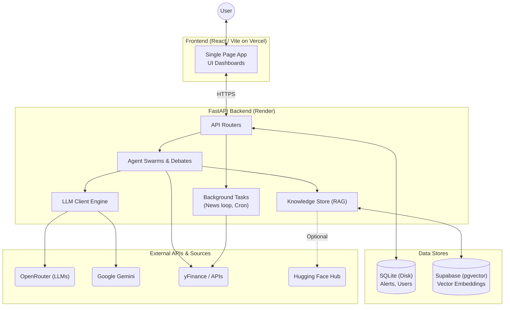
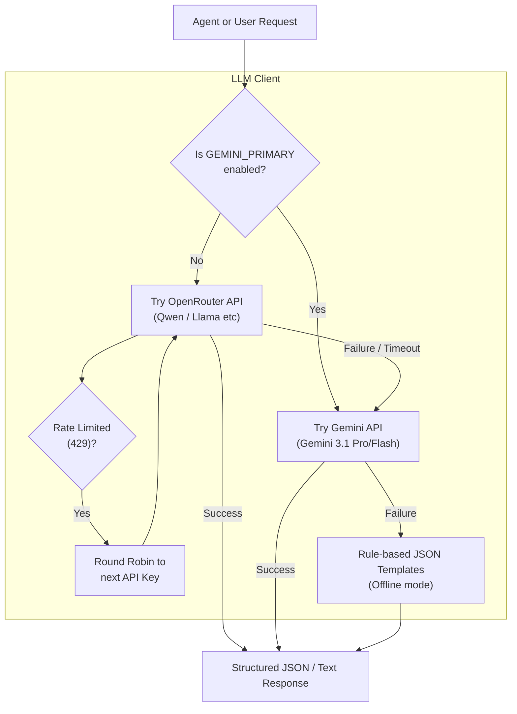
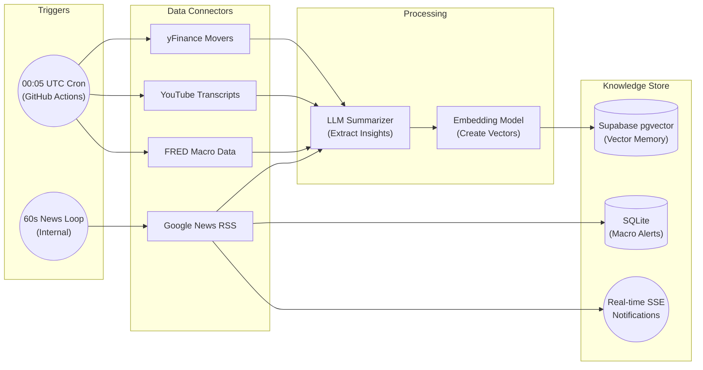
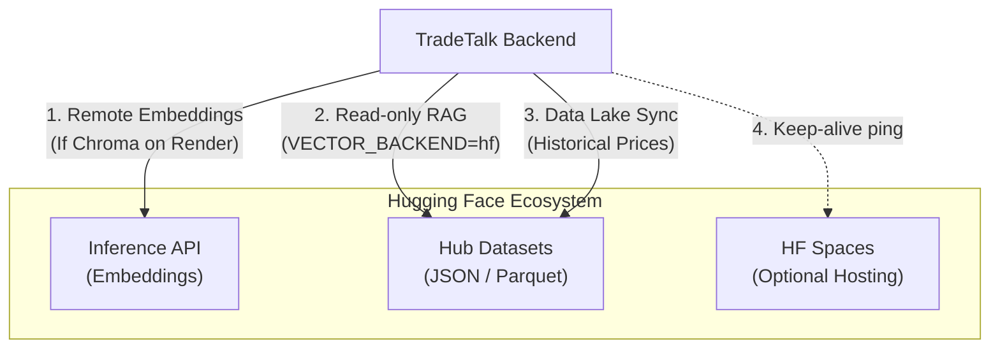

# TradeTalk System Diagrams

This document contains simplified diagrams of the TradeTalk architecture and its sub-systems to help understand the flow of data, API usage, and fallback mechanisms.

## 1. Full System Architecture

This diagram shows how a user interacts with the system, from the frontend all the way to external data sources and background jobs.



## 2. LLM Processing and Fallback System

TradeTalk uses a highly resilient LLM system. By default, it connects to OpenRouter, but it will gracefully degrade to Gemini or hardcoded rule-based responses if APIs fail or rate limits are hit.



## 3. Data Ingestion & Scheduled Pipelines

TradeTalk does not just answer questions; it actively reads the market in the background to build a memory. This diagram shows how data flows into the system asynchronously.



## 4. Hugging Face Integrations

While not the primary database, Hugging Face serves as an optional layer for read-only snapshots, remote embeddings, and data lakes.



## 5. Agent Swarm & Debate Architecture

TradeTalk simulates a Wall Street analyst team. A request goes to multiple parallel agents, each looking at different data, before a Moderator agent resolves their disagreements.

```mermaid
flowchart TB
    Input["User: Evaluate AAPL"]

    subgraph Parallel_Agents ["Parallel Specialist Agents"]
        Bull["Bull Agent\n(Growth & Upside)"]
        Bear["Bear Agent\n(Risk & Macro)"]
        Value["Value Agent\n(Fundamentals)"]
        Momentum["Momentum Agent\n(Price Action)"]
        Macro["Macro Agent\n(Credit & Rates)"]
    end

    subgraph Knowledge ["Retrieval Augmented Generation"]
        RAG[("Vector Memory\n(Past lessons, YouTube, Debates)")]
    end

    Input --> Bull
    Input --> Bear
    Input --> Value
    Input --> Momentum
    Input --> Macro

    RAG --> Bull
    RAG --> Bear
    RAG --> Value
    RAG --> Momentum
    RAG --> Macro

    Bull --> Moderator
    Bear --> Moderator
    Value --> Moderator
    Momentum --> Moderator
    Macro --> Moderator

    subgraph Synthesis ["Synthesis Layer"]
        Moderator{"Moderator Agent"}
        Verdict["Final Investment Verdict\n(Buy/Hold/Sell)"]
    end

    Moderator --> Verdict
    Verdict --> RAG
