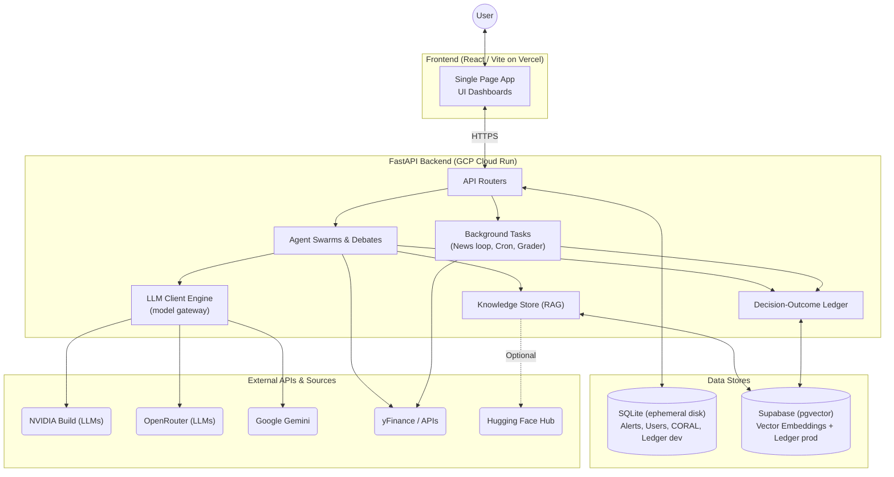
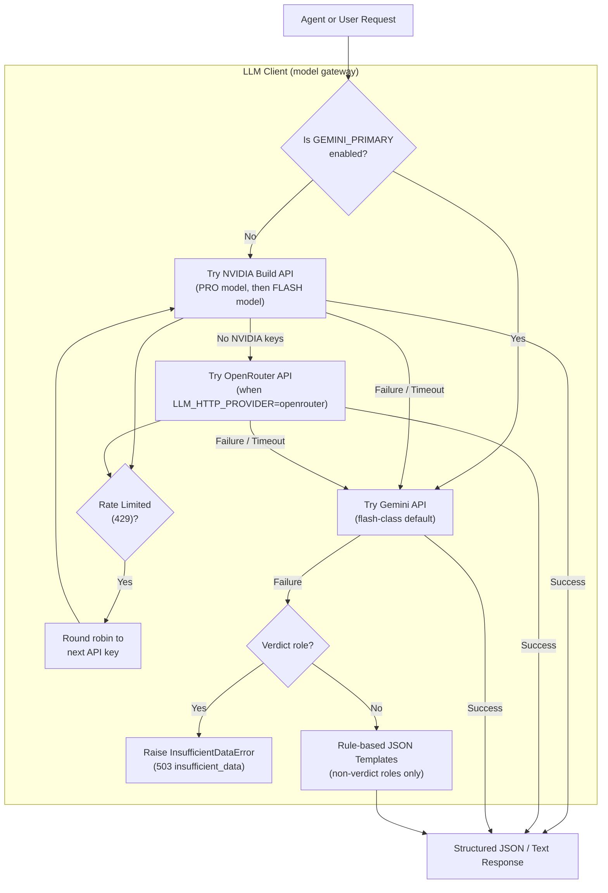
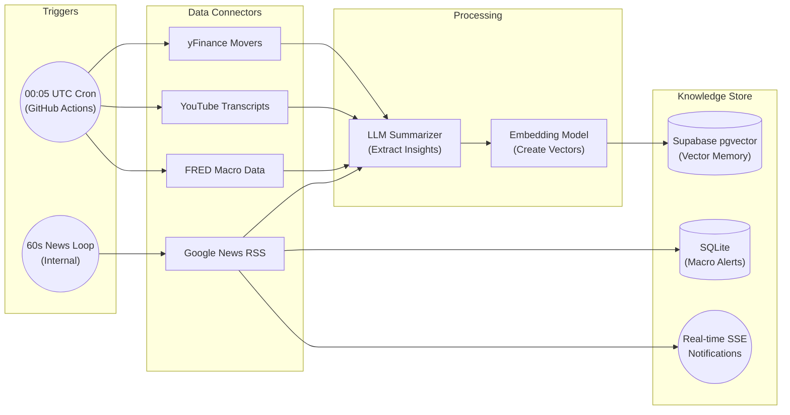
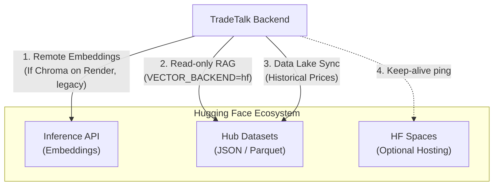
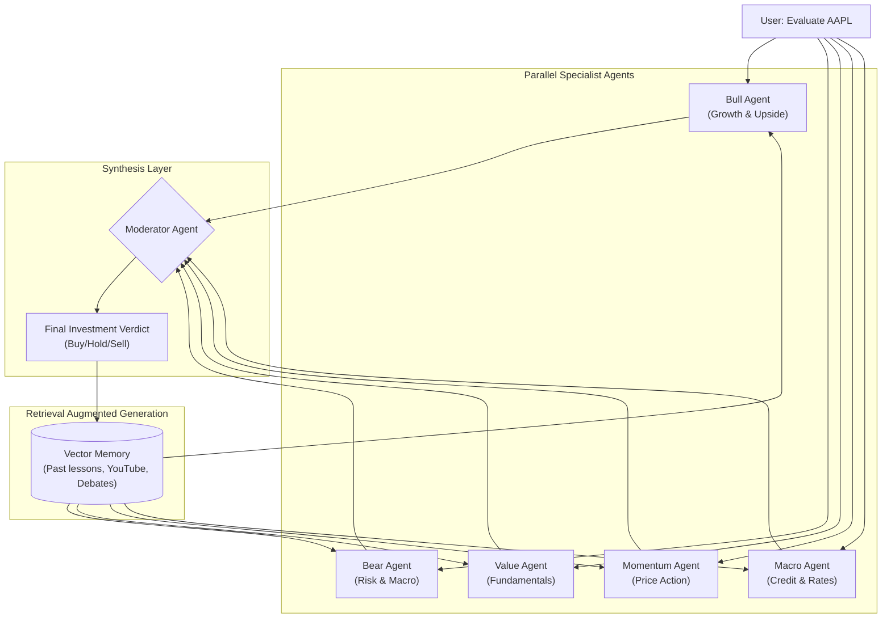
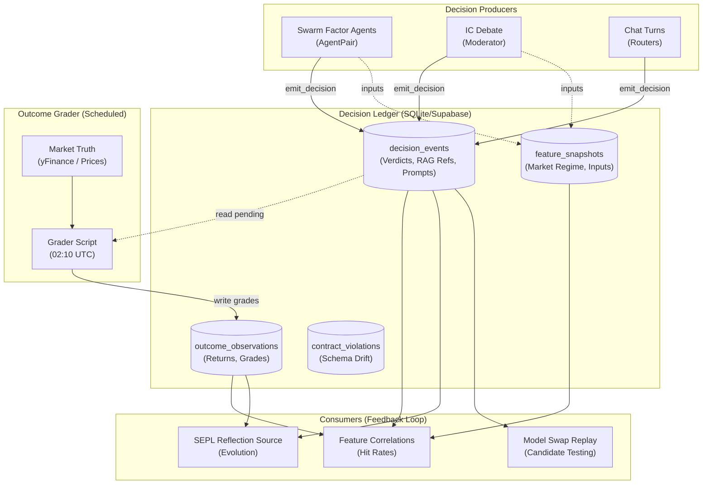
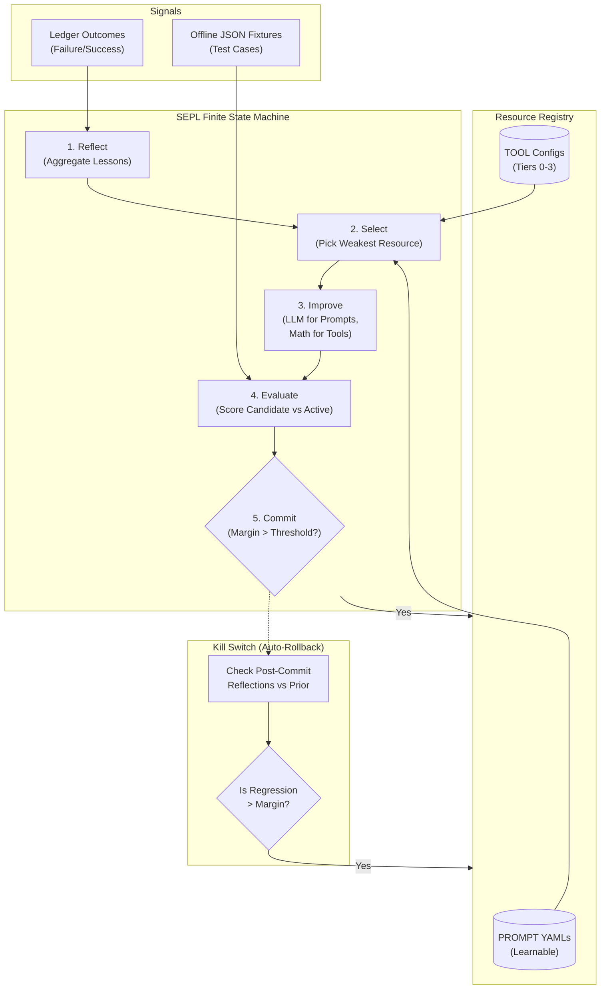
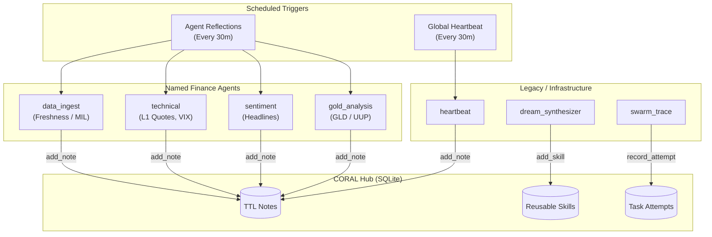

# TradeTalk System Diagrams

This document contains simplified diagrams of the TradeTalk architecture and its sub-systems to help understand the flow of data, API usage, and fallback mechanisms.

## 1. Full System Architecture

This diagram shows how a user interacts with the system, from the frontend all the way to external data sources and background jobs.

## 2. LLM Processing and Fallback System

TradeTalk uses a highly resilient LLM system (the Phase F model gateway in `backend/llm_client.py`). The default cascade is NVIDIA Build → (OpenRouter) → Gemini → rule-based fallback; `GEMINI_PRIMARY=1` routes everything through Gemini directly. Default model IDs are centralized in `backend/model_defaults.py`; verdict roles raise `insufficient_data` instead of using templates (truthful-data contract).

## 3. Data Ingestion & Scheduled Pipelines

TradeTalk does not just answer questions; it actively reads the market in the background to build a memory. This diagram shows how data flows into the system asynchronously.

## 4. Hugging Face Integrations

While not the primary database, Hugging Face serves as an optional layer for read-only snapshots, remote embeddings, and data lakes.

## 5. Agent Swarm & Debate Architecture

TradeTalk simulates a Wall Street analyst team. A request goes to multiple parallel agents, each looking at different data, before a Moderator agent resolves their disagreements.

## 6. Decision Ledger & Outcome Grader Loop

This diagram illustrates how agent decisions are recorded, graded against future market reality, and fed back into the system to improve future performance.

## 7. SEPL Resource Registry & Tool Evolution

This diagram shows the Self-Evolving Prompts and Logic (SEPL) pipeline. The pipeline iterates over prompts and tools, perturbing them, evaluating them against offline fixtures, and committing improvements while an offline Kill Switch guards against regressions.

## 8. CORAL Hub & Named Agents

The CORAL Hub provides a central point for named system agents and infrastructure to persist heartbeat notes, share RAG-adjacent skills, and log meta-learning attempts.

